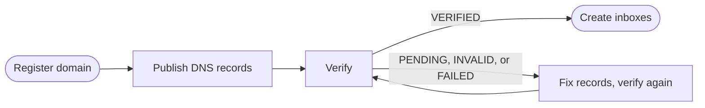

<Visibility for="humans">


<Info>If you don't have an API key yet, follow the [Quickstart](/quickstart) first.</Info>


## Register a Custom Domain

To use a custom domain email address, you need to be on the Developer plan or above and register it.


<Note>
A domain whose mail already routes to Google Workspace or Microsoft 365 cannot be registered. In that case, register a dedicated subdomain (like `mail.example.com`). 
</Note>

If you have registered your apex domain already, you can enable subdomains configuration to create inboxes with addresses on any subdomain without having to register it. See [Register a subdomain](#register-a-subdomain).

A domain belongs to your organization as a whole, or to one pod when its inboxes should live inside that pod's isolated set of resources. Pod-owned domains use the same operations through the pod routes: `/v0/pods/{pod_id}/domains` in the API, `client.pods.domains` in the SDKs, and `pods:domains` in the CLI.

<Steps>
<Step title="Register the domain">

You can also do this in the [AgentMail Console](https://console.agentmail.to) under **Domains**.

`domain` is the only required input.

<CodeGroup>

```bash CLI
agentmail domains create --domain "example.com"
```

```bash API
curl -X POST "https://api.agentmail.to/v0/domains" \
  -H "Authorization: Bearer $AGENTMAIL_API_KEY" \
  -H "Content-Type: application/json" \
  -d '{ "domain": "example.com" }'
```

```typescript TypeScript
const domain = await client.domains.create({ domain: "example.com" });
console.log(domain.domainId, domain.status);
```

```python Python
domain = client.domains.create(domain="example.com")
print(domain.domain_id, domain.status)
```

</CodeGroup>

| Param | Type | What it means |
| --- | --- | --- |
| `domain` | string | The domain or subdomain to register, like `example.com` or `mail.example.com`. Needs at least one dot. |
| `feedback_enabled` | boolean | Deliver bounce and complaint notifications to your inboxes as emails, so your agent learns when an address is dead or a recipient marked its mail as spam. Defaults to `true`. Set `false` to stop the notification emails. |
| `subdomains_enabled` | boolean | Allow inboxes on any subdomain of this domain. Adds a required wildcard MX record (`*.<domain>`) to `records`. Defaults to `false`. |
| `tracking_enabled` | boolean | Serve open tracking pixels from this domain. Adds a required `link.<domain>` CNAME record to `records`, which must be published and verified before `track_opens` works on a send. Defaults to `false`. |
| `client_id` | string | Your own idempotency id. Retrying the create with the same `client_id` returns the already-registered domain instead of an error. |

The response contains a `records` list with every DNS record to publish:

```json Sample response
{
  "domain_id": "example.com",
  "domain": "example.com",
  "status": "NOT_STARTED",
  "feedback_enabled": true,
  "subdomains_enabled": false,
  "tracking_enabled": false,
  "records": [
    {
      "type": "TXT",
      "name": "agentmail._domainkey",
      "value": "v=DKIM1; k=rsa; p=MIIBIjANBgkqhkiG9w0BAQEFAAOCAQ8AMIIBCgKC..."
    },
    {
      "type": "MX",
      "name": "@",
      "value": "inbound-smtp.us-east-1.amazonaws.com",
      "priority": 10
    },
    {
      "type": "MX",
      "name": "mail",
      "value": "feedback-smtp.us-east-1.amazonses.com",
      "priority": 10
    },
    {
      "type": "TXT",
      "name": "mail",
      "value": "v=spf1 include:amazonses.com -all"
    },
    {
      "type": "TXT",
      "name": "_dmarc",
      "value": "v=DMARC1; p=reject; rua=mailto:dmarc@example.com"
    }
  ],
  "created_at": "2026-08-25T09:30:00Z",
  "updated_at": "2026-08-25T09:30:00Z"
}
```

</Step>
<Step title="Publish the DNS records">

Publish every record in the `records` array at the DNS provider that controls the domain's authoritative nameservers. 

| Record | What it does |
| --- | --- |
| DKIM `TXT` (host ends in `._domainkey`) | Publishes the public key receivers use to check the signature on your mail. |
| `MX` on the domain (`@`) | Routes inbound mail for the domain to AgentMail so your inboxes receive. |
| `MX` on the `mail` host | The bounce return path for your outgoing mail. Keep this host to exactly one MX record. |
| SPF `TXT` on the `mail` host | Authorizes AgentMail's servers to send for that return path. |
| DMARC `TXT` (`_dmarc`) | Tells receivers what to do with mail that fails authentication. See [Customize DMARC policy](#customize-dmarc-policy). |
| Wildcard `MX` (`*`) | Present only with `subdomains_enabled`. Routes mail for every subdomain. |
| `CNAME` (`link`) | Present only with `tracking_enabled`. Serves open tracking pixels. |

<CodeGroup>

```bash CLI
agentmail domains get-zone-file \
  --domain-id "example.com" > example.com.zone
```

```bash API
curl "https://api.agentmail.to/v0/domains/example.com/zone-file" \
  -H "Authorization: Bearer $AGENTMAIL_API_KEY" \
  -o example.com.zone
```

```typescript TypeScript
import { writeFile } from "node:fs/promises";

const zoneFile = await client.domains.getZoneFile("example.com");
await writeFile("example.com.zone", Buffer.from(await zoneFile.arrayBuffer()));
```

```python Python
with open("example.com.zone", "wb") as f:
    for chunk in client.domains.get_zone_file(domain_id="example.com"):
        f.write(chunk)
```

</CodeGroup>

Review the import before applying it. On some providers (Porkbun, for one) a zone file import replaces every existing record, which is fine for a fresh domain but destructive on a domain with other records.

</Step>
<Step title="Verify the domain">

<CodeGroup>

```bash CLI
agentmail domains verify --domain-id "example.com"
agentmail domains get --domain-id "example.com"
```

```bash API
curl -X POST "https://api.agentmail.to/v0/domains/example.com/verify" \
  -H "Authorization: Bearer $AGENTMAIL_API_KEY"

curl "https://api.agentmail.to/v0/domains/example.com" \
  -H "Authorization: Bearer $AGENTMAIL_API_KEY"
```

```typescript TypeScript
await client.domains.verify("example.com");

const domain = await client.domains.get("example.com");
console.log(domain.status, domain.records);
```

```python Python
client.domains.verify(domain_id="example.com")

domain = client.domains.get(domain_id="example.com")
print(domain.status, domain.records)
```

</CodeGroup>

Instead of polling the get, you can subscribe to the `domain.verified` [webhook event](/advanced/webhooks) and start creating inboxes when it fires.

The domain's `status` tells you where you are:

| Status | Meaning | Next action |
| --- | --- | --- |
| `NOT_STARTED` | Verification has not been requested. | Call verify. |
| `PENDING` | Required records have not been found yet. | Publish the records, then wait for DNS propagation. |
| `INVALID` | At least one record was found but is misconfigured. | Find the record whose `status` is `INVALID` and fix its value (for MX records, the priority too). |
| `FAILED` | The records are in place but the verification attempt did not complete. | Call verify again to trigger a recheck. |
| `VERIFYING` | Records are correct and authorization is in progress. | Get the domain again until the status changes. |
| `VERIFIED` | The domain is ready. | Create inboxes on it. |

DNS propagation takes anywhere from a minute to 48 hours depending on the provider.

```json Sample response
{
  "domain_id": "example.com",
  "domain": "example.com",
  "status": "PENDING",
  "feedback_enabled": true,
  "subdomains_enabled": false,
  "tracking_enabled": false,
  "records": [
    {
      "type": "TXT",
      "name": "agentmail._domainkey",
      "value": "v=DKIM1; k=rsa; p=MIIBIjANBgkqhkiG9w0BAQEFAAOCAQ8AMIIBCgKC...",
      "status": "VALID"
    },
    {
      "type": "MX",
      "name": "@",
      "value": "inbound-smtp.us-east-1.amazonaws.com",
      "priority": 10,
      "status": "VALID"
    },
    {
      "type": "MX",
      "name": "mail",
      "value": "feedback-smtp.us-east-1.amazonses.com",
      "priority": 10,
      "status": "VALID"
    },
    {
      "type": "TXT",
      "name": "mail",
      "value": "v=spf1 include:amazonses.com -all",
      "status": "VALID"
    },
    {
      "type": "TXT",
      "name": "_dmarc",
      "value": "v=DMARC1; p=reject; rua=mailto:dmarc@example.com",
      "status": "MISSING"
    }
  ],
  "created_at": "2026-08-25T09:30:00Z",
  "updated_at": "2026-08-25T09:32:00Z"
}
```

</Step>
<Step title="Create the first inbox on the domain">

Once the domain is `VERIFIED`, name it when you create an inbox.

<CodeGroup>

```bash CLI
agentmail inboxes create \
  --username "support" \
  --domain "example.com" \
  --display-name "Support"
```

```bash API
curl -X POST "https://api.agentmail.to/v0/inboxes" \
  -H "Authorization: Bearer $AGENTMAIL_API_KEY" \
  -H "Content-Type: application/json" \
  -d '{
    "username": "support",
    "domain": "example.com",
    "display_name": "Support"
  }'
```

```typescript TypeScript
const inbox = await client.inboxes.create({
  username: "support",
  domain: "example.com",
  displayName: "Support",
});
console.log(inbox.inboxId);
```

```python Python
from agentmail.inboxes import CreateInboxRequest

inbox = client.inboxes.create(request=CreateInboxRequest(
    username="support",
    domain="example.com",
    display_name="Support",
))
print(inbox.inbox_id)
```

</CodeGroup>

For a pod-owned domain, create the inbox in that pod with the pod inbox route.

```json Sample response
{
  "organization_id": "1a2b3c4d-5e6f-4a1b-8c2d-3e4f5a6b7c8d",
  "inbox_id": "support@example.com",
  "email": "support@example.com",
  "display_name": "Support",
  "created_at": "2026-08-25T10:12:04Z",
  "updated_at": "2026-08-25T10:12:04Z"
}
```

The new inbox's address is in the `email` field, and everything on [Send](/core/send) and [Receive](/core/receive) takes its `inbox_id` unchanged.

</Step>
</Steps>

<Accordion title="Troubleshooting">

**The register call fails.** It fails before anything is registered:

- A `400 ValidationError` means the domain name is malformed, and its `errors` array shows the expected format.
- A `403` comes back when the name is already registered, with either of these codes:
  - `already_exists` if your own organization registered it
  - `resource_taken` if a different organization did
- A `403 limit_exceeded` means you are at your plan's domain cap. The error names the plan that raises it.
- A `422 unprocessable` means the domain cannot be registered as is, and the message says why. The two causes:
  - the domain's mail already routes to Google Workspace or Microsoft 365, so register a dedicated subdomain instead
  - the name is reserved (`agentmail.to` and everything under it)

**The zone file download returns a `422`.** The domain predates zone file support, so publish its `records` array by hand instead.

**The inbox create fails.** The error names the problem:

- A `404` with "Domain not found" means the domain is not registered under your organization, or your key's scope does not cover it.
- A `403 domain_not_verified` means the domain is registered but not `VERIFIED` yet. The error names the domain to finish verifying.
- A `422` means the address is on a subdomain of the registered domain and subdomains are not enabled on it. See [Register a subdomain](#register-a-subdomain).
- A `403 already_exists` means the username is taken on this domain, with up to three available alternatives in `suggestions`.

**A domain will not verify.** When a domain sits in `PENDING` or `INVALID` longer than propagation explains, compare every returned record's name, type, value, and MX priority against what your provider actually serves. These are the usual causes:

- **Records added at the wrong provider.** Records only count at the provider that controls the domain's active nameservers. Records added in a registrar panel are ignored when the nameservers point elsewhere (a domain bought at Namecheap but served by Cloudflare, for example).
- **The domain got appended twice.** Many editors add your domain to the host automatically, so entering `agentmail._domainkey.example.com` creates `agentmail._domainkey.example.com.example.com`. Enter the relative host exactly as returned.
- **Extra quotes or spaces in TXT values.** Some providers wrap TXT values in quotes for you, so pasting a pre-quoted value double-quotes it. Paste values exactly as returned and let the provider handle quoting.
- **Stale or conflicting records on the same host.** An old DKIM record on the same selector host, or a second SPF record, keeps the new value from validating. Keep the value AgentMail returned and remove duplicates.
- **More than one MX on the `mail` host.** The bounce return path host must carry exactly one MX record.
- **Propagation is still running.** Wait it out instead of editing the record again. Use [dnschecker.org](https://dnschecker.org) to confirm the records are visible globally, then call verify to recheck. Propagation can stall, and a manual verify unsticks it.
- **Status reads `FAILED`.** Your records are fine and the checker needs a bump. Call verify again.

A host can carry only one SPF record. If the returned SPF host already has one, merge AgentMail's `include:` mechanism into the existing record, right before its trailing `~all` or `-all`, instead of adding a second record. Two SPF records on one host fail authentication, and providers like Gmail reject the mail.

Instead of entering records one by one, download the domain's BIND zone file and import it where the provider supports that (the Console has a **Download BIND Zone File** button for the same file). Provider-specific quirks:

<AccordionGroup>
<Accordion title="Cloudflare">
Add records under **DNS > Records**, or import the zone file via **Import and Export**. The Name field strips your domain automatically, so enter only the relative host (`agentmail._domainkey`, not the full name). Duplicate TXT values are allowed by the editor but still fail verification, so remove stale ones. Propagates in 1 to 5 minutes. See [Cloudflare DNS record management](https://developers.cloudflare.com/dns/manage-dns-records/how-to/create-dns-records/).
</Accordion>
<Accordion title="GoDaddy">
Add records from the domain's DNS management page. GoDaddy wraps TXT values in quotes for you, so never add your own, and it appends your domain to the Name field, so enter only the relative host. A parked or forwarding domain can override your MX records, so disable both before setting up receiving. Propagates in 15 to 30 minutes. See [add an MX record](https://www.godaddy.com/help/add-an-mx-record-19234) and [add a TXT record](https://www.godaddy.com/help/add-a-txt-record-19232).
</Accordion>
<Accordion title="Route 53">
Create records in the hosted zone that serves the active nameservers, or use **Import zone file** and paste the zone file contents. TXT values must be wrapped in double quotes. Route 53 caps each TXT string at 255 characters, and the DKIM value is longer, so split it into two quoted strings inside one record with nothing between the quotes: `"first-half""second-half"`. A space or line break between them creates two separate records and receivers like Gmail reject the mail. MX values combine priority and host in one field, like `10 inbound-smtp.us-east-1.amazonaws.com`. Use simple routing. Propagates in a few minutes. See [import a zone file](https://docs.aws.amazon.com/Route53/latest/DeveloperGuide/resource-record-sets-creating-importing.html).
</Accordion>
<Accordion title="Namecheap">
Add records under **Advanced DNS**. The Host field appends your domain automatically, so enter only the relative host. Records here only apply while the domain uses Namecheap BasicDNS or PremiumDNS nameservers. Propagates in 15 to 30 minutes, occasionally a few hours. See [Namecheap MX records](https://www.namecheap.com/support/knowledgebase/article.aspx/434/2237/how-can-i-set-up-mx-records-required-for-mail-service/) and [Namecheap TXT, SPF, DKIM, and DMARC records](https://www.namecheap.com/support/knowledgebase/article.aspx/317/2237/how-do-i-add-txtspfdkimdmarc-records-for-my-domain).
</Accordion>
<Accordion title="Porkbun">
Open the domain's **DNS** subtab and use the quick upload section to import the zone file. The import replaces every existing record, so on a domain with records you need to keep, add the returned records manually instead.
</Accordion>
</AccordionGroup>

If none of this resolves it, email [support@agentmail.cc](mailto:support@agentmail.cc) with the domain name and a screenshot of your DNS records.

**Check where a domain's mail goes.** An MX lookup shows what every sender on the internet sees, so it answers two setup questions: which provider serves a name today, and whether the record you published is live yet. Query each name on its own, since a subdomain's MX records are independent of the root's.

<CodeGroup>

```bash dig
dig +short MX example.com
dig +short MX agents.example.com
```

```bash nslookup
nslookup -type=MX example.com
nslookup -type=MX agents.example.com
```

</CodeGroup>

The number in each answer is the record's priority, and senders try the lowest number first. AgentMail's own shared domain shows the answer a working AgentMail name gives:

```text dig +short MX agentmail.to
10 inbound-smtp.us-east-1.amazonaws.com.
```

| The answer names | The name's mail goes to |
| --- | --- |
| `smtp.google.com`, or `aspmx.l.google.com` on older setups | Gmail or Google Workspace |
| a host ending in `protection.outlook.com` | Microsoft 365 |
| `inbound-smtp.us-east-1.amazonaws.com` | AgentMail |

An empty answer means no server receives the name's mail, which is what a subdomain returns before its records are published. A record added minutes ago can take from a minute to 48 hours to appear depending on the provider, so an unchanged answer right after a DNS edit usually means propagation is still running.

</Accordion>

## Register a subdomain

Follow the same steps with `subdomain.example.com` as the `domain`: every returned host sits under the subdomain, so the root's mail, in Gmail or Microsoft 365, is untouched. Use this when the root's mail belongs elsewhere, or when outreach needs a sending reputation it can [cycle out](#scale-across-multiple-domains).

To host inboxes on any subdomain without registering each one, set `subdomains_enabled` on a registered domain instead. That adds one wildcard MX record to publish, and then any subdomain works as an inbox's `domain` (`{ "username": "agent", "domain": "bot.example.com" }`). Those inboxes share the parent's DKIM identity and reputation.

<Accordion title="Troubleshooting">

- **Registering a root is refused with a `422`** while its mail routes to Google Workspace or Microsoft 365. Register a subdomain, or remove the provider's MX records first if AgentMail should take over the root.
- **Workspace users' mail to the subdomain never arrives, while outside mail does.** Google delivers Workspace subdomain mail internally. Add a routing rule in the Google Admin Console (**Apps > Google Workspace > Gmail > Routing**) that sends the subdomain to its external MX records.
- **Creating a subdomain inbox returns a `422`.** Subdomains are not enabled on the domain. Enable them with the [update call](#domain-settings).

</Accordion>

## Domain Settings

The update changes a domain's behavior without touching its registration. Send at least one of `feedback_enabled`, `subdomains_enabled`, or `tracking_enabled`. Omitted fields stay unchanged.

<CodeGroup>

```bash CLI
agentmail domains update \
  --domain-id "example.com" \
  --subdomains-enabled=true
```

```bash API
curl -X PATCH "https://api.agentmail.to/v0/domains/example.com" \
  -H "Authorization: Bearer $AGENTMAIL_API_KEY" \
  -H "Content-Type: application/json" \
  -d '{ "subdomains_enabled": true }'
```

```typescript TypeScript
const domain = await client.domains.update("example.com", {
  subdomainsEnabled: true,
});
console.log(domain.status, domain.records);
```

```python Python
domain = client.domains.update(
    domain_id="example.com",
    subdomains_enabled=True,
)
print(domain.status, domain.records)
```

</CodeGroup>

The response is the updated domain. When the change makes a new DNS record required (enabling `subdomains_enabled` adds the wildcard MX, enabling `tracking_enabled` adds the `link` CNAME), the response includes the refreshed `records` array so you can publish the new record right away, and a `VERIFIED` domain returns to `PENDING` until it verifies. Toggling `feedback_enabled` takes effect immediately with no DNS change.

When a domain should stop existing, delete it. The delete is permanent. Inboxes on the domain immediately stop sending and receiving, but you keep access to their stored data, so past threads and messages remain readable.

<CodeGroup>

```bash CLI
agentmail domains delete --domain-id "example.com"
```

```bash API
curl -X DELETE "https://api.agentmail.to/v0/domains/example.com" \
  -H "Authorization: Bearer $AGENTMAIL_API_KEY"
```

```typescript TypeScript
await client.domains.delete("example.com");
```

```python Python
client.domains.delete(domain_id="example.com")
```

</CodeGroup>

The delete returns a `204` with no body. Deleting frees a slot under your plan's domain cap, and the name can be registered again afterward.

<Accordion title="Troubleshooting">

- **The update is rejected with a `400`.** The body was empty. Send at least one of `feedback_enabled`, `subdomains_enabled`, or `tracking_enabled`.

</Accordion>

## Scale across multiple domains

Past a single domain, how you spread traffic becomes a deliverability decision:

- **Isolate reputations with separately registered subdomains.** Agents have different risk profiles, and a high-risk cold outreach agent can drag down the reputation a transactional agent depends on. Register `billing.example.com` for transactional agents, `outreach.example.com` for high-volume outreach, and `support.example.com` for support, each as its own domain. Each registration gets its own DKIM identity, which is what keeps the reputations separate. This is the opposite trade from `subdomains_enabled`, where every subdomain shares the parent's identity.
- **Pool domains for high volume.** Even a warmed domain has a daily volume ceiling before providers throttle it. Register a pool of root domains (`example.com`, `example.net`, `get-example.com`), keep the list in your application, and rotate sending inboxes across it. Spreading the volume improves inbox placement at scale, and if one domain's reputation takes a hit, the rest keep delivering.

New domains also need warming before they can carry volume. See [Deliverability](/advanced/deliverability) for the ramp.

A fleet of domains needs auditing. Listing shows every registered domain in your organization, newest first, which is how you see what exists and drive per-domain checks. All three parameters are optional: `limit` and `page_token` page the results (pass the previous response's `next_page_token` to resume), and `ascending` flips to oldest first.

<CodeGroup>

```bash CLI
agentmail domains list
```

```bash API
curl "https://api.agentmail.to/v0/domains" \
  -H "Authorization: Bearer $AGENTMAIL_API_KEY"
```

```typescript TypeScript
const domains = await client.domains.list();
for (const domain of domains.domains) {
  console.log(domain.domainId, domain.feedbackEnabled, domain.subdomainsEnabled);
}
```

```python Python
domains = client.domains.list()
for domain in domains.domains:
    print(domain.domain_id, domain.feedback_enabled, domain.subdomains_enabled)
```

</CodeGroup>

List entries carry each domain's settings and timestamps. For a domain's verification `status` and a fresh check of its `records`, get that domain by id.

```json Sample response
{
  "count": 2,
  "domains": [
    {
      "domain_id": "example.com",
      "domain": "example.com",
      "feedback_enabled": true,
      "subdomains_enabled": true,
      "tracking_enabled": false,
      "created_at": "2026-08-25T09:30:00Z",
      "updated_at": "2026-08-25T10:05:00Z"
    },
    {
      "domain_id": "mail.example.net",
      "domain": "mail.example.net",
      "feedback_enabled": false,
      "subdomains_enabled": false,
      "tracking_enabled": false,
      "created_at": "2026-08-14T16:20:11Z",
      "updated_at": "2026-08-14T17:01:43Z"
    }
  ]
}
```

Verification can lapse after it succeeds. DNS records get edited or deleted by accident, and a `VERIFIED` domain whose records disappear reverts, which blocks new inbox creation on it. AgentMail rechecks verified domains on its own about once a day, and you can catch drift sooner by getting the domain periodically and alerting when any record's `status` leaves `VALID`.

## Customize DMARC policy

AgentMail's returned DMARC record uses `p=reject`, the strictest policy: receivers drop mail that fails authentication, which blocks spoofing of your domain. If you want a softer policy, edit the value of the TXT record whose name starts with `_dmarc` at your DNS provider:

- `p=quarantine` sends failing mail to spam instead of dropping it
- `p=none` only reports failures without acting on them

Verification keeps passing as long as the record still starts with `v=DMARC1` and keeps a `rua=mailto:` reporting address.

## Next Steps

<CardGroup cols={2}>
  <Card title="Deliverability and warmup" icon="chart-line" href="/advanced/deliverability">
    Ramp a new domain's volume so mail from it keeps reaching the inbox.
  </Card>
  <Card title="Build a multi-tenant platform" icon="building" href="/advanced/multi-tenant">
    Isolate each customer's inboxes, domains, and keys in pods of their own.
  </Card>
</CardGroup>

</Visibility>

<Visibility for="agents">

# Register and verify a custom domain

Registering a domain returns the exact DNS records to publish, and verification makes the domain ready for inboxes, so agents send and receive as `support@example.com` under your brand and your own sending reputation. Use it on the Developer plan and above, on a root domain or on a dedicated subdomain that runs AgentMail alongside an existing mail provider.

## Do this

Register the domain. The response is the domain object: `status` starts at `NOT_STARTED`, `records` lists every DNS record to publish, and `domain_id` (the domain name itself) identifies the domain in every later call.

```bash
curl -X POST "https://api.agentmail.to/v0/domains" \
  -H "Authorization: Bearer $AGENTMAIL_API_KEY" \
  -H "Content-Type: application/json" \
  -d '{ "domain": "example.com" }'
```

Publish every record in the returned `records` array at the DNS provider that controls the domain's authoritative nameservers. Where the provider supports imports, download the records as a BIND zone file instead of entering them one by one:

```bash
curl "https://api.agentmail.to/v0/domains/example.com/zone-file" \
  -H "Authorization: Bearer $AGENTMAIL_API_KEY" -o example.com.zone
```

Request verification (returns `204` with no body), then get the domain to watch progress. The get runs a live DNS check and returns the overall `status` plus a `status` per record.

```bash
curl -X POST "https://api.agentmail.to/v0/domains/example.com/verify" \
  -H "Authorization: Bearer $AGENTMAIL_API_KEY"

curl "https://api.agentmail.to/v0/domains/example.com" \
  -H "Authorization: Bearer $AGENTMAIL_API_KEY"
```

Once `status` reads `VERIFIED`, create inboxes on the domain:

```bash
curl -X POST "https://api.agentmail.to/v0/inboxes" \
  -H "Authorization: Bearer $AGENTMAIL_API_KEY" \
  -H "Content-Type: application/json" \
  -d '{ "username": "support", "domain": "example.com", "display_name": "Support" }'
```

## SDK

Install: `npm install agentmail` (TypeScript), `pip install agentmail` (Python), `npm install -g agentmail-cli` (CLI).

- Register: `client.domains.create({ domain: "example.com" })` (TS), `client.domains.create(domain="example.com")` (Python), `agentmail domains create --domain "example.com"` (CLI).
- Get: `client.domains.get("example.com")`, `client.domains.get(domain_id="example.com")`, `agentmail domains get --domain-id "example.com"`.
- Verify: `client.domains.verify("example.com")`, `client.domains.verify(domain_id="example.com")`, `agentmail domains verify --domain-id "example.com"`.
- Zone file: `client.domains.getZoneFile("example.com")`, `client.domains.get_zone_file(domain_id="example.com")`, `agentmail domains get-zone-file --domain-id "example.com"`.
- Update: `client.domains.update("example.com", { subdomainsEnabled: true })`, `client.domains.update(domain_id="example.com", subdomains_enabled=True)`, `agentmail domains update --domain-id "example.com" --subdomains-enabled=true`.
- Delete: `client.domains.delete("example.com")`, `client.domains.delete(domain_id="example.com")`, `agentmail domains delete --domain-id "example.com"`.
- List: `client.domains.list()`, `agentmail domains list`.
- Pod-owned domains: `client.pods.domains` in the SDKs, `pods:domains` in the CLI.

Client setup is on [/integrations/sdks-and-cli](/integrations/sdks-and-cli).

## Facts

- `POST /v0/domains` params: `domain` (required, needs at least one dot), `feedback_enabled` (default `true`, delivers bounce and complaint notifications to your inboxes as emails), `subdomains_enabled` (default `false`), `tracking_enabled` (default `false`), `client_id` (idempotency id, retrying with the same value returns the already registered domain instead of an error).
- Default records returned by `POST /v0/domains`: DKIM `TXT` on `agentmail._domainkey` with a per-domain value starting `v=DKIM1; k=rsa; p=`, `MX` on `@` with value `inbound-smtp.us-east-1.amazonaws.com` priority `10`, `MX` on `mail` with value `feedback-smtp.us-east-1.amazonses.com` priority `10`, SPF `TXT` on `mail` with value `v=spf1 include:amazonses.com -all`, DMARC `TXT` on `_dmarc` with a value like `v=DMARC1; p=reject; rua=mailto:dmarc@example.com`.
- The DKIM record carries only the public half of the signing key. AgentMail holds the private key and signs outgoing mail with it.
- `subdomains_enabled` adds one required wildcard `MX` on host `*` (for a registered subdomain `mail.example.com`, the host is `*.mail`). `tracking_enabled` adds one required `CNAME` on host `link`, which must be published and verified before `track_opens` works on a send.
- Record names come back relative to the apex zone, with `@` for the apex. If the DNS editor shows fully qualified names, append the domain to the host.
- A host can carry only one SPF record. Merge `include:amazonses.com` into an existing SPF record right before its trailing `~all` or `-all`. Two SPF records on one host fail authentication.
- The `mail` host (bounce return path) must carry exactly one `MX` record.
- Domain `status` values and next action: `NOT_STARTED` (call verify), `PENDING` (required records not found yet, wait for propagation), `INVALID` (a record was found but is misconfigured, fix the value and MX priority of each record whose own `status` is `INVALID`), `FAILED` (records are in place, call verify again), `VERIFYING` (records correct, get again until it changes), `VERIFIED` (create inboxes).
- Per-record `status` values: `MISSING` (not found in DNS), `INVALID` (found with the wrong value), `VALID`.
- `POST /v0/domains/{domain_id}/verify` returns `204` with no body. AgentMail then rechecks on its own every few minutes while the domain is unverified, and about once a day once verified. The `domain.verified` webhook event fires when verification completes.
- DNS propagation takes from a minute to 48 hours depending on the provider, so a fresh record can read `MISSING` without anything being wrong. A stalled propagation or a `FAILED` status unsticks with another verify call.
- A `VERIFIED` domain whose records are later edited or deleted reverts, which blocks new inbox creation on it. Catch drift by getting the domain periodically and alerting when any record's `status` leaves `VALID`.
- Custom domains are available on the Developer plan and above. Mail from shared `@agentmail.to` addresses carries a `Sent via AgentMail` footer on the Free and Agent plans, mail from an inbox on your own verified domain does not.
- Domains are organization-level, not inbox-scoped. Register and verify once, then create any number of inboxes. Pod-owned domains use `/v0/pods/{pod_id}/domains`.
- `PATCH /v0/domains/{domain_id}` takes at least one of `feedback_enabled`, `subdomains_enabled`, `tracking_enabled`. Omitted fields stay unchanged. Enabling `subdomains_enabled` or `tracking_enabled` on a `VERIFIED` domain returns it to `PENDING` until the new record verifies. Existing inboxes keep sending and receiving during that window, new inbox creation waits for `VERIFIED`. Toggling `feedback_enabled` takes effect immediately with no DNS change.
- `DELETE /v0/domains/{domain_id}` returns `204`, is permanent, stops the domain's inboxes sending and receiving immediately, keeps stored threads and messages readable, frees a slot under the plan's domain cap, and lets the name be registered again.
- `GET /v0/domains` lists registered domains newest first. Optional `limit`, `page_token` (pass the previous response's `next_page_token`), and `ascending` (flips to oldest first). Entries carry settings and timestamps, get a single domain for `status` and a live record check.
- Inboxes on arbitrary subdomains (enabled by `subdomains_enabled`) send under the parent domain's DKIM identity and share its reputation, and they do not appear in `GET /v0/domains`. A separately registered subdomain gets its own DKIM identity and its own reputation.
- `dig +short MX example.com` shows where a name's mail goes: `10 inbound-smtp.us-east-1.amazonaws.com.` is AgentMail, `smtp.google.com` or `aspmx.l.google.com` is Google, a host ending in `protection.outlook.com` is Microsoft 365. An empty answer means no server receives the name's mail. Query each subdomain separately, MX records are independent per name.
- The DMARC policy can be softened to `p=quarantine` or `p=none` by editing the `_dmarc` TXT value at the DNS provider. Verification keeps passing while the value starts with `v=DMARC1` and keeps a `rua=mailto:` reporting address.
- Provider quirks that break verification: editors that append the domain to the host automatically (enter only the relative host or you get `agentmail._domainkey.example.com.example.com`), editors that auto-quote TXT values (paste values unquoted), Route 53's 255-character cap per TXT string (split the DKIM value into two quoted strings with nothing between them, `"first-half""second-half"`), records added in a registrar panel while the nameservers point elsewhere (only the provider serving the active nameservers counts), and stale or conflicting records on the same host (keep the returned value, remove duplicates).
- Google Workspace can deliver a subdomain's mail internally without consulting the subdomain's MX records, so mail from your own Workspace users never reaches AgentMail while outside mail arrives normally. Fix in the Google Admin Console under Apps, Google Workspace, Gmail, Routing with a rule that routes the subdomain's mail to its external MX records.
- If verification still fails, email `support@agentmail.cc` with the domain name and a screenshot of the DNS records.

## Not supported

- A domain whose mail already routes to Google Workspace or Microsoft 365 cannot be registered (`422 unprocessable`). Register a dedicated subdomain such as `agents.example.com` instead, the create checks the MX records of the exact name you register, not the root's.
- `agentmail.to` and every name under it is reserved and cannot be registered.
- Creating an inbox on a subdomain of a registered domain fails with a `422` unless `subdomains_enabled` is on. Registering a domain does not cover its subdomains by default.
- The verify call returns no verification result. Read progress with `GET /v0/domains/{domain_id}` or the `domain.verified` webhook event.
- Publishing DKIM, SPF, and DMARC records does not move inbound mail. Only MX records route mail, so pointing a root's MX at AgentMail stops the existing provider receiving every address on that root once the change propagates.
- Do not copy DNS record values from documentation samples. The DKIM value is generated per domain, only the returned `records` array is the source of truth.
- A zone file import replaces every existing record on some providers (Porkbun, for one). Do not import into a zone with records to keep, add the returned records manually instead.

## Errors

| Error | Status | Cause | Fix |
| --- | --- | --- | --- |
| `validation_error` (`ValidationError`) | 400 | `domain` on `POST /v0/domains` is malformed | the `errors` array shows the expected format |
| `already_exists` | 403 | domain create: your own organization already registered the name. Inbox create: the username is taken on the domain | fetch the existing domain, or pick a username from the up to 3 alternatives in `suggestions` |
| `resource_taken` | 403 | a different organization registered the domain | pick a different name |
| `limit_exceeded` | 403 | the plan's domain cap is reached | the error names the plan that raises the cap, deleting a domain frees a slot |
| `unprocessable` | 422 | domain create: the domain's mail already routes to Google Workspace or Microsoft 365, or the name is reserved | register a dedicated subdomain, or pick a different name |
| `domain_not_verified` | 403 | inbox create before the domain reaches `VERIFIED` | finish verification, the error names the domain |
| `not_found` (message `Domain not found`) | 404 | inbox create on a domain not registered under your organization, or outside the key's scope | check the registration and the key's scope |
| `422` | 422 | inbox create on a subdomain without `subdomains_enabled`, or a zone file request for a domain that predates zone file support | enable subdomains with `PATCH /v0/domains/{domain_id}`, or publish the `records` array by hand |
| `400` | 400 | `PATCH /v0/domains/{domain_id}` with an empty body | send at least one of the three settings fields |

## Verify

```bash
curl "https://api.agentmail.to/v0/domains/example.com" \
  -H "Authorization: Bearer $AGENTMAIL_API_KEY"
```

Success is a domain object whose `status` is `VERIFIED` and whose every record `status` is `VALID`. Any code that decides whether the domain is usable reads this same `status` field.

## Related

- [/advanced/deliverability](/advanced/deliverability) for warming a new domain before it carries volume.
- [/advanced/multi-tenant](/advanced/multi-tenant) for pods that own domains and isolate each customer's resources.
- [/advanced/webhooks](/advanced/webhooks) for subscribing to the `domain.verified` event.
- [/core/send](/core/send) and [/core/receive](/core/receive) for using inboxes created on the domain.

</Visibility>
