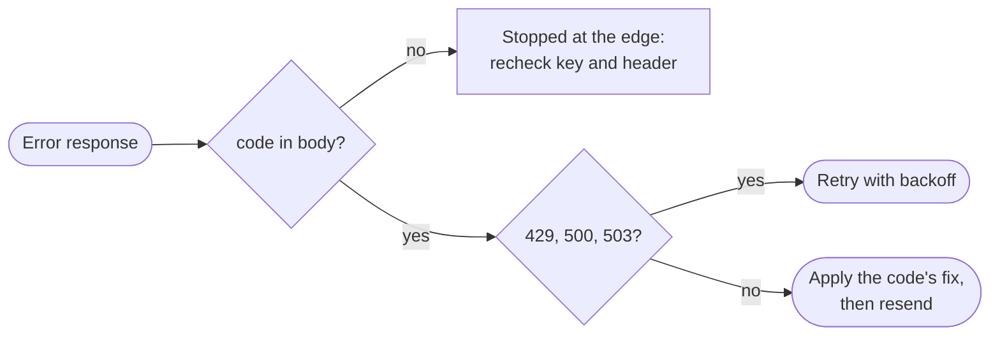

<Visibility for="humans">


## Error reference

### Read an error response

Every error that reaches the API returns a JSON body built for code to act on, not just for a person to read:

- `name` and `message` describe the failure. They keep their long-standing wording for backward compatibility (a permission denial still reads `Forbidden`), so do not branch on them.
- `code` is a stable snake_case identifier of the cause, like `not_found` or `missing_permission`. Branch on this.
- `fix` is the concrete next action that resolves the error. It is omitted when no generic remedy applies.
- `docs` links to the reference entry for the code.

Some errors carry extra fields. Validation failures add `errors`, an array where each entry names the invalid field in `path` and explains it in `message`. Name collisions add `suggestions`, up to 3 currently available alternatives. Plan-cap errors name the `resource` that ran out, the `limit` when it is known, and an `upgrade_url`. Suspension errors name the cause in `suspended_reason`.

You can see the shape by requesting something that does not exist:

<CodeGroup>

```bash CLI
agentmail inboxes get --inbox-id "missing@agentmail.to"
# prints the error body below and exits non-zero
```

```bash API
curl "https://api.agentmail.to/v0/inboxes/missing@agentmail.to" \
  -H "Authorization: Bearer $AGENTMAIL_API_KEY"
```

</CodeGroup>

```json 404 Sample response
{
  "name": "NotFoundError",
  "code": "not_found",
  "message": "Inbox not found",
  "fix": "No inbox with the given identifier is visible to this credential. Check the id, that your credential's scope (organization, pod, or inbox) covers the resource, and that you hold the required read permissions — some resources (e.g. restricted labels like spam or trash) are hidden without their label-read permission. The corresponding list endpoint returns only the ids visible to you.",
  "docs": "https://docs.agentmail.to/errors#not_found"
}
```

If a request fails validation, the response names every field to correct before you resend:

```json 400 Sample response
{
  "name": "ValidationError",
  "code": "validation_error",
  "message": "Request validation failed",
  "errors": [
    {
      "code": "invalid_format",
      "format": "custom",
      "path": ["limit"],
      "message": "limit cannot exceed 100 for filtered queries"
    }
  ],
  "fix": "One or more request fields are invalid. Inspect the 'errors' array — each entry has a 'path' and 'message' — correct the offending fields and resend.",
  "docs": "https://docs.agentmail.to/errors#validation_error"
}
```

If a response carries none of those fields, just a bare `{"message": "Unauthorized"}` or `{"message": "Forbidden"}`, it was stopped at the edge before it reached the API:

- A bare `401` means the request carried no usable `Authorization` header. Send `Authorization: Bearer <api_key>`.
- A bare `403` means the credential was rejected (usually, the key was copied incompletely). Keys start with `am_` and are shown once, so re-copy the full value or create a new key.
- Requests from a small set of blocked regions are also refused at the edge with a `403` before credentials are checked. If your region should have access, email support@agentmail.cc with the response headers and where the request came from.

The fastest way to confirm a key works is an authenticated read like `agentmail inboxes list`.



### Match the code to a recovery action

The HTTP status alone does not tell you what to do. A `403` can mean a missing permission, a taken username, a plan cap, or a rejected send, and each needs a different reaction:

{/* Anchor targets for the `docs` links in live error bodies (https://docs.agentmail.to/errors#<code>).
    One span per code in the API's AGENT_ERROR_CODES enum; keep in sync with agentmail-api. */}
<span id="unauthorized" /><span id="missing_authorization" /><span id="invalid_token_type" /><span id="unknown_api_key" /><span id="forbidden" /><span id="missing_permission" /><span id="permission_escalation" /><span id="unrestricted_key_required" /><span id="not_found" /><span id="validation_error" /><span id="already_exists" /><span id="resource_taken" /><span id="limit_exceeded" /><span id="domain_not_verified" /><span id="message_rejected" /><span id="account_suspended" /><span id="race_condition" /><span id="conflict" /><span id="unprocessable" /><span id="resource_deleting" /><span id="cannot_delete" /><span id="rate_limit_exceeded" /><span id="service_unavailable" /><span id="query_range_too_wide" /><span id="internal_error" />

| Status | `code` | What happened | What to do |
| --- | --- | --- | --- |
| 401 | `missing_authorization` | The `Authorization` header is absent, skips the case-sensitive `Bearer ` scheme, or carries a broken key value. | Send `Authorization: Bearer <api_key>`. |
| 401 | `invalid_token_type` | The request used a console session token where an API key is required. | Use an API key. Keys start with `am_`. |
| 401 | `unknown_api_key` | The key is not recognized or was revoked. | Copy the full key again or create a new one. |
| 401 | `unauthorized` | Generic authentication failure. | Send a valid API key. Do not retry unchanged credentials. |
| 403 | `missing_permission` | The key lacks a permission this operation needs. | The `fix` names the missing permission and how to get a key that holds it. A key cannot grant a permission it lacks, and when the gate is your key's scope or the organization's state (like pending agent verification), a new key at the same scope cannot help. |
| 403 | `permission_escalation` | An API key create or update asked for a permission the calling key does not hold. | Remove the extra permissions, or use a key that already holds them. |
| 403 | `unrestricted_key_required` | Creating or reconfiguring an unrestricted key needs an unrestricted credential. | Retry with a dashboard session or an unrestricted key. |
| 403 | `forbidden` | The key's scope (organization, pod, or inbox) does not cover this action. | Use a key whose scope contains the resource. |
| 403 | `already_exists` | A resource with these details already exists in your organization. | Fetch or update the existing resource. On username collisions, `suggestions` lists available alternatives. |
| 403 | `resource_taken` | The requested value, like an inbox username, belongs to another organization. | Pick a different value. `suggestions` lists up to 3 available ones. |
| 403 | `limit_exceeded` | A resource limit was reached. | Remove a resource, or raise the cap as the `fix` directs. This check runs before the name-collision check, so at a cap a duplicate username returns this code rather than `already_exists`. |
| 403 | `domain_not_verified` | The sending domain has not completed DNS verification. | Add the DNS records for the domain and verify it before sending from its addresses. See [Custom domains](/advanced/custom-domains). |
| 403 | `message_rejected` | AgentMail refused to send the message. | Read the `fix`. The cases are listed below this table. |
| 403 | `account_suspended` | The account is suspended, so sends and other operations are refused. `suspended_reason` names the cause. | Email support@agentmail.cc. Retrying keeps failing until the suspension is resolved. On a send, `name` and `message` still read like a rejected message, so branch on the code. |
| 400 | `validation_error` | One or more request fields failed validation. | Correct the fields named in `errors[]` and resend. |
| 400 | `query_range_too_wide` | A metrics query asked for too wide a time range. | Narrow the range, or increase the period or bucket size. |
| 404 | `not_found` | No resource with this identifier is visible to your key. | Check the id, your key's scope, and your label-read permissions. |
| 409 | `conflict` | The request clashes with another request under the same `Idempotency-Key`. | Retry the identical request, or use a new key for a new message. See [Make sends safe to retry](#make-sends-safe-to-retry). |
| 409 | `race_condition` | A concurrent modification collided with yours. | Re-fetch the resource for its latest state, then retry. |
| 409 | `resource_deleting` | The resource is being deleted and cannot be used. | Wait for the deletion to finish, or use a different resource. |
| 409 | `cannot_delete` | Dependent resources still block the deletion. | Resolve the blocker named in the message, then retry. |
| 422 | `unprocessable` | The request is well formed but cannot be processed as is, like a send with no recipient in `to`, `cc`, or `bcc`. | Adjust the request per the message, then retry. |
| 429 | `rate_limit_exceeded` | Requests came too fast, or a usage quota ran out. | Honor the `Retry-After` header, then retry with exponential backoff. A daily or monthly quota only resets with its window. |
| 500 | `internal_error` | A server-side failure, not a problem with your request. | Retry with exponential backoff. If it persists, email support@agentmail.cc. |
| 503 | `service_unavailable` | A downstream dependency is temporarily unavailable. | Retry after a short delay with exponential backoff. |

If a send fails with `message_rejected`, no email went out, and the `fix` states which case applies:

- A recipient is on a send block list. The `fix` names the stored entry (which can be a whole domain) and the exact delete path at the scope where it lives. Deleting an entry at a broader scope than your key, like an organization-level block hit by an inbox-scoped key, needs a key at that scope. Entries added automatically from bounces, complaints, and unsubscribes are read-only, so email support@agentmail.cc to have one reviewed.
- An active send allow list does not include the recipient. Add the recipient to the allow list. On an agent organization that has not completed verification, sending is restricted to the human's email until the verification finishes.
- An attachment URL could not be fetched. Use a URL that returns `200` without authentication, or send the attachment inline as base64.

A suspended account also stops every send, but that case carries its own code, `account_suspended`, because no change to the message can clear it.

A few `403` and `404` behaviors are deliberate and worth knowing before you debug an identifier:

- A scoped key receives `404 not_found` for a real resource outside its organization, pod, or inbox scope. That case is intentionally indistinguishable from a resource that does not exist. List the resource type with the same key, or retry with a broader-scoped key, before treating the identifier as wrong.
- A `404` whose message is `Route not found` means no route matches the path and HTTP method (usually, it is a typo like `/inbox` instead of `/inboxes`, or the wrong method). Every documented route lives under `https://api.agentmail.to/v0`.
- An empty path parameter, like a blank `inbox_id` in the URL, can surface as a `403` instead of a `400`. Check that every path parameter is filled in.

### Catch errors in the SDKs

Every non-success response becomes a typed exception, so your agent can branch on the class instead of parsing HTTP by hand. The full error body rides on the exception, which keeps `code` and `fix` available in the handler.

In TypeScript every API failure throws a subclass of `AgentMailError`, which carries `statusCode`, the parsed `body`, and the `rawResponse` (headers included). A request that never got a response throws `AgentMailTimeoutError` instead. The typed subclasses live on the `AgentMail` namespace export. In Python every API failure raises a subclass of `ApiError`, which carries `status_code`, `body`, and `headers`, and the subclasses are importable straight from the package:

<CodeGroup>

```typescript TypeScript
import { AgentMailClient, AgentMailError, AgentMailTimeoutError, AgentMail } from "agentmail";

const client = new AgentMailClient({ apiKey: process.env.AGENTMAIL_API_KEY });

try {
  await client.inboxes.messages.send("example@agentmail.to", {
    to: "you@example.com",
    subject: "Order update",
    text: "Your order shipped.",
  });
} catch (err) {
  if (err instanceof AgentMail.MessageRejectedError) {
    // 403 message_rejected: correct the recipient, list entry, or attachment
    console.error(err.statusCode, err.body);
  } else if (err instanceof AgentMailError) {
    // any other API error: body carries code and fix
    console.error(err.statusCode, err.body);
  } else if (err instanceof AgentMailTimeoutError) {
    // no response arrived in time: safe to retry sends only with an Idempotency-Key
    console.error(err.message);
  }
}
```

```python Python
import os
from agentmail import AgentMail, MessageRejectedError
from agentmail.core.api_error import ApiError

client = AgentMail(api_key=os.environ["AGENTMAIL_API_KEY"])

try:
    client.inboxes.messages.send(
        inbox_id="example@agentmail.to",
        to="you@example.com",
        subject="Order update",
        text="Your order shipped.",
    )
except MessageRejectedError as e:
    # 403 message_rejected: correct the recipient, list entry, or attachment
    print(e.status_code, e.body)
except ApiError as e:
    # any other API error: body carries code and fix
    print(e.status_code, e.body)
```

</CodeGroup>

The typed classes map to the statuses from the table above:

- `ValidationError` for `400`
- `IsTakenError` and `MessageRejectedError` for `403`
- `NotFoundError` for `404`
- `ConflictError` for `409`
- `UnprocessableError` for `422`

Everything else, including `401`, `429`, and `5xx`, surfaces as the base class (`AgentMailError` or `ApiError`) with the status set. Catch the specific classes you handle differently first, then the base class as the fallback. The `Retry-After` header is reachable on the exception too, through `rawResponse.headers` in TypeScript and `headers` in Python.

## Making retries safe

### Decide what to retry

Both SDKs already retry transient failures for you: by default a request is retried up to 2 times with exponential backoff when the response is a `408`, `429`, or any `5xx`. The Python SDK retries a `409` the same way. An error your code catches from an SDK has therefore already survived its retries, so treat a surfaced `429` or `503` as a signal to slow the whole worker down rather than to retry the one call harder. Tune the budget per request when an operation deserves more or fewer attempts:

<CodeGroup>

```typescript TypeScript
const inbox = await client.inboxes.get("example@agentmail.to", {
  maxRetries: 4,
});
```

```python Python
inbox = client.inboxes.get(
    inbox_id="example@agentmail.to",
    request_options={"max_retries": 4},
)
```

</CodeGroup>

Calling the API directly, retry only what can change without changing the request:

- `429 rate_limit_exceeded`: wait the `Retry-After` seconds when the header is present, then retry with exponential backoff. Rate limits apply per API key. When the `429` comes from a daily or monthly send quota, retrying before the window resets cannot succeed. Plan allowances and quotas are on [Plans and Usage Tracking](/advanced/plans-and-usage).
- `500 internal_error` and `503 service_unavailable`: retry with exponential backoff and a bounded budget. Escalate to support@agentmail.cc if it persists.
- `409 race_condition`: re-fetch the resource state first, then retry.

Do not automatically retry `400`, `401`, ordinary `403`, `404`, or `422`. Those need corrected input, credentials, scope, permissions, or resource state, and resending the same request reproduces the same error. Two special cases:

- A retried send must reuse its original `Idempotency-Key` and payload so the retry replays the first result. A new message needs a new key.
- A `409 conflict` on a send whose first attempt is still in flight resolves by waiting briefly and retrying the identical request.

<Note>
When you log a failure, record what decides the recovery: the route, the HTTP status, `code`, `fix` when present, the resource ids from the path, your own `client_id`, the retry attempt, and the `Retry-After` value you honored. Never log API keys, `Authorization` headers, or email content like bodies, attachments, previews, and recipients. A useful failure record must not become a copy of customer email.
</Note>

### Make creates safe to retry with client_id

Timeouts leave a create in an ambiguous state: you do not know whether the resource now exists. A `client_id`, an identifier you generate, removes the ambiguity. Every create operation accepts it, including inboxes, pods, webhooks, drafts, and domains:

- The first request with a `client_id` creates the resource and stores your identifier against it.
- Any repeat with the same `client_id` returns `200` with the original resource. Nothing new is created, and the repeat's other fields are ignored rather than applied as an update.
- Two simultaneous first requests with the same `client_id` can leave one with a `409 race_condition`. Retry it and you get the original resource back.

A `client_id` is 1 to 256 characters from `A-Z a-z 0-9 - . _ ~`. An `@` is not allowed, so when you derive it from an email address, replace the `@` first (`user_at_example.com`). Make it deterministic for the logical resource (`inbox-for-user-42`) or generate a UUID per resource, persist it in your own database before the first request, and reuse the same value for every retry. Do not reuse one identifier across different resources, like an inbox and a webhook.

<CodeGroup>

```bash CLI
agentmail inboxes create \
  --client-id "support-inbox-v1"
```

```bash API
curl -X POST "https://api.agentmail.to/v0/inboxes" \
  -H "Authorization: Bearer $AGENTMAIL_API_KEY" \
  -H "Content-Type: application/json" \
  -d '{ "client_id": "support-inbox-v1" }'
```

```typescript TypeScript
const inbox = await client.inboxes.create({
  clientId: "support-inbox-v1",
});
console.log(inbox.inboxId);
```

```python Python
from agentmail.inboxes import CreateInboxRequest

inbox = client.inboxes.create(
    request=CreateInboxRequest(client_id="support-inbox-v1")
)
print(inbox.inbox_id)
```

</CodeGroup>

Omitting `username` lets AgentMail generate one, so the example is safe to run as-is; usernames on `agentmail.to` are global and first come, first served. The created resource echoes your identifier back as `client_id`, so you can always tell which of your records a resource belongs to:

```json Sample response
{
  "organization_id": "1a2b3c4d-5e6f-4a1b-8c2d-3e4f5a6b7c8d",
  "pod_id": "1a2b3c4d-5e6f-4a1b-8c2d-3e4f5a6b7c8d",
  "inbox_id": "faircost773@agentmail.to",
  "email": "faircost773@agentmail.to",
  "client_id": "support-inbox-v1",
  "created_at": "2026-08-25T10:35:35Z",
  "updated_at": "2026-08-25T10:35:35Z"
}
```

If a create times out, retry it with the same `client_id`. Whether or not the first attempt completed, the retry returns exactly one resource, the original, so your integration reconciles with what was created instead of provisioning a duplicate. A `client_id` with a disallowed character fails as a `400 validation_error` before anything is created.

### Make sends safe to retry

A send is irreversible (an email actually goes out), so sends use the `Idempotency-Key` HTTP header instead of a body field. It works on every send: new messages, replies, reply-alls, forwards, and draft sends. The character rules match `client_id`, 1 to 256 characters from `A-Z a-z 0-9 - . _ ~`, one key per email you mean to send. Derive it from your own data (`order-4821-receipt`) or generate a UUID per send and reuse it across that send's retries. The API takes it as an HTTP header, and the SDKs take it as a request option:

<CodeGroup>

```bash API
curl -X POST "https://api.agentmail.to/v0/inboxes/example@agentmail.to/messages/send" \
  -H "Authorization: Bearer $AGENTMAIL_API_KEY" \
  -H "Idempotency-Key: order-4821-receipt" \
  -H "Content-Type: application/json" \
  -d '{
    "to": ["you@example.com"],
    "subject": "Your receipt",
    "text": "Thanks for your order."
  }'
```

```typescript TypeScript
const sent = await client.inboxes.messages.send(
  "example@agentmail.to",
  {
    to: ["you@example.com"],
    subject: "Your receipt",
    text: "Thanks for your order.",
  },
  { idempotencyKey: "order-4821-receipt" },
);
```

```python Python
sent = client.inboxes.messages.send(
    inbox_id="example@agentmail.to",
    to=["you@example.com"],
    subject="Your receipt",
    text="Thanks for your order.",
    idempotency_key="order-4821-receipt",
)
```

</CodeGroup>

AgentMail reserves the key before the email leaves and stores the result with the message, so even a crash in the middle of a send cannot produce a duplicate. Requests without a key are not deduplicated. What each call with a key gets back:

- A retry with the same key and payload returns the original `message_id` and `thread_id` and sends no second email. This holds for 24 hours after the send completes, then the key is free to reuse. Keys are scoped to your organization.
- The same key with a different message, sending inbox, or send endpoint returns `409 conflict`, so an accidental reuse fails loudly instead of replaying the wrong result.
- A retry while the first attempt is still in flight also returns `409`. Wait briefly and retry the identical request. If the first attempt died without completing, the key frees up again after a short window.
- An explicitly empty `Idempotency-Key` value is rejected with a `400` rather than silently sending without protection.

The key protects one request from its own retries. To keep your agent from composing the same email twice in the first place, dedupe on your own state, for example by [updating labels](/core/receive#choose-which-messages-you-list) once a message is handled. For a high-stakes email, you can also create a draft with a `client_id` and send the draft: a sent draft is deleted, so a repeated send fails instead of emailing twice.

## Next Steps

<CardGroup cols={2}>
  <Card title="Plans and Usage Tracking" icon="gauge" href="/advanced/plans-and-usage">
    The plan allowances and send quotas behind `limit_exceeded` and `429` responses.
  </Card>
  <Card title="Send and reply" icon="paper-plane" href="/core/send">
    Idempotency keys in action on every send, reply, and forward.
  </Card>
</CardGroup>

</Visibility>

<Visibility for="agents">

# Handle AgentMail API errors and retry safely

Every AgentMail API error returns a JSON body with a stable `code` to branch on, and creates and sends take idempotency identifiers that make retries replay the original result instead of duplicating it. Use this page to map any error to its recovery action and to make timeouts safe.

## Do this

Branch on the `code` field in the error body, never on `name`, `message`, or the HTTP status alone. Retry only `429` (honor `Retry-After`, then exponential backoff), `500` and `503` (exponential backoff with a bounded budget), and `409` `race_condition` (re-fetch the resource state first). Fix the request for everything else.

Give every create a `client_id` you generate and persist, and reuse the same value on every retry:

```bash
curl -X POST "https://api.agentmail.to/v0/inboxes" \
  -H "Authorization: Bearer $AGENTMAIL_API_KEY" \
  -H "Content-Type: application/json" \
  -d '{ "client_id": "support-inbox-v1" }'
```

The first request creates the resource. Any repeat with the same `client_id` returns `200` with the original resource and creates nothing new, so a timed-out create is safe to retry. The response echoes `client_id` back.

Give every send one `Idempotency-Key` HTTP header per email you mean to send, and retry a timed-out send with the same key and payload. The retry returns the original `message_id` and `thread_id` and sends no second email.

## SDK

```bash
npm install agentmail           # TypeScript
pip install agentmail           # Python
npm install -g agentmail-cli    # CLI
```

- TypeScript: every API failure throws a subclass of `AgentMailError` carrying `statusCode`, the parsed `body`, and `rawResponse` (headers included). Typed subclasses live on the `AgentMail` namespace export, for example `AgentMail.MessageRejectedError`. A request that never got a response throws `AgentMailTimeoutError`.
- Python: every API failure raises a subclass of `ApiError` carrying `status_code`, `body`, and `headers`. Subclasses import from the package, for example `from agentmail import MessageRejectedError`.
- Typed classes by status: `ValidationError` for `400`, `IsTakenError` and `MessageRejectedError` for `403`, `NotFoundError` for `404`, `ConflictError` for `409`, `UnprocessableError` for `422`. Everything else, including `401`, `429`, and `5xx`, surfaces as the base class.
- Per-request retry budget: `maxRetries` in TypeScript, `request_options={"max_retries": ...}` in Python.

More on [/integrations/sdks-and-cli](/integrations/sdks-and-cli).

## Facts

- Error body fields: `code` is a stable snake_case identifier of the cause, `name` and `message` keep long-standing human wording, `fix` is the concrete next action (omitted when no generic remedy applies), `docs` links to the code's reference entry at `https://docs.agentmail.to/errors`.
- Extra fields by case: `errors` array on validation failures (each entry names the invalid field in `path` and explains it in `message`), `suggestions` on name collisions (up to 3 currently available alternatives), `resource` plus `limit` when known plus `upgrade_url` on plan caps, `suspended_reason` on suspensions.
- A body with no `code`, like `{"message": "Unauthorized"}` or `{"message": "Forbidden"}`, was stopped at the edge before reaching the API: a missing or malformed `Authorization: Bearer` header, an incompletely copied key, or a blocked region.
- API keys start with `am_` and are shown once.
- SDK defaults: up to 2 retries with exponential backoff on `408`, `429`, and any `5xx`. The Python SDK also retries `409`. An error surfaced by an SDK already survived those retries, so slow the whole worker down rather than retrying the one call harder.
- Rate limits apply per API key. A `429` from a daily or monthly send quota only resets with its window.
- Do not automatically retry `400`, `401`, ordinary `403`, `404`, or `422`. Resending the same request reproduces the same error.
- Every create operation accepts `client_id`, including inboxes, pods, webhooks, drafts, and domains.
- Two simultaneous first creates with the same `client_id` can leave one with `409` `race_condition`. Retrying it returns the original resource.
- `client_id` and `Idempotency-Key` values are 1 to 256 characters from `A-Z a-z 0-9 - . _ ~`. `@` is not allowed, so replace it when deriving from an email address (`user_at_example.com`). A disallowed character in `client_id` fails as `400` `validation_error` before anything is created.
- Do not reuse one `client_id` across different resources, like an inbox and a webhook.
- `Idempotency-Key` works on every send: new messages, replies, reply-alls, forwards, and draft sends. One key per email.
- A send's replay window holds for 24 hours after the send completes, then the key is free to reuse. Keys are scoped to the organization.
- The same `Idempotency-Key` with a different message, sending inbox, or send endpoint returns `409` `conflict`.
- A retry while the first send attempt is still in flight returns `409`. Wait briefly and retry the identical request. A first attempt that died without completing frees the key after a short window.
- The `Retry-After` header is reachable on SDK exceptions through `rawResponse.headers` in TypeScript and `headers` in Python.
- `message_rejected` means no email went out. The cases: a recipient on a send block list (the `fix` names the stored entry, which can be a whole domain, and its exact delete path), an active send allow list that does not include the recipient, or an attachment URL that could not be fetched (use a URL that returns `200` without authentication, or send the attachment inline as base64).
- A scoped key receives `404` `not_found` for a real resource outside its organization, pod, or inbox scope, intentionally indistinguishable from a resource that does not exist. List the resource type with the same key, or retry with a broader-scoped key, before treating the identifier as wrong.
- A `404` whose message is `Route not found` means no route matches the path and HTTP method. Every documented route lives under `https://api.agentmail.to/v0`.
- An empty path parameter, like a blank `inbox_id` in the URL, can surface as `403` instead of `400`.
- When logging a failure, record the route, HTTP status, `code`, `fix` when present, the resource ids from the path, your own `client_id`, the retry attempt, and the honored `Retry-After`. Never log API keys, `Authorization` headers, or email content such as bodies, attachments, previews, and recipients.
- For a high-stakes email, create a draft with a `client_id` and send the draft. A sent draft is deleted, so a repeated send fails instead of emailing twice.

## Not supported

- Do not branch on `name` or `message`. They keep long-standing wording for backward compatibility, so a permission denial still reads `Forbidden`.
- A repeat create with a known `client_id` ignores the repeat's other fields. It is not applied as an update.
- A key cannot grant a permission it lacks. When the gate is the key's scope or the organization's state, like pending agent verification, a new key at the same scope cannot help.
- Block list entries added automatically from bounces, complaints, and unsubscribes are read-only. Email support@agentmail.cc to have one reviewed. Deleting an entry stored at a broader scope than your key, like an organization-level block hit by an inbox-scoped key, needs a key at that scope.
- An explicitly empty `Idempotency-Key` value is rejected with `400`. It does not silently send without protection.
- Retrying `account_suspended`, or retrying a quota-driven `429` before its window resets, cannot succeed.
- On an agent organization that has not completed verification, sending is restricted to the human's email until the verification finishes.

## Errors

| `code` | Status | Cause | Fix |
| --- | --- | --- | --- |
| `missing_authorization` | 401 | The `Authorization` header is absent, skips the case-sensitive `Bearer ` scheme, or carries a broken key value. | Send `Authorization: Bearer <api_key>`. |
| `invalid_token_type` | 401 | A console session token was used where an API key is required. | Use an API key. Keys start with `am_`. |
| `unknown_api_key` | 401 | The key is not recognized or was revoked. | Copy the full key again or create a new one. |
| `unauthorized` | 401 | Generic authentication failure. | Send a valid API key. Do not retry unchanged credentials. |
| `missing_permission` | 403 | The key lacks a permission this operation needs. | The `fix` names the missing permission and how to get a key that holds it. |
| `permission_escalation` | 403 | An API key create or update asked for a permission the calling key does not hold. | Remove the extra permissions, or use a key that already holds them. |
| `unrestricted_key_required` | 403 | Creating or reconfiguring an unrestricted key needs an unrestricted credential. | Retry with a dashboard session or an unrestricted key. |
| `forbidden` | 403 | The key's scope (organization, pod, or inbox) does not cover this action. | Use a key whose scope contains the resource. |
| `already_exists` | 403 | A resource with these details already exists in your organization. | Fetch or update the existing resource. On username collisions, `suggestions` lists available alternatives. |
| `resource_taken` | 403 | The requested value, like an inbox username, belongs to another organization. | Pick a different value. `suggestions` lists up to 3 available ones. |
| `limit_exceeded` | 403 | A resource limit was reached. This check runs before the name-collision check, so at a cap a duplicate username returns this code, not `already_exists`. | Remove a resource, or raise the cap as the `fix` directs. |
| `domain_not_verified` | 403 | The sending domain has not completed DNS verification. | Add the DNS records for the domain and verify it before sending from its addresses. |
| `message_rejected` | 403 | AgentMail refused to send the message. No email went out. | Read the `fix`: block list entry, allow list miss, or unfetchable attachment URL. |
| `account_suspended` | 403 | The account is suspended. `suspended_reason` names the cause. On a send, `name` and `message` still read like a rejected message, so branch on the code. | Email support@agentmail.cc. Retrying keeps failing until the suspension is resolved. |
| `validation_error` | 400 | One or more request fields failed validation. | Correct the fields named in `errors[]` and resend. |
| `query_range_too_wide` | 400 | A metrics query asked for too wide a time range. | Narrow the range, or increase the period or bucket size. |
| `not_found` | 404 | No resource with this identifier is visible to your key. | Check the id, your key's scope, and your label-read permissions. |
| `conflict` | 409 | The request clashes with another request under the same `Idempotency-Key`. | Retry the identical request, or use a new key for a new message. |
| `race_condition` | 409 | A concurrent modification collided with yours. | Re-fetch the resource for its latest state, then retry. |
| `resource_deleting` | 409 | The resource is being deleted and cannot be used. | Wait for the deletion to finish, or use a different resource. |
| `cannot_delete` | 409 | Dependent resources still block the deletion. | Resolve the blocker named in the message, then retry. |
| `unprocessable` | 422 | The request is well formed but cannot be processed as is, like a send with no recipient in `to`, `cc`, or `bcc`. | Adjust the request per the message, then retry. |
| `rate_limit_exceeded` | 429 | Requests came too fast, or a usage quota ran out. | Honor the `Retry-After` header, then retry with exponential backoff. A daily or monthly quota only resets with its window. |
| `internal_error` | 500 | A server-side failure, not a problem with your request. | Retry with exponential backoff. If it persists, email support@agentmail.cc. |
| `service_unavailable` | 503 | A downstream dependency is temporarily unavailable. | Retry after a short delay with exponential backoff. |

## Verify

```bash
curl "https://api.agentmail.to/v0/inboxes/missing@agentmail.to" \
  -H "Authorization: Bearer $AGENTMAIL_API_KEY"
```

A working key returns `404` with a coded body:

```json
{
  "name": "NotFoundError",
  "code": "not_found",
  "message": "Inbox not found",
  "fix": "No inbox with the given identifier is visible to this credential. ...",
  "docs": "https://docs.agentmail.to/errors#not_found"
}
```

A `code` field in the body proves the request reached the API with a usable key. A bare `{"message": "Unauthorized"}` or `{"message": "Forbidden"}` means it was stopped at the edge, so recheck the key and header. The fastest key check is an authenticated read like `agentmail inboxes list`.

## Related

- [/advanced/plans-and-usage](/advanced/plans-and-usage): the plan allowances and send quotas behind `limit_exceeded` and `429` responses.
- [/core/send](/core/send): the `Idempotency-Key` header in action on every send, reply, and forward.
- [/advanced/custom-domains](/advanced/custom-domains): the DNS verification behind `domain_not_verified`.
- [/core/receive](/core/receive): dedupe handled messages by updating labels so the same email is not composed twice.

</Visibility>
