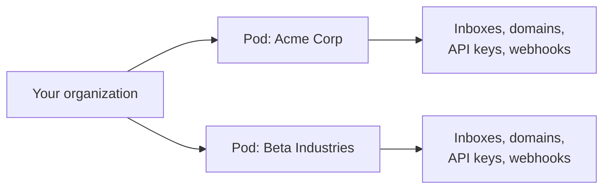

<Visibility for="humans">


This page is a guide to building a platform that gives your end customers email addresses of their own.

AgentMail's unit for this is the **pod**, an isolated grouping that sits between your organization and your inboxes.

Create one pod per customer and it becomes the boundary between them:

- API keys can be scoped to a single pod
- Each customer's mail and data stay private
- Allow and block lists live per pod



Every organization starts with one pod, the Default Pod, created at sign-up. Its `pod_id` is the same value as your `organization_id`, and everything you create without naming a pod lands in it.

There is no hard limit on how many pods you add beyond it. If you only manage email for yourself, the Default Pod already holds everything and you never need to reference a pod at all.

## Use pods to isolate

Everything a tenant owns hangs off their pod, so one `pod_id` reaches all of it, and each row stays private to that tenant:

| Resource | What you isolate with it |
| --- | --- |
| Inboxes | The tenant's addresses: create, list, get, update, and delete them. |
| Threads | The tenant's conversations across all their inboxes, attachments included. |
| Drafts | The tenant's pending drafts. |
| Domains | The tenant's sending domains and their full lifecycle, zone file included. |
| Lists | The tenant's allow and block lists, private to their pod. |
| Metrics | Usage and event metrics for this tenant alone. |
| Webhooks | Webhooks pinned to this tenant's events. |
| API keys | Keys that can act only inside this tenant's pod. |

Two boundaries to keep in mind:

- Pods isolate data access, not email delivery. Inboxes in different pods can email each other like any two addresses.
- An inbox stays in the pod it was created in. To move an address's work into another pod, create a new inbox there.

These views across all of a tenant's inboxes are what you build tenant dashboards from. "All unread conversations for Acme" is one call:

<CodeGroup>

```bash CLI
agentmail pods:threads list \
  --pod-id "<pod_id>" \
  --label unread
```

```bash API
curl "https://api.agentmail.to/v0/pods/<pod_id>/threads?labels=unread" \
  -H "Authorization: Bearer $AGENTMAIL_API_KEY"
```

```typescript TypeScript
const threads = await client.pods.threads.list("<pod_id>", {
  labels: ["unread"],
});
for (const thread of threads.threads) {
  console.log(thread.inboxId, thread.subject);
}
```

```python Python
threads = client.pods.threads.list(pod_id="<pod_id>", labels=["unread"])
for thread in threads.threads:
    print(thread.inbox_id, thread.subject)
```

</CodeGroup>


```json Sample response
{
  "count": 1,
  "threads": [
    {
      "organization_id": "1a2b3c4d-5e6f-4a1b-8c2d-3e4f5a6b7c8d",
      "pod_id": "2b3c4d5e-6f7a-4b2c-8d3e-4f5a6b7c8d9e",
      "inbox_id": "support@example.com",
      "thread_id": "4d5e6f7a-8b9c-4d4e-8f5a-6b7c8d9e0f1a",
      "labels": ["received", "unread"],
      "timestamp": "2026-08-25T10:31:07Z",
      "received_timestamp": "2026-08-25T10:31:07Z",
      "senders": ["A Customer <you@example.com>"],
      "recipients": ["support@example.com"],
      "subject": "Question about my order",
      "preview": "Hi, could you check the status of order 4417?",
      "last_message_id": "<010001a02e0497eb-1a2b3c4d-5e6f-4a1b-8c2d-3e4f5a6b7c8d-000000@email.amazonses.com>",
      "message_count": 1,
      "size": 4619,
      "created_at": "2026-08-25T10:31:07Z",
      "updated_at": "2026-08-25T10:31:07Z"
    }
  ]
}
```

Usage is a per-tenant view too. A pod's usage metrics report inbox, message, thread, and domain counts plus storage bytes as running totals, the numbers you meter when you bill customers by usage:

<CodeGroup>

```bash API
curl "https://api.agentmail.to/v0/pods/<pod_id>/metrics/usage?usage_types=inbox_count,storage_bytes&period=86400" \
  -H "Authorization: Bearer $AGENTMAIL_API_KEY"
```

```typescript TypeScript
const usage = await client.pods.metrics.queryUsage("<pod_id>", {
  usageTypes: ["inbox_count", "storage_bytes"],
  period: 86400,
});
```

```python Python
usage = client.pods.metrics.query_usage(
    pod_id="<pod_id>",
    usage_types=["inbox_count", "storage_bytes"],
    period=86400,
)
```

</CodeGroup>

Each usage type comes back as cumulative `{ timestamp, value }` points, and the newest point carries the current total:

```json Sample response
{
  "inbox_count": [
    { "timestamp": "2026-08-25T00:00:00Z", "value": 3 },
    { "timestamp": "2026-08-25T10:41:14.207Z", "value": 4 }
  ],
  "storage_bytes": [
    { "timestamp": "2026-08-25T00:00:00Z", "value": 453786 },
    { "timestamp": "2026-08-25T10:41:14.207Z", "value": 560307 }
  ]
}
```

Windows, resolution, the full list of usage types, and the event-count variant are on [Plans and Usage Tracking](/advanced/plans-and-usage#measure-your-usage).

Keys follow the same boundary. Your own organization-level key reaches every pod, so it stays on your platform's side and never goes to a tenant. A pod-scoped key can make every call inside its pod and none outside it, and code holding one can [discover its own boundary at runtime](/architecture#keys-and-scopes) instead of being told separately. Two ways to narrow a tenant's access further:

- Inbox-scoped keys grant a single inbox and its messages, threads, and drafts. Mint one (`client.inboxes.apiKeys.create`) for an agent that runs one address.
- A `permissions` object on any key create acts as a whitelist: only the operations you set to `true` are allowed. Permissions intersect with the key's scope, and a key can never create a child key more powerful than itself.

A tenant holding a pod-scoped key also never has to name the pod: the plain inbox, thread, and draft calls resolve to the key's own pod, so code written for a single-tenant setup runs unchanged when a tenant runs it ([how scope shapes requests](/architecture#keys-and-scopes)).

## Route events per tenant

One organization-wide webhook receives every tenant's events, which leaves your receiver to split them apart. Two ways to avoid that:

- `pod_ids` on an organization webhook delivers only events from those pods. A webhook can watch at most 10 pods and inboxes combined.
- Creating the webhook inside the pod (`client.pods.webhooks.create`) pins it to the tenant for good, and the tenant's own pod-scoped key can manage it.

<CodeGroup>

```bash CLI
agentmail webhooks create \
  --url "https://example.com/hooks/acme" \
  --event-type message.received \
  --pod-id '["<pod_id>"]'
```

```bash API
curl -X POST "https://api.agentmail.to/v0/webhooks" \
  -H "Authorization: Bearer $AGENTMAIL_API_KEY" \
  -H "Content-Type: application/json" \
  -d '{
    "url": "https://example.com/hooks/acme",
    "event_types": ["message.received"],
    "pod_ids": ["<pod_id>"]
  }'
```

```typescript TypeScript
const webhook = await client.webhooks.create({
  url: "https://example.com/hooks/acme",
  eventTypes: ["message.received"],
  podIds: ["<pod_id>"],
});
console.log(webhook.webhookId, webhook.secret);
```

```python Python
webhook = client.webhooks.create(
    url="https://example.com/hooks/acme",
    event_types=["message.received"],
    pod_ids=["<pod_id>"],
)
print(webhook.webhook_id, webhook.secret)
```

</CodeGroup>

Save the `secret`. Your receiver verifies delivery signatures with it. Signature verification, retries, the full event catalog, and routing to single inboxes with `inbox_ids` are all on [Webhooks](/advanced/webhooks).

```json Sample response
{
  "organization_id": "1a2b3c4d-5e6f-4a1b-8c2d-3e4f5a6b7c8d",
  "webhook_id": "ep_1a2b3c4d5e6f7a8b9c0d1e2f3a4",
  "url": "https://example.com/hooks/acme",
  "event_types": ["message.received"],
  "pod_ids": ["2b3c4d5e-6f7a-4b2c-8d3e-4f5a6b7c8d9e"],
  "secret": "whsec_1a2b3c4d5e6f7a8b9c0d1e2f3a4b5c6d",
  "enabled": true,
  "updated_at": "2026-08-25T10:19:41Z",
  "created_at": "2026-08-25T10:19:41Z"
}
```

An organization holds at most 50 webhooks. On a platform with more tenants than that, point several pods at one endpoint and attribute events by the `inbox_id` every payload carries, since your platform knows which pod each inbox belongs to.

## Provision a pod

Creating a pod takes two optional strings. `name` is a human-readable label for listings and defaults to `My Pod`. `client_id` is your own identifier for the tenant, usually the customer's id in your database.

Set `client_id` on every pod you create. It makes the create idempotent: creating again with the same `client_id` returns the existing pod instead of a duplicate, even when the request carries a different `name`. Onboarding becomes safe to retry, a repeat create doubles as a lookup, and you never need a table mapping your customer ids to `pod_id`s. Both fields are set once, at creation.

<CodeGroup>

```bash CLI
agentmail pods create \
  --name "Acme Corp" \
  --client-id "customer-042"
```

```bash API
curl -X POST "https://api.agentmail.to/v0/pods" \
  -H "Authorization: Bearer $AGENTMAIL_API_KEY" \
  -H "Content-Type: application/json" \
  -d '{ "name": "Acme Corp", "client_id": "customer-042" }'
```

```typescript TypeScript
const pod = await client.pods.create({
  name: "Acme Corp",
  clientId: "customer-042",
});
console.log(pod.podId);
```

```python Python
pod = client.pods.create(name="Acme Corp", client_id="customer-042")
print(pod.pod_id)
```

</CodeGroup>

```json Sample response
{
  "organization_id": "1a2b3c4d-5e6f-4a1b-8c2d-3e4f5a6b7c8d",
  "pod_id": "2b3c4d5e-6f7a-4b2c-8d3e-4f5a6b7c8d9e",
  "client_id": "customer-042",
  "name": "Acme Corp",
  "updated_at": "2026-08-25T10:18:54Z",
  "created_at": "2026-08-25T10:18:54Z"
}
```

`pod_id` is the tenant's handle for everything that follows. It goes in the path of every pod-scoped call, and it is the value API keys and webhooks use to pin themselves to this customer. Get one pod by `pod_id` anytime, or list them all, newest first and [paginated](/integrations/sdks-and-cli#pagination); the Default Pod is the entry whose `pod_id` equals your `organization_id`.

Onboarding a tenant end to end is four calls: create the pod, add their domain to it, create their first inbox, and mint an API key that can touch only their pod.

<CodeGroup>

```bash CLI
# 1. an isolated pod for the customer
agentmail pods create --client-id "customer-042" --name "Acme Corp"

# 2. the customer's domain, inside their pod
agentmail pods:domains create --pod-id "<pod_id>" --domain "example.com"

# 3. a first inbox (on agentmail.to until the domain verifies)
agentmail pods:inboxes create \
  --pod-id "<pod_id>" \
  --username "acme-support" \
  --display-name "Acme Support"

# 4. an API key that can only act inside this pod
agentmail pods:api-keys create --pod-id "<pod_id>" --name "acme-tenant-key"
```

```bash API
curl -X POST "https://api.agentmail.to/v0/pods" \
  -H "Authorization: Bearer $AGENTMAIL_API_KEY" \
  -H "Content-Type: application/json" \
  -d '{ "client_id": "customer-042", "name": "Acme Corp" }'

curl -X POST "https://api.agentmail.to/v0/pods/<pod_id>/domains" \
  -H "Authorization: Bearer $AGENTMAIL_API_KEY" \
  -H "Content-Type: application/json" \
  -d '{ "domain": "example.com" }'

curl -X POST "https://api.agentmail.to/v0/pods/<pod_id>/inboxes" \
  -H "Authorization: Bearer $AGENTMAIL_API_KEY" \
  -H "Content-Type: application/json" \
  -d '{ "username": "acme-support", "display_name": "Acme Support" }'

curl -X POST "https://api.agentmail.to/v0/pods/<pod_id>/api-keys" \
  -H "Authorization: Bearer $AGENTMAIL_API_KEY" \
  -H "Content-Type: application/json" \
  -d '{ "name": "acme-tenant-key" }'
```

```typescript TypeScript
async function onboardTenant(tenantId: string, domainName: string) {
  const pod = await client.pods.create({ clientId: tenantId });

  const domain = await client.pods.domains.create(pod.podId, {
    domain: domainName,
  });

  // on agentmail.to until the domain verifies
  const inbox = await client.pods.inboxes.create(pod.podId, {
    username: "acme-support",
    displayName: "Acme Support",
  });

  const key = await client.pods.apiKeys.create(pod.podId, {
    name: `${tenantId}-key`,
  });

  return {
    podId: pod.podId,
    inboxId: inbox.inboxId,
    dnsRecords: domain.records, // the customer adds these to their DNS
    tenantApiKey: key.apiKey, // shown only this once, deliver securely
  };
}
```

```python Python
def onboard_tenant(tenant_id: str, domain_name: str):
    pod = client.pods.create(client_id=tenant_id)

    domain = client.pods.domains.create(pod_id=pod.pod_id, domain=domain_name)

    # on agentmail.to until the domain verifies
    inbox = client.pods.inboxes.create(
        pod_id=pod.pod_id,
        username="acme-support",
        display_name="Acme Support",
    )

    key = client.pods.api_keys.create(pod_id=pod.pod_id, name=f"{tenant_id}-key")

    return {
        "pod_id": pod.pod_id,
        "inbox_id": inbox.inbox_id,
        "dns_records": domain.records,  # the customer adds these to their DNS
        "tenant_api_key": key.api_key,  # shown only this once, deliver securely
    }
```

</CodeGroup>

Three things to know about the middle two calls:

- The domain create returns the DNS `records` the customer must add. Inboxes can be created on the domain only after it reaches `VERIFIED`, so start tenants on `@agentmail.to` and create inboxes on their own domain when the `domain.verified` event fires. The full domain lifecycle is on [Custom domains](/advanced/custom-domains).
- A domain belongs to exactly one pod, or to every pod when created at the organization level. It cannot be shared by a subset of pods.
- The inbox create takes the same fields as anywhere else: `username`, `domain`, `display_name`, `client_id`, and `metadata`, all optional.

The key response includes the full `api_key` only this once. Deliver it to the tenant's service securely. A lost key cannot be read again, so delete it and create a replacement instead:

```json Sample response
{
  "organization_id": "1a2b3c4d-5e6f-4a1b-8c2d-3e4f5a6b7c8d",
  "pod_id": "2b3c4d5e-6f7a-4b2c-8d3e-4f5a6b7c8d9e",
  "api_key_id": "3c4d5e6f-7a8b-4c3d-9e4f-5a6b7c8d9e0f",
  "prefix": "am_us_1a2b3c",
  "name": "acme-tenant-key",
  "created_at": "2026-08-25T10:20:11Z",
  "api_key": "am_us_1a2b3c4d5e6f7a8b9c0d1e2f3a4b5c6d7e8f9a0b1c2d3e4f5a6b7c8d9e0f1a2b"
}
```

Store the `api_key_id` on your side. It is what the list and delete calls take. The `prefix` is the key's first characters, enough to tell keys apart in a dashboard without holding the secret.

<Accordion title="Troubleshooting">

- **The pod create returns a `403 missing_permission`.** Your key carries a permissions whitelist without `pod_create`. Keys created without a whitelist have every permission.
- **A pod get returns a `404` with "Pod not found".** The id does not match a pod visible to your key (usually a typo in the `pod_id`, or a key scoped to a different pod).

</Accordion>

## Decommission a pod

A pod can only be deleted once it is empty, so tear the tenant down from the bottom up:

- Delete the tenant's inboxes. Deleting an inbox permanently removes its messages, threads, and drafts, so there is no per-message cleanup.
- Delete the pod's API keys, so no credential outlives the tenant.
- Delete the pod's domains and webhooks, so nothing keeps pointing at a customer who is gone.

Then delete the pod itself. Success is a `204` with no body, and the pod disappears from the list.

<CodeGroup>

```bash CLI
# empty the pod first
agentmail pods:inboxes list --pod-id "<pod_id>"
agentmail pods:inboxes delete --pod-id "<pod_id>" --inbox-id "<inbox_id>"

agentmail pods:api-keys list --pod-id "<pod_id>"
agentmail pods:api-keys delete --pod-id "<pod_id>" --api-key-id "<api_key_id>"

agentmail pods:domains list --pod-id "<pod_id>"
agentmail pods:domains delete --pod-id "<pod_id>" --domain-id "<domain_id>"

# then delete the pod itself
agentmail pods delete --pod-id "<pod_id>"
```

```bash API
curl -X DELETE "https://api.agentmail.to/v0/pods/<pod_id>/inboxes/<inbox_id>" \
  -H "Authorization: Bearer $AGENTMAIL_API_KEY"

curl -X DELETE "https://api.agentmail.to/v0/pods/<pod_id>/api-keys/<api_key_id>" \
  -H "Authorization: Bearer $AGENTMAIL_API_KEY"

curl -X DELETE "https://api.agentmail.to/v0/pods/<pod_id>/domains/<domain_id>" \
  -H "Authorization: Bearer $AGENTMAIL_API_KEY"

curl -X DELETE "https://api.agentmail.to/v0/pods/<pod_id>" \
  -H "Authorization: Bearer $AGENTMAIL_API_KEY"
```

```typescript TypeScript
async function offboardTenant(podId: string) {
  const inboxes = await client.pods.inboxes.list(podId);
  for (const inbox of inboxes.inboxes) {
    await client.pods.inboxes.delete(podId, inbox.inboxId);
  }

  const keys = await client.pods.apiKeys.list(podId);
  for (const key of keys.apiKeys) {
    await client.pods.apiKeys.delete(podId, key.apiKeyId);
  }

  const domains = await client.pods.domains.list(podId);
  for (const domain of domains.domains) {
    await client.pods.domains.delete(podId, domain.domainId);
  }

  await client.pods.delete(podId);
}
```

```python Python
def offboard_tenant(pod_id: str):
    inboxes = client.pods.inboxes.list(pod_id=pod_id)
    for inbox in inboxes.inboxes:
        client.pods.inboxes.delete(pod_id=pod_id, inbox_id=inbox.inbox_id)

    keys = client.pods.api_keys.list(pod_id=pod_id)
    for key in keys.api_keys:
        client.pods.api_keys.delete(pod_id=pod_id, api_key_id=key.api_key_id)

    domains = client.pods.domains.list(pod_id=pod_id)
    for domain in domains.domains:
        client.pods.domains.delete(pod_id=pod_id, domain_id=domain.domain_id)

    client.pods.delete(pod_id=pod_id)
```

</CodeGroup>

Deleting a pod releases its `client_id`. If the customer ever comes back, the same id creates a fresh pod with a new `pod_id` and none of the old data.

<Accordion title="Troubleshooting">

When the delete is refused, the response is a `409` with the code `cannot_delete`:

- A pod that still holds inboxes or pod-scoped API keys returns it with a message naming the blocker, such as "Cannot delete pod with existing inboxes". Delete those resources and retry.
- The Default Pod always returns it. That block is permanent, so do not retry it:

```json 409 Sample response
{
  "name": "CannotDeleteError",
  "code": "cannot_delete",
  "message": "Cannot delete Pod: Cannot delete default pod",
  "fix": "The default pod can never be deleted — do not retry. Create additional pods for groupings you may want to delete later.",
  "docs": "https://docs.agentmail.to/errors#cannot_delete"
}
```

- **The delete returns a `404 not_found`.** The `pod_id` is wrong or not visible to your key.

</Accordion>

## Next Steps

<CardGroup cols={2}>
  <Card title="Errors and Idempotency" icon="triangle-exclamation" href="/advanced/errors">
    The error codes and retry rules your provisioning code should handle.
  </Card>
  <Card title="Plans and Usage Tracking" icon="gauge" href="/advanced/plans-and-usage">
    Plan limits and the usage metrics you meter per tenant.
  </Card>
</CardGroup>

</Visibility>

<Visibility for="agents">

# Provision an isolated pod per customer

A pod is an isolated workspace inside your AgentMail organization, and nothing in one pod can see into another. Create one pod per tenant, provision domains, inboxes, scoped API keys, and webhooks inside it, and delete the pod when the tenant offboards.

## Do this

Onboard a tenant with four calls: create the pod, add the tenant's domain, create a first inbox, mint a pod-scoped key.

```bash
# 1. Create the tenant's pod. client_id is your own tenant id and makes the
#    create idempotent: repeating with the same client_id returns the existing pod.
curl -X POST "https://api.agentmail.to/v0/pods" \
  -H "Authorization: Bearer $AGENTMAIL_API_KEY" \
  -H "Content-Type: application/json" \
  -d '{ "client_id": "customer-042", "name": "Acme Corp" }'
# save pod_id from the response, it goes in the path of every call below

# 2. Add the tenant's domain to the pod. The response carries the DNS records
#    the tenant must add.
curl -X POST "https://api.agentmail.to/v0/pods/$POD_ID/domains" \
  -H "Authorization: Bearer $AGENTMAIL_API_KEY" \
  -H "Content-Type: application/json" \
  -d '{ "domain": "example.com" }'

# 3. Create a first inbox, on agentmail.to until the domain verifies.
curl -X POST "https://api.agentmail.to/v0/pods/$POD_ID/inboxes" \
  -H "Authorization: Bearer $AGENTMAIL_API_KEY" \
  -H "Content-Type: application/json" \
  -d '{ "username": "acme-support", "display_name": "Acme Support" }'

# 4. Mint a key that can act only inside this pod. The response includes the
#    full api_key exactly once. Deliver it to the tenant securely.
curl -X POST "https://api.agentmail.to/v0/pods/$POD_ID/api-keys" \
  -H "Authorization: Bearer $AGENTMAIL_API_KEY" \
  -H "Content-Type: application/json" \
  -d '{ "name": "acme-tenant-key" }'
```

Create inboxes on the tenant's own domain when the `domain.verified` event fires.

## SDK

Install: `npm install -g agentmail-cli` (CLI), `npm install agentmail` (TypeScript), `pip install agentmail` (Python).

| Operation | CLI | TypeScript | Python |
| --- | --- | --- | --- |
| Create pod | `agentmail pods create --client-id "customer-042" --name "Acme Corp"` | `client.pods.create({ clientId, name })` | `client.pods.create(client_id=..., name=...)` |
| List and get pods | `agentmail pods list` and `agentmail pods get --pod-id "..."` | `client.pods.list()` and `client.pods.get("<pod_id>")` | `client.pods.list()` and `client.pods.get(pod_id=...)` |
| Add domain | `agentmail pods:domains create --pod-id "..." --domain "example.com"` | `client.pods.domains.create(podId, { domain })` | `client.pods.domains.create(pod_id=..., domain=...)` |
| Create inbox | `agentmail pods:inboxes create --pod-id "..." --username "..."` | `client.pods.inboxes.create(podId, { username, displayName })` | `client.pods.inboxes.create(pod_id=..., username=..., display_name=...)` |
| Mint pod key | `agentmail pods:api-keys create --pod-id "..." --name "..."` | `client.pods.apiKeys.create(podId, { name })` | `client.pods.api_keys.create(pod_id=..., name=...)` |
| Tenant thread view | `agentmail pods:threads list --pod-id "..." --label unread` | `client.pods.threads.list(podId, { labels })` | `client.pods.threads.list(pod_id=..., labels=[...])` |
| Tenant webhook | `agentmail webhooks create --url "..." --event-type message.received --pod-id '["<pod_id>"]'` | `client.webhooks.create({ url, eventTypes, podIds })` | `client.webhooks.create(url=..., event_types=[...], pod_ids=[...])` |
| Empty the pod | `agentmail pods:inboxes delete`, `pods:api-keys delete`, `pods:domains delete` | `client.pods.inboxes.delete(podId, inboxId)`, same shape for `apiKeys` and `domains` | `client.pods.inboxes.delete(pod_id=..., inbox_id=...)`, same shape for `api_keys` and `domains` |
| Delete pod | `agentmail pods delete --pod-id "..."` | `client.pods.delete(podId)` | `client.pods.delete(pod_id=...)` |

Client setup and the full surface reference: /integrations/sdks-and-cli

## Facts

- `POST /v0/pods` takes two optional strings, `name` (a label for listings, defaults to `My Pod`) and `client_id` (your tenant's id in your own database). Both are set once, at creation.
- Repeating `POST /v0/pods` with the same `client_id` returns the existing pod instead of creating a duplicate, even when the request carries a different `name`. A repeat create doubles as a lookup.
- Every organization starts with a Default Pod whose `pod_id` equals the `organization_id`. Everything created without naming a pod lands in the Default Pod.
- There is no hard limit on the number of pods beyond the Default Pod.
- Pods isolate data access, not email delivery. Inboxes in different pods can email each other like any two addresses.
- `GET /v0/pods` returns pods newest first with a `next_page_token` when more remain. Params: `limit` (integer), `page_token` (string), `ascending` (boolean, oldest first).
- `POST /v0/pods/{pod_id}/domains` returns the DNS `records` the tenant must add. Inboxes can be created on the domain only after it reaches `VERIFIED`.
- A domain belongs to exactly one pod, or to every pod when created at the organization level.
- `POST /v0/pods/{pod_id}/inboxes` takes `username`, `domain`, `display_name`, `client_id`, and `metadata`, all optional.
- `POST /v0/pods/{pod_id}/api-keys` returns the full `api_key` only in the create response. Store the `api_key_id`, the value list and delete calls take. `prefix` is the key's first characters, for telling keys apart in a dashboard.
- A pod-scoped key can make every call inside its pod and none outside it. An organization-level key reaches every pod, so it stays on the platform side and never goes to a tenant.
- `GET /v0/auth/me` tells a key its own `pod_id` and scope, so a tenant's service discovers its boundary at runtime.
- `POST /v0/inboxes/{inbox_id}/api-keys` (`client.inboxes.apiKeys.create`) mints an inbox-scoped key granting a single inbox and its messages, threads, and drafts.
- A `permissions` object on any key create is a whitelist: only operations set to `true` are allowed, and permissions intersect with the key's scope. Keys created without a whitelist have every permission.
- Resource routes under `/v0/pods/{pod_id}`: `/inboxes`, `/threads`, `/drafts`, `/domains`, `/lists`, `/metrics`, `/webhooks`, `/api-keys`.
- `GET /v0/pods/{pod_id}/threads` takes the same filters as the inbox thread list: `labels`, `senders`, `recipients`, `subject`, `before`, `after`, and the `include_*` flags. Each entry carries its `inbox_id`.
- `GET /v0/pods/{pod_id}/metrics/usage` reports the tenant's inbox, message, thread, and domain counts plus storage bytes, the numbers to meter when billing customers by usage.
- With a pod-scoped key, unprefixed paths such as `/v0/inboxes` resolve to the key's own pod, so code written against the normal paths runs unchanged for a tenant.
- `pod_ids` on `POST /v0/webhooks` delivers only events from the listed pods. A webhook can watch at most 10 pods and inboxes combined.
- A webhook created at `POST /v0/pods/{pod_id}/webhooks` is pinned to that pod for good, and the tenant's own pod-scoped key can manage it.
- An organization holds at most 50 webhooks. With more tenants than that, point several pods at one endpoint and attribute events by the `inbox_id` every payload carries.
- Save the webhook `secret` from the create response. The receiver verifies delivery signatures with it.
- `DELETE /v0/pods/{pod_id}` succeeds only on an empty pod. Success is `204` with no body.
- Deleting an inbox permanently removes its messages, threads, and drafts.
- Deleting a pod releases its `client_id`. The same `client_id` then creates a fresh pod with a new `pod_id` and none of the old data.

## Not supported

- An inbox cannot move between pods. Create a new inbox in the target pod instead.
- A domain cannot be shared by a subset of pods. It belongs to one pod or to every pod.
- The Default Pod can never be deleted. Its `409 cannot_delete` is permanent, do not retry.
- A pod that still holds inboxes or pod-scoped API keys cannot be deleted. Empty it first.
- A lost `api_key` cannot be read again after creation. Delete the key and create a replacement.
- Pod `name` and `client_id` cannot be changed after creation.
- A key can never create a child key more powerful than itself.

## Errors

| Error | HTTP | Cause | Fix |
| --- | --- | --- | --- |
| `missing_permission` | 403 | The key carries a permissions whitelist without `pod_create` | Use a key that has `pod_create`, or one created without a whitelist |
| `not_found` | 404 | The `pod_id` is wrong or not visible to the key (typo, or key scoped to a different pod) | Check the `pod_id`, or call with a key that can see the pod |
| `cannot_delete` | 409 | The pod still holds inboxes or pod-scoped API keys, or it is the Default Pod | Delete the blocking resources named in the message and retry. Never retry the Default Pod delete |

## Verify

```bash
curl "https://api.agentmail.to/v0/pods/$POD_ID" \
  -H "Authorization: Bearer $AGENTMAIL_API_KEY"
```

`200` with a pod object echoing `pod_id` and `client_id` confirms the tenant is provisioned. After offboarding, the same call returns `404` and the pod is gone from `GET /v0/pods`.

## Related

- /advanced/errors - the error codes and retry rules provisioning code should handle
- /advanced/plans-and-usage - plan limits and the usage metrics to meter per tenant
- /advanced/custom-domains - the full domain verification lifecycle
- /advanced/webhooks - signature verification, retries, and the event catalog
- /core/conversations - the thread filters the pod thread list shares
- /quickstart - get an API key first

</Visibility>
