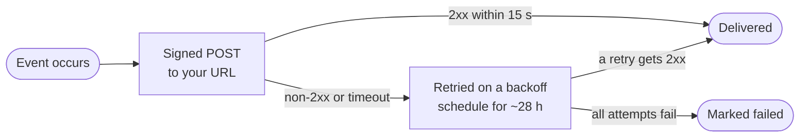

<Visibility for="humans">


<Info>If you don't have an API key yet, follow the [Quickstart](/quickstart) first.</Info>

A webhook is a subscription: you register an HTTPS URL and AgentMail sends it a signed `POST` request every time a subscribed event happens, so your agent reacts in seconds instead of asking the API over and over. 

Use [WebSockets](/advanced/websockets) when your agent has no public URL, which is common in local development and for desktop agents. They carry the same events over a persistent connection with no tunnel or hosting required.

## Events reference

| Event | Fires when | Use it for |
| --- | --- | --- |
| `message.received` | A received email is processed into one of your inboxes | Standard inbound mail workflows |
| `message.received.spam` | A received email is classified as spam | Spam review or quarantine workflows |
| `message.received.blocked` | A received email matches a block list entry from your [inbound rules](/core/inbound-control) | Block list auditing |
| `message.received.unauthenticated` | A received email arrives without authentication headers, so the sender cannot be verified | Deciding whether to trust unverified senders |
| `message.sent` | A message successfully leaves AgentMail's servers | Sent-mail tracking and follow-up workflows |
| `message.delivered` | The recipient's mail server confirms it accepted the message | Delivery tracking |
| `message.bounced` | A sent message fails to deliver and bounces back | Suppression and remediation |
| `message.complained` | A recipient reports your message as spam | Complaint handling and sender reputation |
| `message.rejected` | A send is rejected before it goes out (validation or policy) | Send validation handling |
| `message.opened` | A tracked message is opened for the first time | Timing follow-ups, measuring engagement |
| `domain.verified` | A custom domain finishes verification | Starting work that waited on the domain |

What to know when picking from this list:

- The spam, blocked, and unauthenticated variants replace `message.received` for the mail they cover. A message classified as spam fires only `message.received.spam`, never `message.received`, so include each variant your agent should see.
- Subscribing to `message.received.spam`, `message.received.blocked`, or `message.received.unauthenticated` requires the API key creating the webhook to hold the matching label permission (`label_spam_read`, `label_blocked_read`, or `label_unauthenticated_read`).
- `message.sent` fires for your own outgoing mail. An inbound agent that subscribes to it must not treat those events as new work, or it will answer its own messages in a loop.
- `message.sent` and `message.delivered` are different stages: `sent` means the message left AgentMail's servers, `delivered` means the receiving server answered that it accepted it. Delivered does not mean it landed in the recipient's primary inbox. The provider decides placement after accepting.
- `message.opened` fires once per message, on the first open. It requires `track_opens` on the send, a custom domain with tracking enabled, and an HTML body. One tracking pixel is injected per message, so a message with several recipients fires a single event without identifying who opened it. Clients that block remote images suppress opens, and image proxies can register an open within seconds of delivery without anyone reading the message.
- After a hard bounce, spam complaint, or unsubscribe, AgentMail stops future sends to that address to protect your [deliverability](/advanced/deliverability). Keep your account bounce rate under 2 percent. A rate above 10 percent across 50 or more recent sends flags the account for review.

<Accordion title="Troubleshooting">

- **Subscribing to `message.opened` currently returns a `400`** saying the type does not exist. Track opens through the message's `opened` label until subscriptions accept it.
- **Creating or updating the webhook returns a `403`.** The key lacks the matching label permission for the restricted receive variant it subscribes to.

</Accordion>

## Create a webhook

Creating a webhook registers your URL and the events it should receive. `url` and `event_types` are required, everything else narrows or annotates the subscription. The full parameter list is below the code.

<CodeGroup>

```bash CLI
agentmail webhooks create \
  --url "https://worker.example.com/webhooks" \
  --event-type message.received \
  --event-type message.bounced \
  --client-id "inbound-agent-v1"
```

```bash API
curl -X POST "https://api.agentmail.to/v0/webhooks" \
  -H "Authorization: Bearer $AGENTMAIL_API_KEY" \
  -H "Content-Type: application/json" \
  -d '{
    "url": "https://worker.example.com/webhooks",
    "event_types": ["message.received", "message.bounced"],
    "client_id": "inbound-agent-v1"
  }'
```

```typescript TypeScript
const webhook = await client.webhooks.create({
  url: "https://worker.example.com/webhooks",
  eventTypes: ["message.received", "message.bounced"],
  clientId: "inbound-agent-v1",
});
console.log(webhook.webhookId, webhook.secret);
```

```python Python
webhook = client.webhooks.create(
    url="https://worker.example.com/webhooks",
    event_types=["message.received", "message.bounced"],
    client_id="inbound-agent-v1",
)
print(webhook.webhook_id, webhook.secret)
```

</CodeGroup>

| Param | Type | What it means |
| --- | --- | --- |
| `url` | string | The HTTPS endpoint deliveries go to. Plain `http` URLs are rejected. |
| `event_types` | string[] | The full list of event types to deliver, at least one. The webhook receives exactly the types you list. |
| `client_id` | string | Your own stable id for this subscription. Creating again with the same `client_id` returns the existing webhook instead of a duplicate, which makes creation safe to retry. |
| `inbox_ids` | string[] | Only deliver events for these inboxes. Omit both filters to receive events for the whole organization. |
| `pod_ids` | string[] | Only deliver events for these pods. |
| `headers` | map of string to string | Custom HTTP headers sent with every delivery. Values are write-only. See [custom headers](#send-custom-headers-with-every-delivery). |

A webhook can watch at most 10 inboxes and pods combined. A retried create with a known `client_id` returns the existing webhook as it is and ignores any new `url` or `event_types` in the request. Use [update](#update-a-webhook) to change an existing subscription.

The response is the webhook object. `webhook_id` addresses every management call that follows, and `secret` is what your receiver verifies signatures with. Save the secret in your receiver's secret store right away.

```json Sample response
{
  "organization_id": "1a2b3c4d-5e6f-4a1b-8c2d-3e4f5a6b7c8d",
  "webhook_id": "ep_1a2b3c4d5e6f7a8b9c0d1e2f3a4",
  "client_id": "inbound-agent-v1",
  "url": "https://worker.example.com/webhooks",
  "event_types": ["message.bounced", "message.received"],
  "secret": "whsec_1a2b3c4d5e6f7a8b9c0d1e2f3a4b5c6d",
  "enabled": true,
  "updated_at": "2026-08-25T09:00:00Z",
  "created_at": "2026-08-25T09:00:00Z"
}
```

`enabled` tells you whether deliveries are active, see [what happens when deliveries keep failing](#acknowledge-delivery). If you lose the secret, [get the webhook by id](#list-and-inspect-your-webhooks) to read it again.

You can also create a webhook from the [Console](https://console.agentmail.to): open **Webhooks** in the sidebar, click **Create Webhook**, paste your URL, pick the events, and copy the signing secret.

<Accordion title="Troubleshooting">

If creation fails, here are the possible causes:

- `400 validation_error` when `event_types` is missing or empty, names an event type that does not exist, or the `url` is not HTTPS.
- `403` with `label_spam_read is forbidden` (or the `label_blocked_read` / `label_unauthenticated_read` equivalent) when you subscribe to a restricted receive variant without that permission on your key.
- `403 limit_exceeded` when the webhook would watch more than 10 inboxes and pods combined, or when the organization already has 50 webhooks.

</Accordion>

## Verify the signature on every delivery

Without verification, anyone who discovers your URL can post fake events and trigger your agent. Every delivery is signed with the webhook's `secret` (it starts with `whsec_`) and carries three headers:

| Header | What it carries |
| --- | --- |
| `svix-id` | Unique delivery id. Retries of the same event reuse it. |
| `svix-timestamp` | Unix timestamp in seconds when the delivery was sent. |
| `svix-signature` | One or more signatures, space separated, each in the form `v1,<base64>`. |

AgentMail delivers through [Svix](https://www.svix.com/), so the `svix` libraries verify deliveries with one call. A minimal receiver that verifies before it does anything else:

<CodeGroup>

```typescript TypeScript
// npm install express svix
import express from "express";
import { Webhook } from "svix";

const app = express();
const verifier = new Webhook(process.env.AGENTMAIL_WEBHOOK_SECRET!);

app.post("/webhooks", express.raw({ type: "application/json" }), (req, res) => {
  let event: any;
  try {
    event = verifier.verify(req.body, req.headers as Record<string, string>);
  } catch {
    return res.status(400).send();
  }
  // hand the verified event to your queue or worker here
  console.log(event.event_type, event.event_id);
  res.status(200).send();
});

app.listen(3000);
```

```python Python
# pip install flask svix
import os
from flask import Flask, request
from svix.webhooks import Webhook, WebhookVerificationError

app = Flask(__name__)
verifier = Webhook(os.environ["AGENTMAIL_WEBHOOK_SECRET"])

@app.route("/webhooks", methods=["POST"])
def handle():
    try:
        verifier.verify(request.get_data(), request.headers)
    except WebhookVerificationError:
        return "", 400
    event = request.get_json()
    # hand the verified event to your queue or worker here
    print(event["event_type"], event["event_id"])
    return "", 200

app.run(port=3000)
```

</CodeGroup>

Run it with `npx tsx server.ts` (or `python server.py` for the Flask version) and it listens on port 3000. What makes verification succeed or fail:

- The signature covers the exact raw bytes of the body. A parsed and re-serialized payload fails the check, which is the most common cause of verification errors.
- Header names are matched case-insensitively. When the headers are missing entirely, a reverse proxy in front of your service is usually stripping them.
- Deliveries with a timestamp more than 5 minutes off fail verification, which blocks replayed requests. A wrong server clock trips the same check.
- Answer a failed verification with a `400` and do nothing else with the payload. Do not parse it, queue it, or call the AgentMail API with its contents.

## Handle the event

Every payload carries the same envelope: `type` is always `"event"`, `event_type` names what happened, `event_id` identifies this event for deduplication, and one event-specific object holds the details.

`message.received` and its spam, blocked, and unauthenticated variants are the only events that carry full data: a `message` object with the complete email and a `thread` object with conversation metadata such as `message_count`. If you need more metadata on other event types, email support@agentmail.cc.

```json Sample message.received payload
{
  "type": "event",
  "event_type": "message.received",
  "event_id": "1a2b3c4d-5e6f-4a1b-8c2d-3e4f5a6b7c8d",
  "message": {
    "organization_id": "1a2b3c4d-5e6f-4a1b-8c2d-3e4f5a6b7c8d",
    "inbox_id": "example@agentmail.to",
    "thread_id": "2b3c4d5e-6f7a-4b2c-9d3e-4f5a6b7c8d9e",
    "message_id": "<010001a02e0497eb-1a2b3c4d-5e6f-4a1b-8c2d-3e4f5a6b7c8d-000000@email.amazonses.com>",
    "labels": ["received"],
    "timestamp": "2026-08-25T09:00:00Z",
    "from": "You <you@example.com>",
    "from_": "You <you@example.com>",
    "to": ["example@agentmail.to"],
    "subject": "Question about my account",
    "preview": "Hi, I have a question about...",
    "text": "Hi, I have a question about my account.",
    "html": "<html>...</html>",
    "attachments": [
      {
        "attachment_id": "3c4d5e6f-7a8b-4c3d-8e4f-5a6b7c8d9e0f",
        "filename": "invoice.pdf",
        "content_type": "application/pdf",
        "size": 123456,
        "inline": false
      }
    ],
    "created_at": "2026-08-25T09:00:00Z",
    "updated_at": "2026-08-25T09:00:00Z"
  },
  "thread": {
    "inbox_id": "example@agentmail.to",
    "thread_id": "2b3c4d5e-6f7a-4b2c-9d3e-4f5a6b7c8d9e",
    "senders": ["You <you@example.com>"],
    "recipients": ["example@agentmail.to"],
    "subject": "Question about my account",
    "last_message_id": "<010001a02e0497eb-1a2b3c4d-5e6f-4a1b-8c2d-3e4f5a6b7c8d-000000@email.amazonses.com>",
    "message_count": 1,
    "created_at": "2026-08-25T09:00:00Z",
    "updated_at": "2026-08-25T09:00:00Z"
  }
}
```

Reading the payload:

- The sender appears as both `from` and `from_`. The underscore variant exists for Python, where `from` is a reserved word.
- `text` and `preview` can be absent when the sender's client produced HTML-only mail, common with Gmail and Outlook forwards. Treat `html` as the primary content source and `text` as optional.
- Attachment entries are metadata only. Download the file through the [attachments call](/core/receive#download-an-attachment-from-a-message) with the message's ids.
- The other events carry one small object named for the stage instead of `message` and `thread`: `send` and `delivery` hold the message ids and `recipients`, `bounce` adds a `type`, `sub_type`, and per-recipient status, `complaint` has its own `type` and `sub_type`, `reject` has a `reason`, `open` has the message ids and the open `timestamp`, and `domain` has the `domain_id`, `status`, and DNS `records`.

Most events arrive with the complete `text` and `html`, so your agent can act without another call. When a message's stored body is larger than 64 KB, which heavy HTML and inline images reach quickly, the event leaves the inline body out and carries only the metadata. When `text` and `html` are missing, fetch the message.

The event's `message.message_id` is the same id the messages API uses everywhere, in RFC 822 form with angle brackets. Pass it together with the event's `message.inbox_id`:

<CodeGroup>

```bash CLI
agentmail inboxes:messages get \
  --inbox-id "example@agentmail.to" \
  --message-id "<message_id>"
```

```bash API
curl "https://api.agentmail.to/v0/inboxes/example@agentmail.to/messages/<message_id>" \
  -H "Authorization: Bearer $AGENTMAIL_API_KEY"
```

```typescript TypeScript
const message = await client.inboxes.messages.get(
  event.message.inbox_id,
  event.message.message_id,
);
console.log(message.text ?? message.html);
```

```python Python
message = client.inboxes.messages.get(
    inbox_id=event["message"]["inbox_id"],
    message_id=event["message"]["message_id"],
)
print(message.text or message.html)
```

</CodeGroup>

A `message_id` contains `<`, `>`, and `@`, so URL-encode it when you build the API path by hand. The CLI and SDKs encode it for you.

## Acknowledge delivery



A delivery counts as acknowledged only when your endpoint returns a `2xx` status within 15 seconds. Anything else is a failure, including `3xx` redirects. After a failure the same event is retried automatically: immediately, then 5 seconds, 5 minutes, 30 minutes, 2 hours, 5 hours, 10 hours, and 10 hours after each preceding attempt. The final retry happens about 28 hours after the event, and a delivery that fails every attempt is marked failed and stops.

Design your receiver around that contract:

- Delivery is at least once. A receiver that times out or errors after doing the work sees the same event again, with the same `svix-id` header and the same `event_id` in the payload.
- Deduplicate the business action, not just the delivery. For inbound mail, record the event's `message.message_id` in a durable store with a unique constraint before queuing the work. When the insert conflicts, the event is a duplicate: acknowledge it with a `200` without queuing a second job, because the original delivery already owns that message.
- Return success only after the deduplication record and the queue handoff are durable. Acknowledging first and crashing loses the event, since an acknowledged delivery is never sent again.
- An endpoint that fails every delivery for about 5 days is disabled automatically. Its `enabled` flag turns `false` and deliveries stop. Fix the receiver, then create a fresh webhook and delete the disabled one.

## Scope a webhook to a pod or inbox

An organization webhook covers everything unless you narrow it with `inbox_ids` and `pod_ids`. When one tenant maps to one pod, or one agent maps to one inbox, create the webhook directly under that resource instead. The scope then comes from the path:

- An inbox-scoped webhook is fixed to its inbox. Only its `event_types` can change later.
- A pod-scoped webhook covers the whole pod, optionally narrowed to specific inboxes in it with `inbox_ids`. The pod itself cannot change later.
- An organization webhook can have its event types, inboxes, and pods all adjusted later.

<CodeGroup>

```bash CLI
# narrow an organization webhook to one pod
agentmail webhooks create \
  --url "https://worker.example.com/webhooks" \
  --event-type message.received \
  --pod-id '["1a2b3c4d-5e6f-4a1b-8c2d-3e4f5a6b7c8d"]'
```

```bash API
# webhook scoped to a single inbox
curl -X POST "https://api.agentmail.to/v0/inboxes/example@agentmail.to/webhooks" \
  -H "Authorization: Bearer $AGENTMAIL_API_KEY" \
  -H "Content-Type: application/json" \
  -d '{
    "url": "https://worker.example.com/webhooks",
    "event_types": ["message.received"]
  }'
```

```typescript TypeScript
// webhook scoped to a single pod
await client.pods.webhooks.create("<pod_id>", {
  url: "https://worker.example.com/webhooks",
  eventTypes: ["message.received"],
});

// webhook scoped to a single inbox
await client.inboxes.webhooks.create("example@agentmail.to", {
  url: "https://worker.example.com/webhooks",
  eventTypes: ["message.received"],
});
```

```python Python
# webhook scoped to a single pod
client.pods.webhooks.create(
    pod_id="<pod_id>",
    url="https://worker.example.com/webhooks",
    event_types=["message.received"],
)

# webhook scoped to a single inbox
client.inboxes.webhooks.create(
    inbox_id="example@agentmail.to",
    url="https://worker.example.com/webhooks",
    event_types=["message.received"],
)
```

</CodeGroup>

The scoped routes carry the same list, get, update, delete, and header operations as the organization ones, under `/v0/pods/<pod_id>/webhooks` and `/v0/inboxes/<inbox_id>/webhooks`.

Scoped webhooks pair with pod- and inbox-scoped API keys: such a key sees and manages only the webhooks within its scope, and a webhook it creates is automatically pinned there. Two rules follow from that:

- A scoped key cannot pass `inbox_ids` or `pod_ids` outside its own scope. A pod-scoped key may pass `inbox_ids` to narrow within its pod.
- A scoped webhook must always keep at least one inbox or pod subscription.

<Accordion title="Troubleshooting">

- **Passing `inbox_ids` or `pod_ids` wider than the key's own scope returns a `403`.**
- **An update that would remove a scoped webhook's last inbox or pod subscription is rejected.**

</Accordion>

## List and inspect your webhooks

Results cover every webhook visible to your API key, newest first, with `limit`, `page_token`, and `ascending` as optional paging parameters. List entries carry everything except the `secret`. To read a webhook's secret again, get it by its `webhook_id`:

<CodeGroup>

```bash CLI
agentmail webhooks list

agentmail webhooks get --webhook-id "<webhook_id>"
```

```bash API
curl "https://api.agentmail.to/v0/webhooks" \
  -H "Authorization: Bearer $AGENTMAIL_API_KEY"

curl "https://api.agentmail.to/v0/webhooks/<webhook_id>" \
  -H "Authorization: Bearer $AGENTMAIL_API_KEY"
```

```typescript TypeScript
const all = await client.webhooks.list();
console.log(all.count);

const webhook = await client.webhooks.get("<webhook_id>");
console.log(webhook.secret);
```

```python Python
all = client.webhooks.list()
print(all.count)

webhook = client.webhooks.get(webhook_id="<webhook_id>")
print(webhook.secret)
```

</CodeGroup>

`count` is the number of webhooks in the current page, and a `next_page_token` appears when more remain:

```json Sample response
{
  "count": 1,
  "webhooks": [
    {
      "organization_id": "1a2b3c4d-5e6f-4a1b-8c2d-3e4f5a6b7c8d",
      "webhook_id": "ep_1a2b3c4d5e6f7a8b9c0d1e2f3a4",
      "client_id": "inbound-agent-v1",
      "url": "https://worker.example.com/webhooks",
      "event_types": ["message.bounced", "message.received"],
      "enabled": true,
      "updated_at": "2026-08-25T09:00:00Z",
      "created_at": "2026-08-25T09:00:00Z"
    }
  ]
}
```

<Accordion title="Troubleshooting">

- **The get returns a `404` with "Webhook not found".** The `webhook_id` does not match a webhook visible to your key (a scoped key gets the same `404` for webhooks outside its scope).

</Accordion>

## Update a webhook

Updating changes what an existing subscription receives. Event types are replaced wholesale, while inbox and pod subscriptions change through add and remove lists. All parameters are optional:

<CodeGroup>

```bash CLI
agentmail webhooks update \
  --webhook-id "<webhook_id>" \
  --event-type '["message.received", "message.delivered"]'
```

```bash API
curl -X PATCH "https://api.agentmail.to/v0/webhooks/<webhook_id>" \
  -H "Authorization: Bearer $AGENTMAIL_API_KEY" \
  -H "Content-Type: application/json" \
  -d '{
    "event_types": ["message.received", "message.delivered"],
    "add_inbox_ids": ["example@agentmail.to"]
  }'
```

```typescript TypeScript
const webhook = await client.webhooks.update("<webhook_id>", {
  eventTypes: ["message.received", "message.delivered"],
  addInboxIds: ["example@agentmail.to"],
});
console.log(webhook.eventTypes, webhook.inboxIds);
```

```python Python
webhook = client.webhooks.update(
    webhook_id="<webhook_id>",
    event_types=["message.received", "message.delivered"],
    add_inbox_ids=["example@agentmail.to"],
)
print(webhook.event_types, webhook.inbox_ids)
```

</CodeGroup>

| Param | Type | What it means |
| --- | --- | --- |
| `event_types` | string[] | Replaces the subscribed list in full, the same "set the whole list" behavior as create. It is not a merge or diff, so send every type you want after the update. Omit it to leave the types unchanged. |
| `add_inbox_ids` | string[] | Inboxes to subscribe to the webhook. |
| `remove_inbox_ids` | string[] | Inboxes to unsubscribe from the webhook. |
| `add_pod_ids` | string[] | Pods to subscribe to the webhook. |
| `remove_pod_ids` | string[] | Pods to unsubscribe from the webhook. |

The rules from create carry over, plus a few of update's own:

- You cannot clear the event types, so a webhook always keeps at least one type.
- Adding the spam or blocked variants on update requires the same label permissions as on create.
- The combined inbox and pod count stays capped at 10, and a scoped webhook cannot drop its last subscription.
- The `url` is fixed for the webhook's lifetime. To point a subscription at a new URL, create a webhook with the new URL and delete the old one.

The response is the updated webhook object, so you can confirm the resulting `event_types`, `inbox_ids`, and `pod_ids` in one look.

<Accordion title="Troubleshooting">

- **An empty `event_types` list is rejected with a `400`.** Send every type the webhook should keep instead.

</Accordion>

## Delete a webhook

Deleting a webhook stops its deliveries immediately and permanently. Events that occur afterwards are not held for it, so create the replacement first when you are migrating receivers.

<CodeGroup>

```bash CLI
agentmail webhooks delete --webhook-id "<webhook_id>"
```

```bash API
curl -X DELETE "https://api.agentmail.to/v0/webhooks/<webhook_id>" \
  -H "Authorization: Bearer $AGENTMAIL_API_KEY"
```

```typescript TypeScript
await client.webhooks.delete("<webhook_id>");
```

```python Python
client.webhooks.delete(webhook_id="<webhook_id>")
```

</CodeGroup>

A successful delete returns `204` with no body.

<Accordion title="Troubleshooting">

- **The delete returns a `404`.** The `webhook_id` does not match a webhook visible to your key.

</Accordion>

## Send custom headers with every delivery

Headers are configured per webhook. The usual uses are an `Authorization` value your infrastructure already checks and routing metadata for a gateway. Header values are write-only: AgentMail sends them to your endpoint but never returns them from any read.

Set `headers` when creating the webhook, read the configured names with the headers call, and rotate values atomically with the header update:

<CodeGroup>

```bash API
curl -X POST "https://api.agentmail.to/v0/webhooks" \
  -H "Authorization: Bearer $AGENTMAIL_API_KEY" \
  -H "Content-Type: application/json" \
  -d '{
    "url": "https://worker.example.com/webhooks",
    "event_types": ["message.received"],
    "headers": { "Authorization": "Bearer hook-token", "X-Environment": "production" }
  }'

# names only, values are never returned
curl "https://api.agentmail.to/v0/webhooks/<webhook_id>/headers" \
  -H "Authorization: Bearer $AGENTMAIL_API_KEY"

# rotate one value and drop another header in one atomic call
curl -X PATCH "https://api.agentmail.to/v0/webhooks/<webhook_id>/headers" \
  -H "Authorization: Bearer $AGENTMAIL_API_KEY" \
  -H "Content-Type: application/json" \
  -d '{
    "headers": { "Authorization": "Bearer rotated-token" },
    "remove_headers": ["X-Environment"]
  }'
```

```typescript TypeScript
const webhook = await client.webhooks.create({
  url: "https://worker.example.com/webhooks",
  eventTypes: ["message.received"],
  headers: { Authorization: "Bearer hook-token", "X-Environment": "production" },
});

// names only, values are never returned
const configured = await client.webhooks.getHeaders(webhook.webhookId);
console.log(configured.headerNames);

// rotate one value and drop another header in one atomic call
await client.webhooks.updateHeaders(webhook.webhookId, {
  headers: { Authorization: "Bearer rotated-token" },
  removeHeaders: ["X-Environment"],
});
```

```python Python
webhook = client.webhooks.create(
    url="https://worker.example.com/webhooks",
    event_types=["message.received"],
    headers={"Authorization": "Bearer hook-token", "X-Environment": "production"},
)

# names only, values are never returned
configured = client.webhooks.get_headers(webhook_id=webhook.webhook_id)
print(configured.header_names)

# rotate one value and drop another header in one atomic call
client.webhooks.update_headers(
    webhook_id=webhook.webhook_id,
    headers={"Authorization": "Bearer rotated-token"},
    remove_headers=["X-Environment"],
)
```

</CodeGroup>

The same `headers` field and header calls exist on the pod- and inbox-scoped routes (`pods.webhooks` and `inboxes.webhooks` in the SDKs). The rules:

- The `headers` map must have at least one entry when provided, and every name and value must be a valid HTTP header.
- The headers read returns names only. Since a lost value cannot be recovered, keep the values in a secret manager and rotate them with the header update.
- The header update sets, replaces, and removes in one atomic call. Provide at least one of `headers` or `remove_headers`, and it answers `204` with no body.

```json Sample headers response
{
  "header_names": ["Authorization", "X-Environment"]
}
```

<Accordion title="Troubleshooting">

- **The header update returns a `400 validation_error`.** It comes back when the same header name appears in both `headers` and `remove_headers`, regardless of casing, or when both fields are missing.

</Accordion>

## General webhook best practices

Whatever framework or host your receiver runs on:

- Accept deliveries only over HTTPS. AgentMail rejects plain `http` URLs at creation, and any hosting provider with a stable public HTTPS URL and environment variables works (Render, Railway, Replit, Fly.io, and the like). Make the webhook route accept only `POST`, listen on the port your platform provides, and add a separate unauthenticated health route (a `GET /health` that returns `200`) so you can confirm the service is reachable before wiring AgentMail to it.
- Verify the signature before anything else touches the payload, and answer a failed check with a `400`. The check needs the exact raw bytes of the request body, so parse the JSON only after verification succeeds. On platforms that parse the body for you, such as Vercel, read the unmodified request body before calling `request.json()`.
- Handle events idempotently. Delivery is at least once, so deduplicate on the payload's `event_id`, or on the message id for inbound mail, before your agent acts. [Acknowledge delivery](#acknowledge-delivery) shows the pattern.
- Respond fast and queue heavy work. You have 15 seconds to return a `2xx`, so hand model calls and replies to a background queue instead of running them inside the request handler.
- Keep secrets out of URLs, client-side code, and logs. Store the webhook's `secret` in an environment variable like `AGENTMAIL_WEBHOOK_SECRET` or in your platform's secret settings. If you lose it, [read it back by id](#list-and-inspect-your-webhooks).
- Rotate custom headers regularly. When your infrastructure checks an `Authorization` value on each delivery, keep that value in a secret manager and rotate it with the [atomic header update](#send-custom-headers-with-every-delivery), since a header value can never be read back.

- For local development, tunnel a public HTTPS URL to your machine with [ngrok](https://ngrok.com/) (`ngrok http 3000`, matching your receiver's port) and create a webhook for the tunnel URL. Free sessions end after 2 hours and a restarted tunnel gets a new URL, so create a webhook for the new URL and delete the one pointing at the dead tunnel. The tunnel is for AgentMail's deliveries; open the receiver locally through `http://127.0.0.1:3000`. If nothing arrives, confirm ngrok forwards to the port your receiver listens on and the webhook `url` path matches your route.

## Next Steps

<CardGroup cols={2}>
  <Card title="WebSockets" icon="plug" href="/advanced/websockets">
    Stream the same events over a persistent connection, no public URL needed.
  </Card>
  <Card title="Receive email" icon="inbox" href="/core/receive">
    Everything your agent can do with the mail these events announce.
  </Card>
</CardGroup>

</Visibility>

<Visibility for="agents">

# Receive AgentMail events at an HTTPS endpoint

Register an HTTPS URL and AgentMail sends it a signed `POST` for every subscribed event, so an agent reacts to mail in seconds instead of polling. Use webhooks when the service has a public HTTPS endpoint, use WebSockets when it does not, and keep polling for jobs that already run on an interval.

## Do this

Deploy a receiver that verifies the Svix signature before anything else touches the payload:

```python
# pip install flask svix
import os
from flask import Flask, request
from svix.webhooks import Webhook, WebhookVerificationError

app = Flask(__name__)
verifier = Webhook(os.environ["AGENTMAIL_WEBHOOK_SECRET"])

@app.route("/webhooks", methods=["POST"])
def handle():
    try:
        verifier.verify(request.get_data(), request.headers)
    except WebhookVerificationError:
        return "", 400
    event = request.get_json()  # hand the verified event to a queue here
    return "", 200

app.run(port=3000)
```

Create the webhook, then store the returned `secret` as `AGENTMAIL_WEBHOOK_SECRET` in the receiver's environment:

```bash
curl -X POST "https://api.agentmail.to/v0/webhooks" \
  -H "Authorization: Bearer $AGENTMAIL_API_KEY" \
  -H "Content-Type: application/json" \
  -d '{
    "url": "https://worker.example.com/webhooks",
    "event_types": ["message.received", "message.bounced"],
    "client_id": "inbound-agent-v1"
  }'
```

Return a `2xx` within 15 seconds, deduplicate on the payload's `event_id` or on `message.message_id` for inbound mail, and hand heavy work to a queue instead of running it inside the handler.

## SDK

Install: `npm install agentmail` (TypeScript), `pip install agentmail` (Python), `npm install -g agentmail-cli` (CLI).

| Operation | TypeScript | Python | CLI |
| --- | --- | --- | --- |
| Create | `client.webhooks.create(...)` | `client.webhooks.create(...)` | `agentmail webhooks create` |
| List | `client.webhooks.list()` | `client.webhooks.list()` | `agentmail webhooks list` |
| Get, includes `secret` | `client.webhooks.get("<webhook_id>")` | `client.webhooks.get(webhook_id=...)` | `agentmail webhooks get` |
| Update | `client.webhooks.update("<webhook_id>", ...)` | `client.webhooks.update(webhook_id=..., ...)` | `agentmail webhooks update` |
| Delete | `client.webhooks.delete("<webhook_id>")` | `client.webhooks.delete(webhook_id=...)` | `agentmail webhooks delete` |
| Read header names | `client.webhooks.getHeaders(...)` | `client.webhooks.get_headers(...)` | not shown |
| Update headers | `client.webhooks.updateHeaders(...)` | `client.webhooks.update_headers(...)` | not shown |

Scoped variants live at `client.pods.webhooks` and `client.inboxes.webhooks` in both SDKs. Install details: `/integrations/sdks-and-cli`.

## Facts

Complete event type catalog. A webhook receives exactly the types listed in its `event_types`:

| Event type | Fires when | Payload object |
| --- | --- | --- |
| `message.received` | A received email is processed into an inbox | `message`, `thread` |
| `message.received.spam` | A received email is classified as spam | `message`, `thread` |
| `message.received.blocked` | A received email matches a block list entry | `message`, `thread` |
| `message.received.unauthenticated` | A received email arrives without authentication headers | `message`, `thread` |
| `message.sent` | A message leaves AgentMail's servers | `send` |
| `message.delivered` | The recipient's mail server confirms it accepted the message | `delivery` |
| `message.bounced` | A sent message fails to deliver and bounces | `bounce` |
| `message.complained` | A recipient reports the message as spam | `complaint` |
| `message.rejected` | A send is rejected before it goes out | `reject` |
| `message.opened` | A tracked message is opened for the first time. Subscribing currently returns `400`, see Not supported | `open` |
| `domain.verified` | A custom domain finishes verification | `domain` |

- `POST https://api.agentmail.to/v0/webhooks` creates a webhook. Required: `url` (HTTPS) and `event_types` (at least one). Optional: `client_id`, `inbox_ids`, `pod_ids`, `headers`.
- Creating again with a known `client_id` returns the existing webhook unchanged and ignores any new `url` or `event_types` in the request, so creation is safe to retry.
- Limits: at most 10 inboxes and pods combined per webhook, at most 50 webhooks per organization.
- A spam-classified message fires only `message.received.spam`, never `message.received`. The blocked and unauthenticated variants replace `message.received` the same way.
- Subscribing to a restricted receive variant requires its label permission on the key: `label_spam_read` for `message.received.spam`, `label_blocked_read` for `message.received.blocked`, and `label_unauthenticated_read` for `message.received.unauthenticated`. Creating or updating without it returns `403`.
- `message.sent` fires for your own outgoing mail. An inbound agent that treats it as new work answers its own messages in a loop.
- `message.opened` fires once per message, on the first open. It requires `track_opens` on the send, a custom domain with tracking enabled, and an HTML body.
- Every delivery carries `svix-id` (unique delivery id, reused on retries), `svix-timestamp` (Unix seconds), and `svix-signature` (space-separated values, each `v1,<base64>`), signed with the webhook `secret` (prefix `whsec_`).
- The signature covers the exact raw bytes of the body, so verify before parsing. Header names match case-insensitively. A timestamp more than 5 minutes off fails verification.
- A delivery is acknowledged only by a `2xx` returned within 15 seconds. `3xx` redirects count as failures.
- Retry schedule after a failed attempt: immediately, then 5 seconds, 5 minutes, 30 minutes, 2 hours, 5 hours, 10 hours, and 10 hours after each preceding attempt. The final retry lands about 28 hours after the event, then the delivery is marked failed.
- Delivery is at least once. Retries reuse the same `svix-id` header and the same `event_id` in the payload.
- An endpoint that fails every delivery for about 5 days is disabled automatically and its `enabled` flag turns `false`.
- Payload envelope: `type` is always `"event"`, `event_type` names what happened, `event_id` identifies the event for deduplication.
- Only `message.received` and its spam, blocked, and unauthenticated variants carry the full `message` and `thread` objects. The other events carry the small stage object from the catalog: `bounce` adds `type`, `sub_type`, and per-recipient status, `reject` has a `reason`, `open` has the message ids and open `timestamp`, `domain` has `domain_id`, `status`, and DNS `records`.
- The sender appears as both `from` and `from_`. `text` and `preview` can be absent on HTML-only mail. Attachment entries are metadata only, download through the attachments call.
- When a message's stored body exceeds 64 KB the event omits `text` and `html`. Fetch the body with `GET https://api.agentmail.to/v0/inboxes/<inbox_id>/messages/<message_id>`.
- `message_id` is RFC 822 form with angle brackets. URL-encode it in hand-built paths. The CLI and SDKs encode it for you.
- Scoped routes `POST /v0/inboxes/<inbox_id>/webhooks` and `POST /v0/pods/<pod_id>/webhooks` carry the same list, get, update, delete, and header operations. An inbox-scoped webhook can change only `event_types`, a pod-scoped webhook's pod is fixed, and a scoped webhook must keep at least one inbox or pod subscription.
- `PATCH https://api.agentmail.to/v0/webhooks/<webhook_id>` replaces `event_types` wholesale. Inboxes and pods change through `add_inbox_ids`, `remove_inbox_ids`, `add_pod_ids`, and `remove_pod_ids`.
- Custom `headers` go out with every delivery. `GET /v0/webhooks/<webhook_id>/headers` returns names only in `header_names`. `PATCH /v0/webhooks/<webhook_id>/headers` sets, replaces, and removes in one atomic call, needs at least one of `headers` or `remove_headers`, and returns `204`.
- `GET https://api.agentmail.to/v0/webhooks` lists newest first with optional `limit`, `page_token`, and `ascending`. List entries omit `secret`, `GET /v0/webhooks/<webhook_id>` returns it. `DELETE /v0/webhooks/<webhook_id>` returns `204` and stops deliveries immediately.
- Keep the account bounce rate under 2 percent. A rate above 10 percent across 50 or more recent sends flags the account for review.

## Not supported

- Plain `http` URLs are rejected at creation.
- A webhook's `url` cannot be changed after creation. Create a webhook with the new URL and delete the old one.
- A retried create with an existing `client_id` does not apply a new `url` or `event_types` from the request.
- Update does not merge `event_types`, it replaces the list. An empty `event_types` list is rejected with `400`.
- Custom header values are never returned by any read, only the names come back. A lost value can only be rotated, not recovered.
- An acknowledged delivery is never sent again, and events that occur after a delete are not held for the webhook.
- There is no documented re-enable for an automatically disabled webhook. Fix the receiver, create a fresh webhook, and delete the disabled one.
- A scoped API key cannot pass `inbox_ids` or `pod_ids` outside its own scope, that returns `403`.
- `message.delivered` does not mean placement in the recipient's primary inbox, and `message.opened` does not identify which recipient of a multi-recipient message opened it.
- `message.opened` cannot be subscribed to right now: webhook create and update with `message.opened` in `event_types` return `400` (`The following event types don't exist: message.opened`) even though the type is in the catalog. Track opens through the message's `opened` label until subscriptions accept the type.

## Errors

| Error | HTTP status | Cause | Fix |
| --- | --- | --- | --- |
| `validation_error` | 400 | `event_types` missing or empty, an event type that does not exist, a non-HTTPS `url`, or the same header name in both `headers` and `remove_headers` | Correct the named fields and resend |
| `label_spam_read is forbidden` | 403 | Subscribing to a restricted receive variant without its label permission on the key (`label_blocked_read` for blocked, `label_unauthenticated_read` for unauthenticated) | Use a key that holds the label permission |
| `limit_exceeded` | 403 | The webhook would watch more than 10 inboxes and pods combined, or the organization already has 50 webhooks | Remove a webhook or narrow the subscription |
| `Webhook not found` | 404 | The `webhook_id` does not match a webhook visible to the key, including webhooks outside a scoped key's scope | Check the id and the key's scope |

## Verify

```bash
curl "https://api.agentmail.to/v0/webhooks" \
  -H "Authorization: Bearer $AGENTMAIL_API_KEY"
```

A `200` with a `webhooks` array entry showing your `url`, your `event_types`, and `"enabled": true` confirms the subscription is active. End to end: send a message to a subscribed inbox and confirm the receiver logs an `event_type` and `event_id`.

## Related

- `/advanced/websockets` for the same events over a persistent connection with no public URL.
- `/core/receive` for fetching messages and downloading the attachments these events announce.
- `/core/inbound-control` for the block rules behind `message.received.blocked`.
- `/advanced/deliverability` for what bounce and complaint events mean for sender reputation.

</Visibility>
