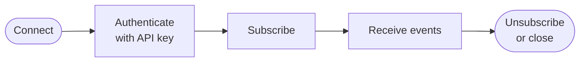

<Visibility for="humans">


<Info>If you don't have an API key yet, follow the [Quickstart](/quickstart) first.</Info>

AgentMail can tell your agent about mail three ways. Pick the transport that matches how the agent runs:

- Use WebSockets when the agent has no public HTTP endpoint, which is common for local and desktop agents. The agent opens one outbound connection and events are pushed over it. They also fit an agent waiting briefly for an expected reply: hold the connection open, act on the event, then close it.
- Use [webhooks](/advanced/webhooks) when a server can accept requests at a public HTTPS endpoint. They are the durable choice for server-side delivery in production.
- Keep [polling](/core/receive) when periodic checks are enough and delayed detection is acceptable.

A WebSocket is a live delivery channel, not an event archive. Events that fire while you are disconnected are not replayed, so reconcile through the mail API after every interruption before treating the connection as current again. [Disconnection and recovery](#disconnection-and-recovery) shows how.

## Events reference

A connection can deliver these event types. The payload field names where the details sit in the frame:

| Event type | Payload field | Fires when |
| --- | --- | --- |
| `message.received` | `message`, `thread` | A message arrives in a subscribed inbox |
| `message.received.spam` | `message`, `thread` | A received message is classified as spam |
| `message.received.blocked` | `message`, `thread` | A received message matches a [block rule](/core/inbound-control) |
| `message.received.unauthenticated` | `message`, `thread` | A received message could not be verified as coming from its claimed sender |
| `message.sent` | `send` | A message leaves an inbox |
| `message.delivered` | `delivery` | The recipient's mail server accepts a sent message |
| `message.bounced` | `bounce` | A sent message bounces |
| `message.complained` | `complaint` | A recipient reports a sent message as spam |
| `message.rejected` | `reject` | A send is rejected before it goes out |
| `message.opened` | `open` | A tracked message is opened for the first time |
| `domain.verified` | `domain` | A [custom domain](/advanced/custom-domains) finishes verification |

`message.opened` fires once per message, on the first open of an HTML message sent with open tracking from a custom domain that has tracking enabled.

The spam, blocked, and unauthenticated variants describe mail that inboxes hide by default, so they are delivered only when the API key that opened the connection holds the matching [label permission](/extras/labels-and-system-labels):

- `message.received.spam` requires `label_spam_read`
- `message.received.blocked` requires `label_blocked_read`
- `message.received.unauthenticated` requires `label_unauthenticated_read`

A key created without an explicit permissions object holds every permission. Permissions are fixed on the connection when it opens. The same rule applies with no filter at all, where the restricted variants are left out of the stream when the key lacks the permission.

<Accordion title="Troubleshooting">

- **Naming one of these event types without the permission returns a `forbidden` error frame.** Permissions are fixed on the connection when it opens, so the fix is to reconnect with a key that holds the permission, not to send another frame.

</Accordion>

## Connect and authenticate

Your agent opens the connection outward, authenticates during the handshake, and keeps the socket open while events stream in. One connection carries everything that follows on this page:



<Steps>
<Step title="Open and authenticate the connection">

Connect to `wss://ws.agentmail.to/v0` with the same API key you use for the rest of the API. Any of these forms authenticates the handshake:

- an `Authorization: Bearer <api_key>` header
- an `api_key` query parameter, for clients that cannot set headers on the handshake
- an `auth_token` query parameter, which works the same as `api_key`

The SDKs pass the key for you when you create the client.

<CodeGroup>

```bash API
# interactive raw connection
npx wscat -c "wss://ws.agentmail.to/v0" \
  -H "Authorization: Bearer $AGENTMAIL_API_KEY"

# or authenticate in the query when you cannot set headers
npx wscat -c "wss://ws.agentmail.to/v0?api_key=$AGENTMAIL_API_KEY"
```

```typescript TypeScript
import { AgentMailClient } from "agentmail";

const client = new AgentMailClient();

const socket = await client.websockets.connect();
```

```python Python
from agentmail import AgentMail

client = AgentMail()

with client.websockets.connect() as socket:
    ...  # subscribe, then iterate over events
```

```python Python (async)
import asyncio
from agentmail import AsyncAgentMail

client = AsyncAgentMail()

async def main():
    async with client.websockets.connect() as socket:
        ...  # subscribe, then iterate over events

asyncio.run(main())
```

</CodeGroup>

The sync Python client's `connect()` is a plain context manager, so open it with `with`. `async with` works only on the `AsyncAgentMail` client shown in the async tab, where every socket call takes an `await`.

TypeScript's `connect()` resolves once the socket is open by default, so you can send frames immediately. On a raw connection, wait for the WebSocket open event before sending anything.

</Step>
<Step title="Subscribe to inboxes, pods, or your whole scope">

A new connection is silent. Deliveries start when you send a subscribe frame naming what you want events for, and what a connection may subscribe to follows the key that opened it:

- An organization-scoped key can subscribe to any inbox or pod in the organization, or to the whole organization at once.
- A pod-scoped key can subscribe to its pod and the inboxes inside it.
- An inbox-scoped key can subscribe only to its own inbox.

<CodeGroup>

```bash API
# send on the open wscat connection:
{"type":"subscribe","inbox_ids":["example@agentmail.to"],"event_types":["message.received"]}
```

```typescript TypeScript
const socket = await client.websockets.connect();

socket.on("message", (event) => {
  if (event.type === "subscribed") {
    console.log("subscribed to", event.inboxIds);
  }
  if (event.type === "event" && event.eventType === "message.received") {
    console.log("received", event.message.messageId, event.message.subject);
  }
});

socket.sendSubscribe({
  type: "subscribe",
  inboxIds: ["example@agentmail.to"],
  eventTypes: ["message.received"],
});
```

```python Python
from agentmail import AgentMail, MessageReceivedEvent, Subscribe, Subscribed

client = AgentMail()

with client.websockets.connect() as socket:
    socket.send_subscribe(
        Subscribe(
            inbox_ids=["example@agentmail.to"],
            event_types=["message.received"],
        )
    )

    for event in socket:
        if isinstance(event, Subscribed):
            print("subscribed to", event.inbox_ids)
        elif isinstance(event, MessageReceivedEvent):
            print("received", event.message.message_id, event.message.subject)
```

</CodeGroup>

| Param | Type | What it means |
| --- | --- | --- |
| `type` | string | Always `subscribe`. |
| `inbox_ids` | string[] | Inboxes to stream events for. `inboxIds` in TypeScript. |
| `pod_ids` | string[] | Pods to stream events for. A pod subscription covers every inbox in the pod. `podIds` in TypeScript. |
| `event_types` | string[] | Deliver only these event types. See the [Events reference](#events-reference). |

Everything except `type` is optional. A frame with neither `inbox_ids` nor `pod_ids` subscribes to the key's whole scope: the organization for an organization key, the pod for a pod key, the inbox for an inbox key.

Without an `event_types` filter, a subscription delivers every event type in the [Events reference](#events-reference) that the key's permissions allow. Filter when your agent acts on only some of them, so the stream carries only what it handles.

Use `inbox_ids` for one or a small set of named inboxes, and `pod_ids` when the agent owns every inbox in a pod. Subscribe at the narrowest scope that covers the agent's work instead of subscribing broadly and filtering in your own code.

</Step>
<Step title="Wait for the subscribed confirmation">

The server confirms each subscribe frame with a `subscribed` frame that echoes the scope. Wait for it before you rely on delivery. You can send more subscribe frames later to add scopes to the same connection.

```json Sample response
{
  "type": "subscribed",
  "inbox_ids": ["example@agentmail.to"],
  "organization_id": "1a2b3c4d-5e6f-4a1b-8c2d-3e4f5a6b7c8d"
}
```

</Step>
</Steps>

<Accordion title="Troubleshooting">

- **The handshake is rejected with HTTP `403`.** The key is missing, mistyped, or revoked; a handshake without a valid key is rejected, and that covers all three alike.

If a subscribe frame fails, an `error` frame comes back instead of the `subscribed` confirmation, carrying the same `code`, `message`, and `fix` fields as [API errors](/advanced/errors). The possible causes:

- `not_found` when an id in `inbox_ids` or `pod_ids` is not visible to your key (usually, it is a typo or a resource outside the key's scope)
- `validation_error` when a field is malformed, for example an event type that does not exist. The `errors` array names the field.
- `forbidden` when an inbox-scoped connection names `pod_ids`. Reconnect with a pod- or organization-scoped key.
- `limit_exceeded` when the frame would take the connection past 100 subscriptions

A frame whose `type` is neither `subscribe` nor `unsubscribe` gets `{"message": "Forbidden"}` back instead of an `error` frame. If you see it, check the frame's `type` spelling first.

</Accordion>

## Handle events

Everything the gateway sends is a JSON frame. Check `type` first:

- `subscribed` and `unsubscribed` confirm your own frames
- `event` carries a mail or domain event, with `event_type` naming what happened
- `error` reports a frame that failed

For an event, the payload sits under the field named in the [Events reference](#events-reference). An event for a received message carries the full `message` object, body included, plus a `thread` summary of the conversation it belongs to, so your agent can usually act without another API call.

```json Sample event frame
{
  "type": "event",
  "event_type": "message.received",
  "event_id": "1a2b3c4d5e6f7a8b9c0d1e2f3a4b5c6d",
  "message": {
    "inbox_id": "example@agentmail.to",
    "thread_id": "7d54a1cf-20b8-4e19-9d63-52c40a8e2b91",
    "message_id": "<010001a03838d5af-6ff5c14f-55b4-48c8-9762-5611b5657b56-000000@email.amazonses.com>",
    "labels": ["received", "unread"],
    "timestamp": "2026-08-25T09:20:43.000Z",
    "from": "You <you@example.com>",
    "to": ["example@agentmail.to"],
    "subject": "Order 4512 refund",
    "preview": "Hi, could you refund order 4512?",
    "text": "Hi, could you refund order 4512?",
    "html": "<div>Hi, could you refund order 4512?</div>",
    "extracted_text": "Hi, could you refund order 4512?",
    "size": 4599,
    "created_at": "2026-08-25T09:20:44.223Z",
    "updated_at": "2026-08-25T09:20:44.223Z"
  },
  "thread": {
    "inbox_id": "example@agentmail.to",
    "thread_id": "7d54a1cf-20b8-4e19-9d63-52c40a8e2b91",
    "labels": ["received", "unread"],
    "senders": ["You <you@example.com>"],
    "recipients": ["example@agentmail.to"],
    "subject": "Order 4512 refund",
    "last_message_id": "<010001a03838d5af-6ff5c14f-55b4-48c8-9762-5611b5657b56-000000@email.amazonses.com>",
    "message_count": 1,
    "size": 4599,
    "created_at": "2026-08-25T09:20:44.223Z",
    "updated_at": "2026-08-25T09:20:44.223Z"
  }
}
```

The fields you will reach for:

- `message.message_id` is what you pass to [reply](/core/send#reply-to-a-message), from the same `inbox_id` that received the message.
- `thread_id` groups the conversation, and the `thread` object summarizes it, including `message_count` and who is involved.
- `event_id` identifies this event. Store it and skip duplicates.
- `labels` shows the classification. The restricted receive variants carry `spam`, `blocked`, or `unauthenticated` alongside `received`.

The SDKs parse each frame into a typed object: match with `isinstance` in Python and narrow on `event.type` and `event.eventType` in TypeScript, as in the subscribe example. If you prefer callbacks to iterating in Python, register them with `socket.on` using the `EventType` enum from `agentmail.core.events` (open, message, error, close) and run `socket.start_listening()`. In TypeScript, `socket.on` takes the same four events as strings, and `socket.close()` ends the connection.

## Disconnection and recovery

When one task finishes but other subscriptions still need the connection, stop deliveries for the finished scope with an unsubscribe frame instead of closing the socket. It names the same `inbox_ids` or `pod_ids` you subscribed with, and a frame with neither removes the subscription to the key's whole scope that a bare subscribe created. The same scope rules apply, so an inbox-scoped connection cannot unsubscribe from pods.

<CodeGroup>

```bash API
# send on the open wscat connection:
{"type":"unsubscribe","inbox_ids":["example@agentmail.to"]}
```

```typescript TypeScript
socket.socket.send(
  JSON.stringify({ type: "unsubscribe", inbox_ids: ["example@agentmail.to"] }),
);
```

```python Python
# raw protocol with the websockets library: pip install websockets
import asyncio, json, os, websockets

async def main():
    headers = {"Authorization": f"Bearer {os.environ['AGENTMAIL_API_KEY']}"}
    async with websockets.connect("wss://ws.agentmail.to/v0", additional_headers=headers) as ws:
        await ws.send(json.dumps({"type": "subscribe", "inbox_ids": ["example@agentmail.to"]}))
        print(await ws.recv())  # subscribed
        await ws.send(json.dumps({"type": "unsubscribe", "inbox_ids": ["example@agentmail.to"]}))
        print(await ws.recv())  # unsubscribed

asyncio.run(main())
```

</CodeGroup>

The server confirms with an `unsubscribed` frame echoing the scope you removed:

```json Sample response
{
  "type": "unsubscribed",
  "inbox_ids": ["example@agentmail.to"],
  "organization_id": "1a2b3c4d-5e6f-4a1b-8c2d-3e4f5a6b7c8d"
}
```

In TypeScript, read the confirmation off the raw frame: it reaches your message handler with `type: "unsubscribed"` and snake_case keys, and the SDK logs a validation warning you can ignore.

Closing the connection ends every subscription on it, so unsubscribe only when the connection stays open for other scopes.

Losing the connection is the harder case. A subscription confirms only the connection it was made on, and events that fire before you resubscribe never reach the socket, so reconnecting alone is not enough for workflows that must see every message.

Store enough state to know which inboxes you were watching and when you last processed an event. On a close or connection error: wait with backoff, connect again, resubscribe, wait for the `subscribed` confirmation, then reconcile through the mail API before treating new socket events as current. Two reconcile queries cover most agents:

- If your agent removes the `unread` label once a message is handled, [list messages](/core/receive) with `labels=unread` in each subscribed inbox and work through what is left.
- Otherwise, keep the `timestamp` of the last processed message as a checkpoint and list messages with `after` set to it.

Make handling idempotent with the event's `event_id` or the message's `message_id`, since a message can arrive once over the socket and again during reconciliation.

```text Reconnect and reconcile pseudocode
lastProcessed = loadCheckpoint()

while running:
  connect()
  subscribe(savedScope, savedEventTypes)
  waitForSubscribed()

  reconcileMailStateAfter(lastProcessed)

  for event in socket:
    if event is already processed:
      continue
    process(event)
    saveCheckpoint(event)

  wait(nextBackoffDelay())
```

## Connection limits

Three limits shape how you spread work across connections:

- One connection holds up to 100 subscriptions, and each entry in `inbox_ids` or `pod_ids` counts as one (a bare subscribe of the key's whole scope counts as one too).
- An organization can hold up to 1,000 concurrent connections.
- Every connection has a 24-hour TTL.

Keep one connection per agent process when its subscription set fits within 100 entries. Group inboxes by pod, or subscribe to the key's whole scope, when that reduces entries without exposing events the process should not receive. Spread larger workloads across a bounded connection pool, leave headroom below the 1,000-connection organization limit, and recreate each connection before its 24-hour lifetime ends. Every replacement connection must repeat the subscribe confirmation and the reconciliation step.

<Accordion title="Troubleshooting">

- **Past a limit, the gateway refuses.** A subscribe frame past 100 returns a `limit_exceeded` error frame, and a connection past the organization limit fails the handshake.

</Accordion>

## Next Steps

<CardGroup cols={2}>
  <Card title="Agent safety" icon="shield-halved" href="/advanced/safety">
    Keep untrusted mail content from steering what your agent does with these events.
  </Card>
  <Card title="Webhooks" icon="bell" href="/advanced/webhooks">
    Durable signed delivery to a public HTTPS endpoint instead of a live connection.
  </Card>
</CardGroup>

</Visibility>

<Visibility for="agents">

# Stream AgentMail events over a WebSocket

One outbound connection to `wss://ws.agentmail.to/v0` carries the same mail events as webhooks, pushed as JSON frames. Use it when the agent has no public HTTP endpoint, common for local and desktop agents, or to hold a connection briefly while waiting for an expected reply.

## Do this

Connect and authenticate during the handshake:

```bash
npx wscat -c "wss://ws.agentmail.to/v0" \
  -H "Authorization: Bearer $AGENTMAIL_API_KEY"
```

Send a subscribe frame on the open connection:

```json
{"type":"subscribe","inbox_ids":["example@agentmail.to"],"event_types":["message.received"]}
```

Wait for the `subscribed` confirmation frame, then act on `event` frames as they arrive. On any close or connection error: wait with backoff, reconnect, resubscribe, wait for `subscribed` again, then reconcile missed mail through the mail API before treating new socket events as current. Reconcile by listing messages with `labels=unread` when the agent clears `unread` after handling, otherwise list with `after` set to the last processed `timestamp`. Deduplicate on `event_id` or `message_id`, because a message can arrive once over the socket and again during reconciliation.

## SDK

Install: `npm install agentmail` (TypeScript), `pip install agentmail` (Python).

| Operation | TypeScript | Python |
| --- | --- | --- |
| Connect | `const socket = await client.websockets.connect()` | `with client.websockets.connect() as socket:` on `AgentMail`, `async with` on `AsyncAgentMail` |
| Subscribe | `socket.sendSubscribe({...})` with `inboxIds`, `podIds`, `eventTypes` | `socket.send_subscribe(Subscribe(inbox_ids=[...], event_types=[...]))`, `Subscribe` imported from `agentmail` |
| Receive | `socket.on("message", handler)`, narrow on `event.type` then `event.eventType` | `for event in socket:` with `isinstance` checks, or `socket.on(...)` plus `socket.start_listening()` using `EventType` from `agentmail.core.events` |
| Close | `socket.close()` | leave the `with` block |

TypeScript `connect()` resolves once the socket is open, so frames can be sent immediately. Install details: `/integrations/sdks-and-cli`.

## Facts

- Connection URL: `wss://ws.agentmail.to/v0`. Authenticate the handshake with an `Authorization: Bearer <api_key>` header, an `api_key` query parameter, or an `auth_token` query parameter. All three forms authenticate the same way.
- A handshake without a valid key is rejected with HTTP `403`. Missing, mistyped, and revoked keys all get the same `403`.
- Client frames: `subscribe` and `unsubscribe`. Server frames: `subscribed`, `unsubscribed`, `event`, and `error`. Check `type` first on every incoming frame.
- Subscribe frame fields: `type` (required, always `subscribe`), `inbox_ids`, `pod_ids`, `event_types` (all optional). A pod subscription covers every inbox in the pod.
- A subscribe frame with neither `inbox_ids` nor `pod_ids` subscribes to the key's whole scope: the organization for an organization key, the pod for a pod key, the inbox for an inbox key.
- Without an `event_types` filter, the subscription delivers every event type the key's permissions allow.

Complete event catalog, with the frame field that holds the payload:

| Event type | Payload field | Fires when |
| --- | --- | --- |
| `message.received` | `message`, `thread` | A message arrives in a subscribed inbox |
| `message.received.spam` | `message`, `thread` | A received message is classified as spam |
| `message.received.blocked` | `message`, `thread` | A received message matches a block rule |
| `message.received.unauthenticated` | `message`, `thread` | A received message could not be verified as coming from its claimed sender |
| `message.sent` | `send` | A message leaves an inbox |
| `message.delivered` | `delivery` | The recipient's mail server accepts a sent message |
| `message.bounced` | `bounce` | A sent message bounces |
| `message.complained` | `complaint` | A recipient reports a sent message as spam |
| `message.rejected` | `reject` | A send is rejected before it goes out |
| `message.opened` | `open` | A tracked message is opened for the first time |
| `domain.verified` | `domain` | A custom domain finishes verification |

- Scope rules: an organization-scoped key subscribes to any inbox or pod or the whole organization, a pod-scoped key to its pod and the inboxes inside it, an inbox-scoped key only to its own inbox.
- Restricted variants need label permissions on the key that opened the connection: `message.received.spam` needs `label_spam_read`, `message.received.blocked` needs `label_blocked_read`, `message.received.unauthenticated` needs `label_unauthenticated_read`. A key created without an explicit permissions object holds every permission.
- Permissions are fixed when the connection opens. With no `event_types` filter, restricted variants the key lacks are silently left out of the stream.
- Event frame envelope: `type` is `event`, `event_type` names what happened, `event_id` identifies the event for deduplication, and the payload sits under the field named in the catalog.
- A received-message event carries the full `message` object, body included, plus a `thread` summary with `message_count`. Restricted receive variants carry `spam`, `blocked`, or `unauthenticated` in `labels` alongside `received`.
- `message.message_id` is what a reply takes, together with the same `inbox_id` that received the message.
- `message.opened` fires once per message, on the first open of an HTML message sent with open tracking from a custom domain that has tracking enabled.
- One connection holds up to 100 subscriptions. Each entry in `inbox_ids` or `pod_ids` counts as one, and a bare whole-scope subscribe counts as one.
- An organization holds up to 1,000 concurrent connections. A connection past that limit fails the handshake.
- Every connection has a 24-hour TTL. Recreate each connection before its lifetime ends, resubscribe, wait for `subscribed`, and reconcile.
- Events that fire while disconnected are never replayed. A subscription is valid only on the connection it was made on.
- An unsubscribe frame names the same `inbox_ids` or `pod_ids` as the subscribe. A frame with neither removes the whole-scope subscription a bare subscribe created. The server confirms with an `unsubscribed` frame echoing the removed scope.
- Closing the connection ends every subscription on it. Unsubscribe only when the connection stays open for other scopes.
- More subscribe frames can be sent later to add scopes to the same connection.
- In TypeScript the `unsubscribed` confirmation reaches the message handler as a raw frame with snake_case keys, and the SDK logs a validation warning that is safe to ignore.

## Not supported

- No replay and no backfill. Events that fire while disconnected never reach the socket, so reconcile through the mail API after every interruption.
- Permissions cannot change on a live connection. A `forbidden` error frame for a restricted event type is fixed by reconnecting with a key that holds the permission, not by sending another frame.
- An inbox-scoped connection cannot name `pod_ids` in subscribe or unsubscribe frames.
- A frame whose `type` is neither `subscribe` nor `unsubscribe` gets `{"message": "Forbidden"}` back instead of an `error` frame.
- A subscription does not carry over to a new connection, and no connection outlives the 24-hour TTL.
- The sync Python client's `connect()` is a plain context manager. `async with` works only on the `AsyncAgentMail` client.

## Errors

| Error | Status or frame | Cause | Fix |
| --- | --- | --- | --- |
| `403` | HTTP handshake response | Missing, mistyped, or revoked API key | Connect again with a valid key |
| `not_found` | `error` frame | An id in `inbox_ids` or `pod_ids` is not visible to the key | Fix the typo or use a key whose scope covers the resource |
| `validation_error` | `error` frame | A malformed field, for example an event type that does not exist | Correct the field named in the `errors` array and resend |
| `forbidden` | `error` frame | An inbox-scoped connection named `pod_ids`, or a restricted event type without its label permission | Reconnect with a pod- or organization-scoped key, or a key holding the permission |
| `limit_exceeded` | `error` frame | The frame would take the connection past 100 subscriptions | Split scopes across connections or subscribe by pod |
| `{"message": "Forbidden"}` | raw frame | Frame `type` is not `subscribe` or `unsubscribe` | Check the `type` spelling |

`error` frames carry the same `code`, `message`, and `fix` fields as API errors.

## Verify

```bash
npx wscat -c "wss://ws.agentmail.to/v0?api_key=$AGENTMAIL_API_KEY"
```

On the open connection send `{"type":"subscribe","inbox_ids":["<inbox_id>"]}`. A frame with `"type": "subscribed"` echoing the `inbox_ids` and the `organization_id` confirms the key, the connection, and the subscription in one round trip.

## Related

- `/advanced/webhooks` for durable signed delivery of the same events to a public HTTPS endpoint.
- `/advanced/safety` for keeping untrusted mail content from steering the agent.
- `/core/receive` for the list calls used to reconcile after a disconnect.
- `/advanced/errors` for the shared `code`, `message`, and `fix` error envelope.

</Visibility>
