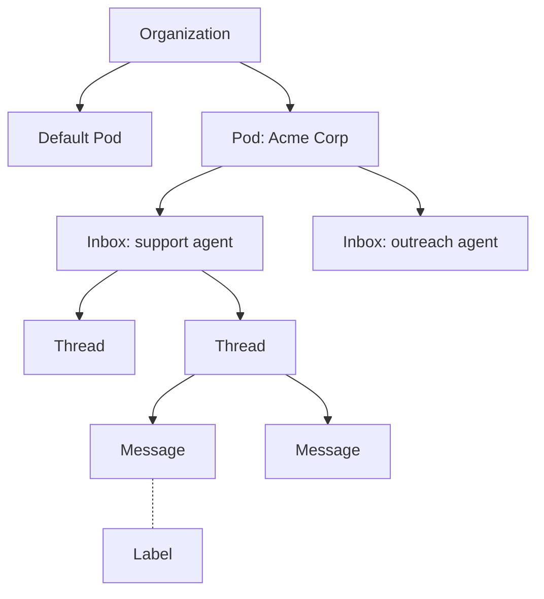

<Visibility for="humans">


Everything you create or work with through AgentMail is a resource:

- **Organization**: your account. Everything you create belongs to it.
- **Pod**: a compartment inside the organization and the boundary between tenants.
- **Inbox**: an email address your agent sends and receives from. Day to day you work almost entirely with inboxes.
- **Message**: one email, sent or received.
- **Thread**: a conversation: its messages in order, assembled by AgentMail from reply headers.
- **Label**: a tag on mail: yours to define, or a system label such as `sent`, `received`, or `bounced`.

## The hierarchy

1. An **organization** is your account. Everything you create belongs to it, and every API key is tied to exactly one organization.
2. A **pod** is a compartment inside the organization. Every org starts with a Default Pod, which cannot be deleted, you can add more pods if you're building a [platform that gives email address](/advanced/multi-tenant) to your customers' agents.
3. An **inbox** belongs to exactly one pod and owns the email address your agent works with.



Webhooks, lists, and API keys cover exactly the scope you attach them to: the organization covers every inbox, a pod or inbox covers only itself. When list entries at several scopes match the same address, the most specific entry wins.

## Next Steps

<CardGroup cols={2}>
  <Card title="Receive email" icon="inbox" href="/core/receive">
    List what an inbox holds and read messages in full.
  </Card>
  <Card title="Build a multi-tenant platform" icon="building" href="/advanced/multi-tenant">
    Give each customer an isolated pod with its own scoped key.
  </Card>
</CardGroup>

</Visibility>

<Visibility for="agents">

# Map the resource hierarchy and discover a key's scope

Every AgentMail resource sits in an organization, pod, inbox hierarchy, and a key's scope in that hierarchy decides the shape of the request paths you call. Use this page to place resources correctly and to make an agent holding a scoped key discover its own boundary at runtime.

## Do this

Ask what the key you hold can act on:

```bash
curl "https://api.agentmail.to/v0/auth/me" \
  -H "Authorization: Bearer $AGENTMAIL_API_KEY"
```

A pod-scoped key to a Default Pod (whose `pod_id` always equals the `organization_id`) answers:

```json
{
  "scope_type": "pod",
  "scope_id": "1a2b3c4d-5e6f-4a1b-8c2d-3e4f5a6b7c8d",
  "organization_id": "1a2b3c4d-5e6f-4a1b-8c2d-3e4f5a6b7c8d",
  "pod_id": "1a2b3c4d-5e6f-4a1b-8c2d-3e4f5a6b7c8d",
  "api_key_id": "3c4d5e6f-7a8b-4c3d-9e4f-5a6b7c8d9e0f"
}
```

- `scope_type`: `organization`, `pod`, or `inbox`. An organization-scoped key needs a `/pods/{pod_id}` path segment for pod-level resources, a pod- or inbox-scoped key does not.
- `scope_id`: the ID for the level named by `scope_type`.
- `organization_id`: the key's organization. Always present.
- `pod_id`: present for pod- and inbox-scoped keys.
- `inbox_id`: present for inbox-scoped keys.
- `api_key_id`: present when authentication used an API key, absent for JWT and proxy credentials.

## Facts

- The resource kinds: organization, pod, inbox, message, thread, label, domain, webhook, list, API key. Every resource has exactly one place in the hierarchy.
- A draft is not a separate resource kind. It is an unsent message.
- An organization is the account. Every resource belongs to an organization, and every API key is tied to exactly one organization.
- A pod is a compartment inside the organization and the boundary between tenants.
- Every organization starts with a pod named Default Pod, whose `pod_id` equals the `organization_id`. New inboxes land in Default Pod unless created in another pod.
- An inbox is an email address the agent sends and receives from. An inbox belongs to exactly one pod.
- Messages and threads always belong to one inbox.
- Threads and unsent drafts can be listed across a pod or the whole organization in one call.
- A thread is the conversation AgentMail assembles from reply headers, and it carries the combined labels of its messages, so label filters work on threads too.
- Labels attach to individual messages. System labels include `sent`, `received`, and `bounced`.
- A domain attaches to the organization or to one pod.
- Webhooks, lists, and API keys attach to the organization, one pod, or one inbox, and cover exactly that scope.
- Lists are allow or block lists of senders and recipients, kept separately for sending, receiving, and replying.
- When list entries at several scopes match the same address, the most specific entry wins.
- Every API key is scoped to the organization, one pod, or one inbox. Most integrations use a pod-scoped key.
- A pod-scoped key selects one pod, and requests with a pod-scoped key omit the `/pods/{pod_id}` path segment: `GET /v0/inboxes` lists the pod's inboxes.
- An inbox-scoped key also resolves its pod without a `/pods/{pod_id}` path segment.
- An organization-scoped key can access multiple pods, and requests for pod-level resources include the segment: `GET /v0/pods/{pod_id}/inboxes`.

## Not supported

- Request paths never include an organization segment. The API key identifies the organization.
- Requests made with a pod-scoped or inbox-scoped key must not include `/pods/{pod_id}`. Path shape must match the key's scope, so swapping between pod- and organization-scoped keys means changing the paths.
- Default Pod cannot be deleted.

## Verify

```bash
curl "https://api.agentmail.to/v0/auth/me" \
  -H "Authorization: Bearer $AGENTMAIL_API_KEY"
```

A valid key returns a JSON object whose `scope_type` is `organization`, `pod`, or `inbox` and which always contains `organization_id`.

## Related

- [/quickstart](/quickstart) - get an API key first if you have none.
- [/core/receive](/core/receive) - list what an inbox holds and read messages in full.
- [/advanced/multi-tenant](/advanced/multi-tenant) - one isolated pod per customer with its own scoped key.
- [/core/conversations](/core/conversations) - fetch a thread instead of stitching messages together.

</Visibility>
