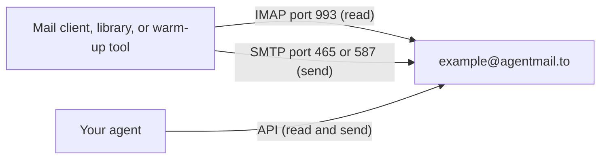

<Visibility for="humans">


<Info>If you don't have an API key yet, follow the [Quickstart](/quickstart) first.</Info>

## Connect any tool with the server settings

Every AgentMail inbox is also a standard mailbox, open to any tool that accepts custom mail-server credentials. The same messages are reachable on every path:



Both protocols use the same login:

- **Username:** the full inbox address, including its domain, for example `example@agentmail.to`
- **Password:** an AgentMail API key

| Setting | IMAP (read) | SMTP (send) |
| --- | --- | --- |
| Host | `imap.agentmail.to` | `smtp.agentmail.to` |
| Port | `993` | `465` or `587` |
| Encryption | SSL/TLS | SSL/TLS on `465`, STARTTLS on `587` |
| Username | Full inbox address | Full inbox address |
| Password | API key | API key |

Encryption is required on every connection. Match the mode to the port:

- Ports `993` and `465` encrypt from the first byte. Choose the SSL/TLS option in a settings form.
- Port `587` connects in plain text and upgrades with STARTTLS before login. Choose the STARTTLS option.

Before configuring a tool, you can check the settings and credentials together with one short script:

```python check_credentials.py
import imaplib
import os
import smtplib

inbox = "example@agentmail.to"
api_key = os.environ["AGENTMAIL_API_KEY"]

with imaplib.IMAP4_SSL("imap.agentmail.to", 993) as imap:
    imap.login(inbox, api_key)
    print("IMAP login ok")

with smtplib.SMTP_SSL("smtp.agentmail.to", 465) as smtp:
    smtp.login(inbox, api_key)
    print("SMTP login ok")
```

```text Sample output
IMAP login ok
SMTP login ok
```

Two ok lines confirm the hosts, ports, encryption modes, and credentials all work together. If a tool still fails after this passes, the problem is in the tool's form, so compare every field against the table.

<Accordion title="Troubleshooting">
When a connection fails, the error points at the value that is off:

- `[AUTHENTICATIONFAILED] Invalid credentials` from IMAP, or `535 5.7.8 Authentication credentials invalid` from SMTP, means the login is wrong (usually a username missing its domain, or a password that is not an API key).
- A TLS handshake error such as `wrong version number` means the encryption mode does not match the port (usually SSL/TLS selected for port `587`, which expects STARTTLS).
- A connection that times out or is refused means the network cannot reach the server (usually a firewall blocking outbound `993`, `465`, or `587`). An unencrypted connection to port `465` stalls the same way, because that port expects TLS immediately.
</Accordion>

## Read a mailbox over IMAP

The same messages the API returns are organized into five folders:

- `INBOX` holds received mail.
- `Sent` holds every message the inbox sent, through the API or through SMTP.
- `Trash` and `Spam` hold trashed and spam mail.
- `Drafts` is listed for client compatibility and stays empty. Create and manage drafts through the API.

Reading takes the credentials from the settings table plus a folder name. `INBOX` matches in any casing. The other folder names are exact.

This example opens `INBOX` read-only and prints the sender and subject of every unread message:

<CodeGroup>

```typescript TypeScript
// npm install imap
import Imap from "imap";

const imap = new Imap({
  user: "example@agentmail.to",
  password: process.env.AGENTMAIL_API_KEY!,
  host: "imap.agentmail.to",
  port: 993,
  tls: true,
});

imap.once("ready", () => {
  imap.openBox("INBOX", true, (err, box) => {
    if (err) throw err;
    console.log(`${box.messages.total} messages in INBOX`);

    imap.search(["UNSEEN"], (err, results) => {
      if (err) throw err;
      if (results.length === 0) return imap.end();

      const fetch = imap.fetch(results, { bodies: "HEADER.FIELDS (FROM SUBJECT)" });
      fetch.on("message", (msg) => {
        msg.on("body", (stream) => {
          let header = "";
          stream.on("data", (chunk) => (header += chunk.toString()));
          stream.once("end", () => {
            const parsed = Imap.parseHeader(header);
            console.log(parsed.from[0], "|", parsed.subject[0]);
          });
        });
      });
      fetch.once("end", () => imap.end());
    });
  });
});

imap.once("error", (err: Error) => {
  console.error("IMAP error:", err.message);
});

imap.connect();
```

```python Python
import email
import imaplib
import os

inbox = "example@agentmail.to"
api_key = os.environ["AGENTMAIL_API_KEY"]

with imaplib.IMAP4_SSL("imap.agentmail.to", 993) as imap:
    imap.login(inbox, api_key)
    imap.select("INBOX", readonly=True)

    status, ids = imap.search(None, "UNSEEN")
    for msg_id in ids[0].split():
        status, data = imap.fetch(msg_id, "(RFC822)")
        message = email.message_from_bytes(data[0][1])
        print(message["From"], "|", message["Subject"])
```

</CodeGroup>

Both tabs open the folder read-only, so fetching does not mark anything as seen.

You get complete raw messages, headers and body included, the same messages the API returns.

```text Sample output
You <you@example.com> | Re: Quote for 40 units
You <you@example.com> | Following up
```

The `Message-ID` header on each message is the value the API calls `message_id`, so your agent can read over IMAP and act through the API: reply in the message's thread or download its attachments.

<Accordion title="Troubleshooting">
Two errors come up in practice:

- `Mailbox not found` means the folder name does not match one of the five folders (usually a casing mismatch, such as `sent` instead of `Sent`).
- A tool that shows zero or stale messages is reading a different folder or reusing an old session. Point it at `INBOX`, then trigger its sync or reconnect the account.
</Accordion>

## Send over SMTP

SMTP sends from the inbox you log in with. Set the From address to that same inbox address. The server enforces three limits:

- Up to 50 recipients per message, counting To, Cc, and Bcc together.
- Up to 10 MB per message, attachments included.
- Sessions time out after 30 minutes, so open a connection per batch instead of holding one long term.

<CodeGroup>

```typescript TypeScript
// npm install nodemailer
import nodemailer from "nodemailer";

const inbox = "example@agentmail.to";

const transporter = nodemailer.createTransport({
  host: "smtp.agentmail.to",
  port: 465,
  secure: true, // for port 587 with STARTTLS: port: 587, secure: false
  auth: {
    user: inbox,
    pass: process.env.AGENTMAIL_API_KEY!,
  },
});

async function sendEmail() {
  const info = await transporter.sendMail({
    from: inbox, // the inbox you log in as
    to: "you@example.com",
    subject: "Hello over SMTP",
    text: "Sent through smtp.agentmail.to.",
  });
  console.log(info.response);
}

sendEmail().catch(console.error);
```

```python Python
import os
import smtplib
from email.message import EmailMessage

inbox = "example@agentmail.to"
api_key = os.environ["AGENTMAIL_API_KEY"]

msg = EmailMessage()
msg["Subject"] = "Hello over SMTP"
msg["From"] = inbox  # the inbox you log in as
msg["To"] = "you@example.com"
msg.set_content("Sent through smtp.agentmail.to.")

with smtplib.SMTP_SSL("smtp.agentmail.to", 465) as smtp:
    smtp.login(inbox, api_key)
    smtp.send_message(msg)

# The same send over port 587:
#   with smtplib.SMTP("smtp.agentmail.to", 587) as smtp:
#       smtp.starttls()
#       smtp.login(inbox, api_key)
#       smtp.send_message(msg)
```

</CodeGroup>

The server accepts the message with a `250` reply that names the new message's id:

```text Sample response
250 Message queued as <010001a0345cce9e-47649bba-41fc-471d-b19c-2dee3108cfc0-000000@email.amazonses.com>
```

That id is the message's `message_id` everywhere else in AgentMail. The message shows up in your message list with the `sent` label and in the IMAP `Sent` folder. Pass the id to the API to get the message or the `thread_id` of the conversation it started. The recipient's copy normally arrives within a few seconds. On the Free and Agent plans, mail from a shared `@agentmail.to` address carries a `Sent via AgentMail` footer.

<Accordion title="Troubleshooting">
A rejected send names the rule it broke:

- `550 5.1.8 Sender address rejected` means the From address is not one this login can send as (it must be the inbox you authenticated as).
- `452 4.5.3 Too many recipients` means the message went past 50 recipients.
- `538 Error: Must issue a STARTTLS command first` means the client tried to log in before encrypting on port `587`. Turn on STARTTLS, or use port `465`.
</Accordion>

## Connect a mail client or warm-up tool

Desktop clients such as Thunderbird, Outlook, and Apple Mail take these settings, and so do warm-up platforms such as Instantly and Smartlead. The form labels vary by product, but the values do not:

- Choose the account type called **custom**, **other**, or **generic IMAP/SMTP**. The Google and Microsoft sign-in buttons run an OAuth flow for accounts at those providers, so pick the generic option instead.
- In the incoming mail or IMAP fields, enter the IMAP column of the settings table.
- In the outgoing mail or SMTP fields, enter the SMTP column. Match the security dropdown to the port: SSL/TLS for `465`, STARTTLS for `587`.
- Set the sender or From address to the same inbox address you entered as the username.

Save the account and run the tool's connection test. Then send one test message and check that it shows up in the tool's activity view and in the inbox's `Sent` folder.

Clients that support IMAP IDLE get new mail pushed to them as it arrives. The server and client negotiate this automatically.

A tool connected over SMTP alone can send but does not see replies. Enter the IMAP settings too when it needs reply detection or warm-up activity. If the connection test fails with a generic error, run the credentials check from the top of this page to tell a credential problem from a form problem.

## Next Steps

<CardGroup cols={2}>
  <Card title="Webhooks" icon="bell" href="/advanced/webhooks">
    React to incoming mail in real time instead of polling.
  </Card>
  <Card title="Deliverability and warmup" icon="envelope-circle-check" href="/advanced/deliverability">
    How receivers authenticate your mail and how to warm up a new sending domain.
  </Card>
</CardGroup>

</Visibility>

<Visibility for="agents">

# Connect a mail tool to an AgentMail inbox over IMAP and SMTP

Every AgentMail inbox is a standard mailbox, so any mail client, library, or warm-up platform that accepts custom mail-server credentials can read it over IMAP and send from it over SMTP. Use this path for tools that speak mail protocols instead of the AgentMail API.

## Do this

Log in with the full inbox address as the username and an AgentMail API key as the password. This script prints unread mail from `INBOX` over IMAP, then sends one message over SMTP:

```python
import email
import imaplib
import os
import smtplib
from email.message import EmailMessage

inbox = "example@agentmail.to"
api_key = os.environ["AGENTMAIL_API_KEY"]

with imaplib.IMAP4_SSL("imap.agentmail.to", 993) as imap:
    imap.login(inbox, api_key)
    imap.select("INBOX", readonly=True)
    status, ids = imap.search(None, "UNSEEN")
    for msg_id in ids[0].split():
        status, data = imap.fetch(msg_id, "(RFC822)")
        message = email.message_from_bytes(data[0][1])
        print(message["From"], "|", message["Subject"])

msg = EmailMessage()
msg["Subject"] = "Hello over SMTP"
msg["From"] = inbox  # must be the inbox you authenticated as
msg["To"] = "you@example.com"
msg.set_content("Sent through smtp.agentmail.to.")

with smtplib.SMTP_SSL("smtp.agentmail.to", 465) as smtp:
    smtp.login(inbox, api_key)
    smtp.send_message(msg)
```

Configuring a settings form instead: pick the account type named custom, other, or generic IMAP/SMTP (not the Google or Microsoft sign-in buttons), enter the IMAP and SMTP values from Facts, match the security dropdown to the port (SSL/TLS for `465`, STARTTLS for `587`), and set the From address to the same inbox address as the username.

## Facts

- IMAP host `imap.agentmail.to`, port `993`, SSL/TLS encryption from the first byte.
- SMTP host `smtp.agentmail.to`, port `465` (SSL/TLS from the first byte) or port `587` (plain connection upgraded with STARTTLS before login).
- Encryption is required on every connection.
- Username for both protocols: the full inbox address including its domain, for example `example@agentmail.to`.
- Password for both protocols: an AgentMail API key.
- IMAP exposes five folders: `INBOX`, `Sent`, `Trash`, `Spam`, `Drafts`.
- `INBOX` matches in any casing. `Sent`, `Trash`, `Spam`, and `Drafts` are exact names.
- `Sent` holds every message the inbox sent, through the API or through SMTP.
- IMAP returns complete raw messages, headers and body included, the same messages the API returns.
- The `Message-ID` header on an IMAP message is the value the API calls `message_id`. Use it through the API to reply in the message's thread or download its attachments.
- Opening a folder read-only keeps fetches from marking messages as seen.
- SMTP limit: 50 recipients per message, counting To, Cc, and Bcc together.
- SMTP limit: 10 MB per message, attachments included.
- SMTP sessions time out after 30 minutes. Open a connection per batch instead of holding one long term.
- The SMTP From address must be the inbox address you authenticated as.
- A successful SMTP send returns `250 Message queued as` followed by the new message's id. That id is the message's `message_id` everywhere else in AgentMail.
- A message sent over SMTP appears in the message list with the `sent` label and in the IMAP `Sent` folder. The recipient's copy normally arrives within a few seconds.
- On the Free and Agent plans, mail from a shared `@agentmail.to` address carries a `Sent via AgentMail` footer.
- Clients that support IMAP IDLE get new mail pushed as it arrives. The server and client negotiate this automatically.

## Not supported

- Drafts cannot be created or managed over IMAP. The `Drafts` folder exists for client compatibility and stays empty. Create and manage drafts through the API.
- SMTP cannot send from a From address other than the authenticated inbox.
- The Google and Microsoft sign-in buttons in mail clients do not work for AgentMail addresses. They run OAuth flows for accounts at those providers. Pick the custom, other, or generic IMAP/SMTP account type.
- Unencrypted connections are not accepted on any port. An unencrypted connection to port `465` stalls until it times out.
- A tool connected over SMTP alone can send but does not see replies. Enter the IMAP settings too when it needs reply detection or warm-up activity.

## Errors

| Error | Protocol | Cause | Fix |
| --- | --- | --- | --- |
| `[AUTHENTICATIONFAILED] Invalid credentials` | IMAP | Wrong login, usually a username missing its domain or a password that is not an API key. | Log in with the full inbox address and an AgentMail API key. |
| `535 5.7.8 Authentication credentials invalid` | SMTP | Wrong login, same causes as the IMAP variant. | Log in with the full inbox address and an AgentMail API key. |
| TLS handshake error such as `wrong version number` | TLS | The encryption mode does not match the port, usually SSL/TLS selected for port `587`, which expects STARTTLS. | Use STARTTLS on `587`. Use SSL/TLS on `993` and `465`. |
| Connection times out or is refused | TCP | The network cannot reach the server, usually a firewall blocking outbound `993`, `465`, or `587`. An unencrypted connection to `465` stalls the same way. | Allow outbound traffic on the port, and encrypt from the first byte on `465`. |
| `Mailbox not found` | IMAP | The folder name does not match one of the five folders, usually a casing mismatch such as `sent` instead of `Sent`. | Use `INBOX`, `Sent`, `Trash`, `Spam`, or `Drafts` exactly. |
| Zero or stale messages | IMAP | The tool is reading a different folder or reusing an old session. | Point the tool at `INBOX`, then trigger its sync or reconnect the account. |
| `550 5.1.8 Sender address rejected` | SMTP | The From address is not one this login can send as. | Set From to the inbox address you authenticated as. |
| `452 4.5.3 Too many recipients` | SMTP | The message went past 50 recipients across To, Cc, and Bcc. | Keep each message at 50 recipients or fewer. |
| `538 Error: Must issue a STARTTLS command first` | SMTP | The client tried to log in before encrypting on port `587`. | Turn on STARTTLS, or use port `465`. |

## Verify

```python
import imaplib
import os
import smtplib

inbox = "example@agentmail.to"
api_key = os.environ["AGENTMAIL_API_KEY"]

with imaplib.IMAP4_SSL("imap.agentmail.to", 993) as imap:
    imap.login(inbox, api_key)
    print("IMAP login ok")

with smtplib.SMTP_SSL("smtp.agentmail.to", 465) as smtp:
    smtp.login(inbox, api_key)
    print("SMTP login ok")
```

Two ok lines confirm the hosts, ports, encryption modes, and credentials all work together. If a tool still fails after this passes, the problem is in the tool's form, so compare every field against Facts.

## Related

- [/quickstart](/quickstart): create the API key used as the password.
- [/advanced/webhooks](/advanced/webhooks): react to incoming mail in real time instead of polling IMAP.
- [/advanced/deliverability](/advanced/deliverability): how receivers authenticate your mail and how to warm up a new sending domain.

</Visibility>
