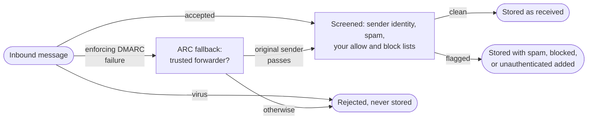

<Visibility for="humans">


<Info>If you don't have an API key yet, follow the [Quickstart](/quickstart) first.</Info>

## Understand how inbound mail is classified

Every email runs through these two checks:

- a virus scan
- DMARC, when the message fails it and the sender's policy asks receivers to enforce it (a policy of `quarantine` or `reject`)

A DMARC failure gets one more check: AgentMail validates the message's ARC chain, and when a trusted forwarder (google.com, microsoft.com, outlook.com, or icloud.com) sealed it, the original sender's authentication results replace the failing ones. Forwarding is what breaks SPF and DKIM in transit, so this is what lets mail auto-forwarded from a Gmail or Outlook account pass authentication.

Rejected mail is never stored. No bounce goes back either, so the sender's mail server may still report the message as delivered.

Everything else is delivered. Mail that passes every check shows up when you list messages, carrying just the `received` label. The remaining checks each add a label instead of rejecting:

- `unauthenticated` means the sender could not be verified (usually, the sender has no SPF, DKIM, or DMARC set up).
- `spam` means the message failed spam screening.
- `blocked` means your lists reject the sender. The rest of this page covers these lists.

One message can collect several of these labels.



The `spam`, `unauthenticated`, and `blocked` labels are hidden from message and thread listings by default, so your agent starts with a clean view and you opt into the rest.

The list check picks one pair of lists per message:

- A message that starts a fresh conversation is checked against the inbox's `receive` lists.
- A message in a conversation your inbox has already sent into is checked against its `reply` lists.

Empty `reply` lists accept every reply. An agent that emails people first keeps getting their answers even when its `receive` allow list admits almost no one.

## Allow or block a sender

By default, an inbox accepts mail from anyone. An entry defines who a list matches. An entry containing `@` matches that one address. Anything else is a domain and matches every address on it. What a match does depends on the list type:

- A `block` entry rejects matching senders and changes nothing else.
- An `allow` entry changes the default. Once an allow list has any entry, only matching senders get through, and everyone else is blocked.

The calls here manage a single inbox. You can also create entries for a whole pod or organization, and they apply to every inbox inside. When several entries match one sender, the most specific wins:

- An inbox entry beats a pod entry, which beats an organization entry.
- Within one scope, an exact address entry beats a domain entry.

So an inbox-level allow for one address carves an exception into an organization-wide block on its domain. The allow default applies across scopes too, and a single organization-wide `receive` allow entry blocks unmatched new senders for every inbox in the organization.

`inbox_id`, `direction`, `type`, and `entry` are required, and `reason` is optional. The full list is below the code.

<CodeGroup>

```bash CLI
agentmail inboxes:lists create \
  --inbox-id "example@agentmail.to" \
  --direction receive \
  --type block \
  --entry blocked-sender@example.com \
  --reason "unwanted newsletter"
```

```bash API
curl -X POST "https://api.agentmail.to/v0/inboxes/example@agentmail.to/lists/receive/block" \
  -H "Authorization: Bearer $AGENTMAIL_API_KEY" \
  -H "Content-Type: application/json" \
  -d '{ "entry": "blocked-sender@example.com", "reason": "unwanted newsletter" }'
```

```typescript TypeScript
await client.inboxes.lists.create("example@agentmail.to", "receive", "block", {
  entry: "blocked-sender@example.com",
  reason: "unwanted newsletter",
});
```

```python Python
client.inboxes.lists.create(
    inbox_id="example@agentmail.to",
    direction="receive",
    type="block",
    entry="blocked-sender@example.com",
    reason="unwanted newsletter",
)
```

</CodeGroup>

| Param | Type | What it means |
| --- | --- | --- |
| `inbox_id` | string | The inbox whose list you are editing. |
| `direction` | string | Which traffic the entry filters: `receive` for new inbound mail, `reply` for replies, `send` for outbound recipients. |
| `type` | string | `allow` or `block`. |
| `entry` | string | The address or domain to match. |
| `reason` | string | A note of up to 1,024 characters, stored on the entry and returned whenever you read it. |

You get back the stored entry for confirmation.

Check `entry_type` to confirm how it will match, `email` for one address or `domain` for a whole domain. A missing `@` turns an address into a domain entry. 

`scope_key` names the exact list the entry landed on (scope, id, direction, and type in one string).

```json Sample response
{
  "scope_key": "inbox#example@agentmail.to#receive#block",
  "organization_id": "1a2b3c4d-5e6f-4a1b-8c2d-3e4f5a6b7c8d",
  "pod_id": "1a2b3c4d-5e6f-4a1b-8c2d-3e4f5a6b7c8d",
  "inbox_id": "example@agentmail.to",
  "direction": "receive",
  "list_type": "block",
  "entry": "blocked-sender@example.com",
  "reason": "unwanted newsletter",
  "entry_type": "email",                              // "email" for one address or "domain" for a whole domain
  "created_at": "2026-08-24T15:03:32Z"
}
```

To read or remove the entry later, you will pass `entry`, `direction`, and `type` back exactly as returned here.

<Accordion title="Troubleshooting">
The create fails with any of these:

- `400` `validation_error` means the entry parses as neither an email address nor a domain.
- `403` `missing_permission` means your access credential cannot create entries.
- `409` `conflict` means the entry already sits on the opposite list of this scope and direction. The error's `fix` field names the exact entry to remove first.
</Accordion>

## List the entries on an inbox

An inbox has six lists, an `allow` and a `block` list for each direction:

- `receive`, filtering new inbound mail
- `reply`, filtering replies
- `send`, filtering outbound recipients

You read one list at a time, naming its direction and type. An entry lives on the allow or the block list of a direction, never both. AgentMail also keeps a separate layer of read-only suppression entries on the organization's `send` block list, added when a recipient hard-bounces, complains of spam, or unsubscribes. They show `read_only: true` when listed, and the API cannot remove them.

One allow entry is automatic too. CLI sign-up seeds the organization's `send` allow list with a single entry, the email address you signed up with, so an unverified organization can email only that address. Completing verification deletes the entry.

Seeing what filtering is active is the first step in debugging why a sender got through or got blocked.

`inbox_id`, `direction`, and `type` are required. Two optional parameters page the results, listed below the code.

<CodeGroup>

```bash CLI
agentmail inboxes:lists list \
  --inbox-id "example@agentmail.to" \
  --direction receive \
  --type block
```

```bash API
curl "https://api.agentmail.to/v0/inboxes/example@agentmail.to/lists/receive/block" \
  -H "Authorization: Bearer $AGENTMAIL_API_KEY"
```

```typescript TypeScript
const entries = await client.inboxes.lists.list("example@agentmail.to", "receive", "block");
for (const entry of entries.entries) {
  console.log(entry.entry, entry.entryType, entry.reason);
}
```

```python Python
entries = client.inboxes.lists.list(
    inbox_id="example@agentmail.to",
    direction="receive",
    type="block",
)
for entry in entries.entries:
    print(entry.entry, entry.entry_type, entry.reason)
```

</CodeGroup>

| Param | Type | What it means |
| --- | --- | --- |
| `limit` | integer | Number of entries per page. |
| `page_token` | string | Where to resume. Pass the `next_page_token` from the previous page. |

Entries come back sorted alphabetically by `entry`, with `count` for the page and a `next_page_token` when more remain:

```json Sample response
{
  "count": 1,
  "entries": [
    {
      "organization_id": "1a2b3c4d-5e6f-4a1b-8c2d-3e4f5a6b7c8d",
      "pod_id": "1a2b3c4d-5e6f-4a1b-8c2d-3e4f5a6b7c8d",
      "inbox_id": "example@agentmail.to",
      "entry": "blocked-sender@example.com",
      "reason": "unwanted newsletter",
      "direction": "receive",
      "list_type": "block",
      "entry_type": "email",
      "created_at": "2026-08-24T15:03:32Z"
    }
  ]
}
```

<Accordion title="Troubleshooting">
- **A `404` `not_found`** means the inbox is not visible to your credential (usually a mistyped `inbox_id`, or an API key scoped to a different inbox).
- **Until you verify, a send to anyone but your sign-up address fails with a `403` `message_rejected`.** The automatic `send` allow entry from CLI sign-up is what enforces this, and completing verification deletes it.
</Accordion>

## Remove an entry

Removing an entry stops it from affecting mail that arrives afterward. Identify it by the same inbox, direction, and type you created it with, plus the entry value itself. Remove an entry at the scope that owns it: an organization-wide entry comes off the organization list, not the inbox list.

<CodeGroup>

```bash CLI
agentmail inboxes:lists delete \
  --inbox-id "example@agentmail.to" \
  --direction receive \
  --type block \
  --entry blocked-sender@example.com
```

```bash API
curl -X DELETE "https://api.agentmail.to/v0/inboxes/example@agentmail.to/lists/receive/block/blocked-sender@example.com" \
  -H "Authorization: Bearer $AGENTMAIL_API_KEY"
```

```typescript TypeScript
await client.inboxes.lists.delete(
  "example@agentmail.to",
  "receive",
  "block",
  "blocked-sender@example.com",
);
```

```python Python
client.inboxes.lists.delete(
    inbox_id="example@agentmail.to",
    direction="receive",
    type="block",
    entry="blocked-sender@example.com",
)
```

</CodeGroup>

A successful delete returns `204` with an empty body.

<Accordion title="Troubleshooting">
- **`404` `not_found`** means no such entry is on this list (usually the wrong direction or type, or the entry lives at another scope).
- **`409` `cannot_delete`** means the entry is one of AgentMail's read-only suppression entries. Only [support@agentmail.cc](mailto:support@agentmail.cc) can remove them.
</Accordion>

## Provider-level suppression

AgentMail lists are an application-level decision layer. Amazon SES, the underlying provider, keeps its own suppression layer that can independently decide whether a recipient is eligible for delivery, so a recipient can be absent from every AgentMail block list and still be suppressed by SES. For shared-domain sending, one unsubscribe can create both an AgentMail read-only block entry and an SES suppression entry, and removing or changing an AgentMail list entry does not establish that SES will accept a later send.

A service-created read-only suppression also outranks your own entries: it continues to block the recipient even when an allow entry exists.

AgentMail's own suppression entries are the record you can inspect: list the organization's `send` block entries and look for `read_only: true`. Removal is a support review, not an API call. Email [support@agentmail.cc](mailto:support@agentmail.cc) and the delivery problem is checked before the entry is lifted, which covers the provider-level record in the same review.

## See mail that was filtered

Filtered mail is stored, not discarded, so you can audit what your lists and the spam screening caught and rescue false positives. A message listing hides four labels until you ask:

- `blocked`, returned with `include_blocked`
- `spam`, returned with `include_spam`
- `unauthenticated`, returned with `include_unauthenticated`
- `trash`, mail moved to trash with the `trash` label, returned with `include_trash`

The same parameters work when listing threads.

<CodeGroup>

```bash CLI
agentmail inboxes:messages list \
  --inbox-id "example@agentmail.to" \
  --include-blocked=true \
  --include-spam=true \
  --include-unauthenticated=true
```

```bash API
curl "https://api.agentmail.to/v0/inboxes/example@agentmail.to/messages?include_blocked=true&include_spam=true&include_unauthenticated=true" \
  -H "Authorization: Bearer $AGENTMAIL_API_KEY"
```

```typescript TypeScript
const messages = await client.inboxes.messages.list("example@agentmail.to", {
  includeBlocked: true,
  includeSpam: true,
  includeUnauthenticated: true,
});
for (const message of messages.messages) {
  console.log(message.subject, message.labels);
}
```

```python Python
messages = client.inboxes.messages.list(
    inbox_id="example@agentmail.to",
    include_blocked=True,
    include_spam=True,
    include_unauthenticated=True,
)
for message in messages.messages:
    print(message.subject, message.labels)
```

</CodeGroup>

Each flag needs the matching read permission on your API key, like `label_blocked_read` for `include_blocked`. Keys created without a permissions restriction hold them all.

Filtered messages appear among the rest, newest first, and the extra label on each says why it was hidden. For a wrongly blocked message, `from` tells you which entry to remove:

```json Sample response
{
  "count": 1,
  "messages": [
    {
      "inbox_id": "example@agentmail.to",
      "thread_id": "99395ee0-c346-4431-b399-b929294e66bd",
      "message_id": "<010001a0344dfda4-32dd7ad5-c3c1-4ec4-b490-231bc3df1bcf-000000@email.amazonses.com>",
      "labels": ["received", "unread", "blocked"],
      "timestamp": "2026-08-24T15:05:21Z",
      "from": "Deals Bot <blocked-sender@example.com>",
      "to": ["example@agentmail.to"],
      "subject": "Weekly deals blast",
      "preview": "This sender is on the block list.",
      "size": 4634,
      "created_at": "2026-08-24T15:05:21Z",
      "updated_at": "2026-08-24T15:05:21Z"
    }
  ]
}
```

Fetch the full body with the message's `message_id` before deciding a message was a false positive. And when a message shows up nowhere even with every flag set, it was rejected before delivery rather than filtered (usually a DMARC failure under the sender's enforcing policy). Rejected mail is not stored, so the fix is on the sender: their domain needs working authentication records.

## Next Steps

<CardGroup cols={2}>
  <Card title="Connect external mail tools: IMAP and SMTP" icon="plug" href="/core/imap-smtp">
    Point mail clients, libraries, and warm-up platforms at the same inbox over IMAP and SMTP.
  </Card>
  <Card title="Deliverability and warmup" icon="chart-line" href="/advanced/deliverability">
    Bounce and complaint practices for the sends your lists let through.
  </Card>
</CardGroup>

</Visibility>

<Visibility for="agents">

# Control who can email an inbox

AgentMail classifies every inbound message, then filters senders through allow and block lists kept per direction at inbox, pod, and organization scope. Use these endpoints to narrow who reaches an agent's inbox, audit what was filtered, and rescue false positives.

## Do this

Block one sender on an inbox, confirm the entry, and audit what the lists and spam screening caught.

```bash
# 1. Add a block entry for new inbound mail
curl -X POST "https://api.agentmail.to/v0/inboxes/example@agentmail.to/lists/receive/block" \
  -H "Authorization: Bearer $AGENTMAIL_API_KEY" \
  -H "Content-Type: application/json" \
  -d '{ "entry": "blocked-sender@example.com", "reason": "unwanted newsletter" }'

# 2. Confirm the entry and how it matches (entry_type: email or domain)
curl "https://api.agentmail.to/v0/inboxes/example@agentmail.to/lists/receive/block" \
  -H "Authorization: Bearer $AGENTMAIL_API_KEY"

# 3. Audit filtered mail, which listings hide by default
curl "https://api.agentmail.to/v0/inboxes/example@agentmail.to/messages?include_blocked=true&include_spam=true&include_unauthenticated=true" \
  -H "Authorization: Bearer $AGENTMAIL_API_KEY"

# 4. Remove the entry
curl -X DELETE "https://api.agentmail.to/v0/inboxes/example@agentmail.to/lists/receive/block/blocked-sender@example.com" \
  -H "Authorization: Bearer $AGENTMAIL_API_KEY"
```

## SDK

Install: `npm install agentmail` (TypeScript), `pip install agentmail` (Python), `npm install -g agentmail-cli` (CLI).

- Create an entry: TS `client.inboxes.lists.create("example@agentmail.to", "receive", "block", { entry, reason })`, Python `client.inboxes.lists.create(inbox_id="example@agentmail.to", direction="receive", type="block", entry="...", reason="...")`, CLI `agentmail inboxes:lists create --inbox-id "example@agentmail.to" --direction receive --type block --entry "..." --reason "..."`
- List entries: TS `client.inboxes.lists.list("example@agentmail.to", "receive", "block")`, Python `client.inboxes.lists.list(inbox_id="example@agentmail.to", direction="receive", type="block")`, CLI `agentmail inboxes:lists list --inbox-id "example@agentmail.to" --direction receive --type block`
- Delete an entry: TS `client.inboxes.lists.delete("example@agentmail.to", "receive", "block", "blocked-sender@example.com")`, Python `client.inboxes.lists.delete(inbox_id="example@agentmail.to", direction="receive", type="block", entry="blocked-sender@example.com")`, CLI `agentmail inboxes:lists delete --inbox-id "example@agentmail.to" --direction receive --type block --entry "blocked-sender@example.com"`
- List filtered messages: TS `client.inboxes.messages.list("example@agentmail.to", { includeBlocked: true, includeSpam: true, includeUnauthenticated: true })`, Python `client.inboxes.messages.list(inbox_id="example@agentmail.to", include_blocked=True, include_spam=True, include_unauthenticated=True)`, CLI `agentmail inboxes:messages list --inbox-id "example@agentmail.to" --include-blocked=true --include-spam=true --include-unauthenticated=true`

Full reference: `/integrations/sdks-and-cli`.

## Facts

- Two checks reject inbound mail outright: a virus scan, and a DMARC failure when the sender's policy is `quarantine` or `reject`. Rejected mail is never stored and no bounce goes back, so the sender's mail server may still report the message as delivered.
- Before an enforcing DMARC failure drops a message, AgentMail validates the message's ARC chain. When a trusted forwarder (google.com, microsoft.com, outlook.com, or icloud.com) sealed it, the original sender's authentication results replace the failing ones. This is what lets mail auto-forwarded from a Gmail or Outlook account pass.
- Everything not rejected is delivered. Mail that passes every check carries just the `received` label. The remaining checks add labels instead of rejecting: `unauthenticated` (the sender could not be verified), `spam` (failed spam screening), `blocked` (a list rejects the sender). One message can collect several.
- Messages labeled `spam`, `unauthenticated`, or `blocked` are hidden from message and thread listings by default.
- A message that starts a fresh conversation is checked against the inbox's `receive` lists. A message in a conversation the inbox has already sent into is checked against its `reply` lists. Empty `reply` lists accept every reply.
- An inbox has six lists: an `allow` and a `block` list for each of `receive` (new inbound mail), `reply` (replies), and `send` (outbound recipients). An entry lives on the allow or the block list of a direction, never both.
- An entry containing `@` matches that one address and stores `entry_type` `email`. Anything else is a domain, matches every address on it, and stores `entry_type` `domain`.
- A `block` entry rejects matching senders and changes nothing else. Once an allow list has any entry, only matching senders get through and everyone else is blocked. With no allow entries, an inbox accepts mail from anyone.
- Entries can be created for a whole pod or organization, and they apply to every inbox inside. When several entries match one sender, the most specific wins: an inbox entry beats a pod entry, which beats an organization entry, and within one scope an exact address entry beats a domain entry.
- The allow default applies across scopes: a single organization-wide `receive` allow entry blocks unmatched new senders for every inbox in the organization. An inbox-level allow for one address carves an exception into an organization-wide block on its domain.
- Entries affect mail that arrives after they exist. Messages already in the inbox keep their labels. Removing an entry also only affects mail that arrives afterward.
- Create: `POST /v0/inboxes/{inbox_id}/lists/{direction}/{type}` with required `entry` and optional `reason` (up to 1,024 characters, stored on the entry and returned whenever it is read).
- The create response's `scope_key` names the exact list the entry landed on, scope, id, direction, and type in one string, like `inbox#example@agentmail.to#receive#block`. Use it when auditing entries across inbox, pod, and organization scopes.
- Read: `GET /v0/inboxes/{inbox_id}/lists/{direction}/{type}` with optional `limit` and `page_token`. Entries return sorted alphabetically by `entry`, with `count` and a `next_page_token` when more remain.
- Delete: `DELETE /v0/inboxes/{inbox_id}/lists/{direction}/{type}/{entry}` returns `204` with an empty body. Pass `entry`, `direction`, and `type` exactly as the create returned them, at the scope that owns the entry.
- AgentMail keeps read-only suppression entries on the organization's `send` block list, added when a recipient hard-bounces, complains of spam, or unsubscribes. They show `read_only: true` when listed.
- CLI sign-up seeds the organization's `send` allow list with the sign-up email address, so an unverified organization can email only that address. A send to anyone else fails with `403` `message_rejected`. Completing verification deletes the entry.
- Filtered mail is stored. Message and thread listings return it with `include_blocked`, `include_spam`, `include_unauthenticated`, and `include_trash` (mail moved to trash with the `trash` label).
- Each include flag needs the matching read permission on the API key, like `label_blocked_read` for `include_blocked`. Keys created without a permissions restriction hold them all.

## Not supported

- Rejected mail (a virus, or an enforcing DMARC failure with no trusted ARC rescue) is never stored. It appears in no listing even with every include flag set, and no bounce goes back to the sender.
- An SPF or DKIM failure alone does not reject a message. An unverifiable sender is delivered with the `unauthenticated` label.
- Creating an entry does not relabel or remove messages already delivered. Entries filter only mail that arrives after they exist.
- An entry cannot sit on both the allow and the block list of the same scope and direction. The create fails with `409` `conflict`.
- Read-only suppression entries cannot be removed through the API. Only support@agentmail.cc can remove them.
- A pod or organization entry cannot be removed through the inbox path. The delete finds nothing there. Remove the entry at the scope that owns it.

## Errors

| Error | Status | Cause | Fix |
| --- | --- | --- | --- |
| `validation_error` | 400 | The entry parses as neither an email address nor a domain. | Send one address or one bare domain as `entry`. |
| `missing_permission` | 403 | The credential cannot create entries, usually an organization from CLI sign-up that has not completed verification. Every key in the organization is gated until verification completes. | Complete verification. |
| `conflict` | 409 | The entry already sits on the opposite list of this scope and direction. | Remove the entry named in the error's `fix` field first. |
| `not_found` | 404 | On read: the inbox is not visible to the credential (mistyped `inbox_id`, or a key scoped to a different inbox). On delete: no such entry on this list (wrong direction or type, or the entry lives at another scope). | Check `inbox_id`, key scope, `direction`, `type`, and the owning scope. |
| `cannot_delete` | 409 | The entry is one of AgentMail's read-only suppression entries. | Contact support@agentmail.cc. |
| `message_rejected` | 403 | An unverified organization sent to an address other than its sign-up email. | Complete verification. |

## Verify

```bash
curl -s -w "\n%{http_code}\n" "https://api.agentmail.to/v0/inboxes/example@agentmail.to/lists/receive/block" \
  -H "Authorization: Bearer $AGENTMAIL_API_KEY"
```

A `200` with `count` and an `entries` array holding the new entry confirms the edit. Check the entry's `entry_type`: `email` matches one address, `domain` matches every address on the domain. A missing `@` turns an intended address entry into a domain entry.

## Related

- `/core/imap-smtp` - point mail clients, libraries, and warm-up platforms at the same inbox
- `/advanced/deliverability` - bounce and complaint practices after a rejected or suppressed send
- `/core/conversations` - list and read the threads these lists protect, with the same include flags

</Visibility>
