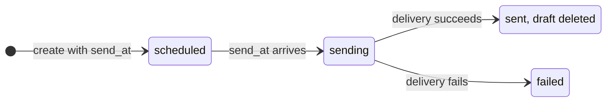

<Visibility for="humans">


<Info>If you don't have an API key yet, follow the [Quickstart](/quickstart) first.</Info>

## Send an email

A send goes out immediately from the inbox you choose. You address it with `to` (or `cc` or `bcc`), and at least one of those three must contain an address. Everything else is optional.

<CodeGroup>

```bash CLI
agentmail inboxes:messages send \
  --inbox-id "example@agentmail.to" \
  --to "you@example.com" \
  --subject "Your receipt" \
  --text "Thanks for your order. Receipt no. 4821." \
  --html "<p>Thanks for your order. Receipt no. 4821.</p>"
```

```bash API
curl -X POST "https://api.agentmail.to/v0/inboxes/example@agentmail.to/messages/send" \
  -H "Authorization: Bearer $AGENTMAIL_API_KEY" \
  -H "Content-Type: application/json" \
  -d '{
    "to": ["you@example.com"],
    "subject": "Your receipt",
    "text": "Thanks for your order. Receipt no. 4821.",
    "html": "<p>Thanks for your order. Receipt no. 4821.</p>"
  }'
```

```typescript TypeScript
import { AgentMailClient } from "agentmail";

const client = new AgentMailClient();

const sent = await client.inboxes.messages.send("example@agentmail.to", {
  to: ["you@example.com"],
  subject: "Your receipt",
  text: "Thanks for your order. Receipt no. 4821.",
  html: "<p>Thanks for your order. Receipt no. 4821.</p>",
});
console.log(sent.messageId, sent.threadId);
```

```python Python
from agentmail import AgentMail

client = AgentMail()

sent = client.inboxes.messages.send(
    inbox_id="example@agentmail.to",
    to=["you@example.com"],
    subject="Your receipt",
    text="Thanks for your order. Receipt no. 4821.",
    html="<p>Thanks for your order. Receipt no. 4821.</p>",
)
print(sent.message_id, sent.thread_id)
```

</CodeGroup>

| Param | Type | What it means |
| --- | --- | --- |
| `to`, `cc`, `bcc` | string or string[] | Recipients. Each takes one address or a list, as a bare address or `Name <address>`. At least one of the three must contain an address. |
| `subject` | string | The subject line. |
| `text` | string | The plain-text body. |
| `html` | string | The HTML body. Send both `text` and `html` when you can: clients that cannot render HTML fall back to the text version, and having both helps deliverability. |
| `reply_to` | string or string[] | Address or list of addresses that replies should go to instead of the sending inbox. |
| `attachments` | object[] | Files to attach. Each entry takes a `filename` plus exactly one source: `content` (the Base64-encoded file bytes) or `url` (a link AgentMail downloads at send time). |
| `labels` | string[] | Your own labels to store on the sent message, so you can find or filter it later. AgentMail adds `sent` on top. In the CLI, pass them as a JSON array: `--label '["orders"]'`. |
| `headers` | object | Custom SMTP headers to set on the outgoing email, as a map of header name to string value. Immediate sends only (send, reply, reply-all, forward); drafts silently ignore it. |

One message can reach up to 50 recipients across `to`, `cc`, and `bcc` combined.

<Note>
Every value in the `headers` map must be a string. The only way to leave a custom header off a send is to omit it from the map. Sends from shared-domain inboxes (addresses on `agentmail.to`) always carry AgentMail's `List-Unsubscribe` headers, and the `headers` map cannot override or suppress them. To control unsubscribe headers yourself, send from a [verified custom domain](/advanced/custom-domains), which passes your own headers through.
</Note>

The send returns the new message's `message_id` and the `thread_id` of the conversation it starts.
- `message_id` is what you reply to or forward later
- `thread_id` fetches the whole conversation when you [manage conversations](/core/conversations).

The sent copy appears in your inbox with the `sent` label plus any labels you passed.

<Note>
Mail sent from a shared `@agentmail.to` address carries a "Sent via AgentMail" footer while your organization is on the Free plan or the Agent plan (the plan an agent lands on when it signs itself up). To send without it:

- send from an inbox on a [verified custom domain](/advanced/custom-domains), on any plan
- or move to a paid plan (Developer and above), which sends unbranded even from `@agentmail.to`
</Note>

<Accordion title="Troubleshooting">
- **A `400` with `"to, cc, or bcc must be specified"`.** The request reached AgentMail with no recipients (often because the recipient list was built empty, or the address ended up under a misspelled field name).
- **The body fields are `text` and `html`.** A common mistake is to send a `body` field: it is dropped silently, so the email goes out with an empty body.

</Accordion>

## Set the name recipients see

The name next to your address on an email app such as Gmail or Apple Mail is the inbox's `display_name`.

<Steps>
<Step title="Set it when you create the inbox">

Both create fields are optional: `username` picks the local part of the address (AgentMail generates one when you omit it), and `display_name` sets the name.

<CodeGroup>

```bash CLI
agentmail inboxes create \
  --username "updates" \
  --display-name "Acme Updates"
```

```bash API
curl -X POST "https://api.agentmail.to/v0/inboxes" \
  -H "Authorization: Bearer $AGENTMAIL_API_KEY" \
  -H "Content-Type: application/json" \
  -d '{
    "username": "updates",
    "display_name": "Acme Updates"
  }'
```

```typescript TypeScript
const inbox = await client.inboxes.create({
  username: "updates",
  displayName: "Acme Updates",
});
console.log(inbox.inboxId, inbox.displayName);
```

```python Python
from agentmail.inboxes import CreateInboxRequest

inbox = client.inboxes.create(request=CreateInboxRequest(
    username="updates",
    display_name="Acme Updates",
))
print(inbox.inbox_id, inbox.display_name)
```

</CodeGroup>

A display name can be up to 256 characters. Characters that have meaning in an email header are rejected: `( ) < > @ , ; : \ " [ ]` and control characters.

</Step>
<Step title="Rename an existing inbox">

You can update the `display_name` any time but the new name applies to messages sent after the change, mail already delivered keeps the name it went out with.

<CodeGroup>

```bash CLI
agentmail inboxes update \
  --inbox-id "example@agentmail.to" \
  --display-name "Acme Updates"
```

```bash API
curl -X PATCH "https://api.agentmail.to/v0/inboxes/example@agentmail.to" \
  -H "Authorization: Bearer $AGENTMAIL_API_KEY" \
  -H "Content-Type: application/json" \
  -d '{ "display_name": "Acme Updates" }'
```

```typescript TypeScript
const inbox = await client.inboxes.update("example@agentmail.to", {
  displayName: "Acme Updates",
});
console.log(inbox.displayName);
```

```python Python
inbox = client.inboxes.update(
    inbox_id="example@agentmail.to",
    display_name="Acme Updates",
)
print(inbox.display_name)
```

</CodeGroup>


</Step>
</Steps>

<Accordion title="Troubleshooting">
- **A display name containing a rejected character fails with a `400 ValidationError`** whose `errors` array lists the offending characters.
- **A taken `username` returns a `403`.** Usernames are first come, first served: the code is `resource_taken` if a different organization owns it, or `already_exists` if your own organization does. Both list up to three currently available variants in `suggestions`, so your agent can pick one and retry. At your plan's inbox cap, `403 limit_exceeded` fires before the collision check, so a duplicate name can surface as the limit error instead.
- **An empty update body returns a `400 ValidationError`** with the message "Must provide display_name or metadata".
</Accordion>

## Reply to a message

To reply, you need the `message_id` of the message you are answering. You get it when you [receive email](/core/receive) or list messages. Recipients are optional on a reply because AgentMail derives them from the original message:

- With no `to`, the reply goes to the original message's `Reply-To` address, or to its sender if there is none.
- Pass `to`, `cc`, or `bcc` to override that and address the reply yourself.

<CodeGroup>

```bash CLI
agentmail inboxes:messages reply \
  --inbox-id "example@agentmail.to" \
  --message-id "<message_id>" \
  --text "Thanks, the tracking number arrived."
```

```bash API
curl -X POST "https://api.agentmail.to/v0/inboxes/example@agentmail.to/messages/<message_id>/reply" \
  -H "Authorization: Bearer $AGENTMAIL_API_KEY" \
  -H "Content-Type: application/json" \
  -d '{ "text": "Thanks, the tracking number arrived." }'
```

```typescript TypeScript
const reply = await client.inboxes.messages.reply(
  "example@agentmail.to",
  "<message_id>",
  { text: "Thanks, the tracking number arrived." },
);
console.log(reply.messageId, reply.threadId);
```

```python Python
reply = client.inboxes.messages.reply(
    inbox_id="example@agentmail.to",
    message_id="<message_id>",
    text="Thanks, the tracking number arrived.",
)
print(reply.message_id, reply.thread_id)
```

</CodeGroup>

A reply takes the same body fields as a send. Your `text` or `html` goes above the quoted original, and AgentMail adds the quote block and the `Re:` subject for you (pass `subject` to override it). When you call the API directly, URL-encode the `message_id` in the path. It contains `<`, `>`, and `@`, which are not valid URL characters, so an unencoded id makes the request fail. The SDKs and CLI encode it for you.

The reply returns a new `message_id` and the same `thread_id` as the message it answered, which is how the conversation stays grouped:

```json Sample response
{
  "message_id": "<010001a034382b3e-6c572037-a296-4430-a35a-e075e4f2476d-000000@email.amazonses.com>",
  "thread_id": "7f4d9495-cb6c-4554-b209-f551ad48b50c"
}
```

<Note>
The reply lands in the same conversation because AgentMail sets the standard threading headers (`In-Reply-To` and `References`) on the outgoing email for you. On received messages, those same ids are exposed as the `in_reply_to` and `references` fields.
</Note>

<Accordion title="Troubleshooting">
- **A `404` with `"Message not found"`** means no message with that id is visible to your credential (most often the `message_id` belongs to a different inbox than the `inbox_id` you replied from). Make sure you reply from the inbox that holds the message.
</Accordion>

### How to not get trapped in a loop

If you're building an auto-reply agent, you need to design for the case where it interacts with an out-of-office auto-responder or another bot.

1. **Never respond to your own outbound mail.** If you consume webhook events, skip `message.sent` events entirely; they fire for your agent's own sends. If you poll, skip messages whose `from` is your inbox address.
2. **Skip auto-generated mail.** Received messages include a `headers` map. Do not reply when `Auto-Submitted` is present with any value other than `no`; that header marks out-of-office notices, delivery reports, and other machine-generated mail. (`Auto-Submitted: no` explicitly marks a human-originated message, so it stays safe to answer.)
3. **Cap replies per thread.** Before replying, count your inbox's prior messages in the thread and stop past a fixed limit. This bounds the damage of any loop the first two checks miss.

## Reply all

A reply-all answers everyone at once: the sender plus every `to` and `cc` recipient of the message you are answering. You do not pass recipients. AgentMail derives the full list from the original message:

- `to` becomes the original `To` line plus the sender (or the sender's `Reply-To` address if it set one), minus your own inbox address.
- `cc` keeps the original `Cc` line.

<CodeGroup>

```bash CLI
agentmail inboxes:messages reply-all \
  --inbox-id "example@agentmail.to" \
  --message-id "<message_id>" \
  --text "Looping everyone in on the update."
```

```bash API
curl -X POST "https://api.agentmail.to/v0/inboxes/example@agentmail.to/messages/<message_id>/reply-all" \
  -H "Authorization: Bearer $AGENTMAIL_API_KEY" \
  -H "Content-Type: application/json" \
  -d '{ "text": "Looping everyone in on the update." }'
```

```typescript TypeScript
const reply = await client.inboxes.messages.replyAll(
  "example@agentmail.to",
  "<message_id>",
  { text: "Looping everyone in on the update." },
);
```

```python Python
reply = client.inboxes.messages.reply_all(
    inbox_id="example@agentmail.to",
    message_id="<message_id>",
    text="Looping everyone in on the update.",
)
```

</CodeGroup>

A reply-all request that includes `to`, `cc`, or `bcc` sends to the derived list anyway. To pick the recipients yourself, send a [reply](#reply-to-a-message) with `to` instead.

The response has the same shape as a reply: a new `message_id` and the thread's `thread_id`.

## Forward a message

A forward sends a message your inbox holds onward to someone new, with the original's attachments riding along. It needs a recipient: `to`, `cc`, or `bcc` must contain an address.

<CodeGroup>

```bash CLI
agentmail inboxes:messages forward \
  --inbox-id "example@agentmail.to" \
  --message-id "<message_id>" \
  --to "teammate@example.com" \
  --text "Forwarding the shipping notice for your records."
```

```bash API
curl -X POST "https://api.agentmail.to/v0/inboxes/example@agentmail.to/messages/<message_id>/forward" \
  -H "Authorization: Bearer $AGENTMAIL_API_KEY" \
  -H "Content-Type: application/json" \
  -d '{
    "to": ["teammate@example.com"],
    "text": "Forwarding the shipping notice for your records."
  }'
```

```typescript TypeScript
const forwarded = await client.inboxes.messages.forward(
  "example@agentmail.to",
  "<message_id>",
  {
    to: ["teammate@example.com"],
    text: "Forwarding the shipping notice for your records.",
  },
);
console.log(forwarded.messageId, forwarded.threadId);
```

```python Python
forwarded = client.inboxes.messages.forward(
    inbox_id="example@agentmail.to",
    message_id="<message_id>",
    to=["teammate@example.com"],
    text="Forwarding the shipping notice for your records.",
)
print(forwarded.message_id, forwarded.thread_id)
```

</CodeGroup>

Your note appears above a "Forwarded message" block that quotes the original with its sender, date, and subject. The subject defaults to `Fwd:` plus the original subject (pass `subject` to override), and any `attachments` you add in the request are sent alongside the original's.

The returned `thread_id` is the source conversation's, so the forward stays attached to the thread you forwarded from:

```json Sample response
{
  "message_id": "<010001a0343a7698-e9b5cd4d-18cb-4b42-93ac-dbd35c573fa4-000000@email.amazonses.com>",
  "thread_id": "eb8d00e0-3a49-4fe9-9ce8-ed68a6e7df9d"
}
```

<Accordion title="Troubleshooting">
- **A forward with no recipient returns a `400`.** `to`, `cc`, or `bcc` must contain an address.
</Accordion>

## Schedule an email with a draft

A draft is a saved, unsent message. It takes the same fields as a send, plus `send_at` as an ISO 8601 datetime. AgentMail delivers it at that time, with no cron job or polling on your side. A scheduled draft must already have a recipient (unless it is a reply draft created with `in_reply_to`, which derives its recipients from the source message).

<CodeGroup>

```bash CLI
agentmail inboxes:drafts create \
  --inbox-id "example@agentmail.to" \
  --to "you@example.com" \
  --subject "Following up" \
  --text "Checking in ahead of our call tomorrow." \
  --send-at "2026-08-26T09:00:00Z"
```

```bash API
curl -X POST "https://api.agentmail.to/v0/inboxes/example@agentmail.to/drafts" \
  -H "Authorization: Bearer $AGENTMAIL_API_KEY" \
  -H "Content-Type: application/json" \
  -d '{
    "to": ["you@example.com"],
    "subject": "Following up",
    "text": "Checking in ahead of our call tomorrow.",
    "send_at": "2026-08-26T09:00:00Z"
  }'
```

```typescript TypeScript
const draft = await client.inboxes.drafts.create("example@agentmail.to", {
  to: ["you@example.com"],
  subject: "Following up",
  text: "Checking in ahead of our call tomorrow.",
  sendAt: new Date(Date.now() + 24 * 60 * 60 * 1000), // 24 hours from now
});
console.log(draft.draftId, draft.sendStatus);
```

```python Python
from datetime import datetime, timedelta, timezone

draft = client.inboxes.drafts.create(
    inbox_id="example@agentmail.to",
    to=["you@example.com"],
    subject="Following up",
    text="Checking in ahead of our call tomorrow.",
    send_at=datetime.now(timezone.utc) + timedelta(hours=24),
)
print(draft.draft_id, draft.send_status)
```

</CodeGroup>

Due drafts are checked every minute, so delivery starts within a minute of `send_at`. A `send_at` in the past is accepted and goes out on the next check.

```json Sample response
{
  "organization_id": "1a2b3c4d-5e6f-4a1b-8c2d-3e4f5a6b7c8d",
  "pod_id": "1a2b3c4d-5e6f-4a1b-8c2d-3e4f5a6b7c8d",
  "inbox_id": "example@agentmail.to",
  "draft_id": "5e971da0-d608-4a72-90ad-0af2fed7740b",
  "subject": "Following up",
  "to": ["you@example.com"],
  "text": "Checking in ahead of our call tomorrow.",
  "send_at": "2026-08-26T09:00:00Z",
  "preview": "Checking in ahead of our call tomorrow.",
  "send_status": "scheduled",
  "labels": ["draft", "scheduled"],
  "updated_at": "2026-08-24T14:44:52.387Z",
  "created_at": "2026-08-24T14:44:52.387Z"
}
```

You can change your mind any time before the draft fires:

- To reschedule, update the draft with a new `send_at`.
- To unschedule but keep the draft, update it with `send_at` set to `null`. It loses the `scheduled` label and stays editable as a plain draft.
- To cancel entirely, delete the draft.

`send_status` tells you where a scheduled draft stands:

- `scheduled` means it is queued for its `send_at` time.
- `sending` means it is going out right now, so it can no longer be edited or canceled.
- `failed` means the send attempt failed. Set a new `send_at` to retry it.

The full lifecycle:



A draft that sends successfully is deleted, so a draft you can still fetch has not gone out.

<Accordion title="Troubleshooting">
- **Scheduling a draft that has no recipients returns a `400`** with `"A scheduled draft (send_at) must specify to, cc, or bcc unless it is a reply (in_reply_to)"`. Give the draft its recipient before you schedule it.
</Accordion>

## Send a draft now

Sending a draft delivers it immediately, whether it is scheduled or a plain unscheduled draft. This is also the approval step when a human reviews drafts an agent wrote: the agent creates the draft, and your review flow sends it.

<CodeGroup>

```bash CLI
agentmail inboxes:drafts send \
  --inbox-id "example@agentmail.to" \
  --draft-id "<draft_id>"
```

```bash API
curl -X POST "https://api.agentmail.to/v0/inboxes/example@agentmail.to/drafts/<draft_id>/send" \
  -H "Authorization: Bearer $AGENTMAIL_API_KEY" \
  -H "Content-Type: application/json" \
  -d '{}'
```

```typescript TypeScript
const sent = await client.inboxes.drafts.send(
  "example@agentmail.to",
  "<draft_id>",
  {}, // no label edits
);
console.log(sent.messageId, sent.threadId);
```

```python Python
sent = client.inboxes.drafts.send(
    inbox_id="example@agentmail.to",
    draft_id="<draft_id>",
)
print(sent.message_id, sent.thread_id)
```

</CodeGroup>

You can pass `add_labels` and `remove_labels` in the request to adjust the labels stored on the sent message.

The send returns the new message's `message_id` and `thread_id`, and the draft itself is deleted. Keep those ids, because the `draft_id` no longer resolves:

```json Sample response
{
  "message_id": "<010001a0343c70da-4545632f-1ee8-4ba0-a62d-e6c095079f47-000000@email.amazonses.com>",
  "thread_id": "e16bc3e9-1833-48c9-a0e6-2ac6f164e4c2"
}
```

<Accordion title="Troubleshooting">
- **A `404` with `"Draft not found"`** means no draft with that id exists in the inbox (usually because the draft already sent, by its schedule or an earlier call, and was deleted with the send).
</Accordion>

## Make sends idempotent

Retries are unavoidable, and a retried send without protection delivers the same email twice. Pass an `Idempotency-Key` header (`idempotencyKey` in TypeScript, `idempotency_key` in Python) on any send your code might retry and AgentMail sends exactly once, replaying the original `message_id` and `thread_id` on retries. Key rules, the replay window, and the `409`/`400` failure modes are on [Make sends safe to retry](/advanced/errors#make-sends-safe-to-retry).

## Next Steps

<CardGroup cols={2}>
  <Card title="Manage conversations" icon="comments" href="/core/conversations">
    Work with the threads your sends create.
  </Card>
  <Card title="Use a custom domain" icon="globe" href="/advanced/custom-domains">
    Send from your own domain instead of `@agentmail.to`.
  </Card>
</CardGroup>

</Visibility>

<Visibility for="agents">

# Send email, reply, and schedule delivery

These endpoints send new mail from an inbox, answer or forward existing messages with the thread kept intact, and schedule drafts for later delivery. Use them whenever an agent originates or responds to email.

## Do this

Send a new email. At least one of `to`, `cc`, `bcc` must contain an address. Add an `Idempotency-Key` header so a retry cannot deliver a duplicate:

```bash
curl -X POST "https://api.agentmail.to/v0/inboxes/example@agentmail.to/messages/send" \
  -H "Authorization: Bearer $AGENTMAIL_API_KEY" \
  -H "Idempotency-Key: order-4821-receipt" \
  -H "Content-Type: application/json" \
  -d '{
    "to": ["you@example.com"],
    "subject": "Your receipt",
    "text": "Thanks for your order. Receipt no. 4821.",
    "html": "<p>Thanks for your order. Receipt no. 4821.</p>"
  }'
```

Keep the returned `message_id` (needed to reply or forward later) and `thread_id` (fetches the conversation).

To answer a message the inbox holds, POST body fields to its reply endpoint. Recipients are derived from the original message:

```bash
curl -X POST "https://api.agentmail.to/v0/inboxes/example@agentmail.to/messages/<url_encoded_message_id>/reply" \
  -H "Authorization: Bearer $AGENTMAIL_API_KEY" \
  -H "Content-Type: application/json" \
  -d '{ "text": "Thanks, the tracking number arrived." }'
```

## SDK

```bash
npm install agentmail        # TypeScript
pip install agentmail        # Python
npm install -g agentmail-cli # CLI
```

- Send: TypeScript `client.inboxes.messages.send(inboxId, { to, subject, text, html })`, Python `client.inboxes.messages.send(inbox_id=..., to=[...], subject=..., text=..., html=...)`, CLI `agentmail inboxes:messages send`
- Reply: TypeScript `client.inboxes.messages.reply(inboxId, messageId, { text })`, Python `client.inboxes.messages.reply(inbox_id=..., message_id=..., text=...)`, CLI `agentmail inboxes:messages reply`
- Reply all: TypeScript `client.inboxes.messages.replyAll(inboxId, messageId, { text })`, Python `client.inboxes.messages.reply_all(inbox_id=..., message_id=..., text=...)`, CLI `agentmail inboxes:messages reply-all`
- Forward: TypeScript `client.inboxes.messages.forward(inboxId, messageId, { to, text })`, Python `client.inboxes.messages.forward(inbox_id=..., message_id=..., to=[...], text=...)`, CLI `agentmail inboxes:messages forward`
- Schedule a draft: TypeScript `client.inboxes.drafts.create(inboxId, { to, subject, text, sendAt })`, Python `client.inboxes.drafts.create(inbox_id=..., to=[...], send_at=...)`, CLI `agentmail inboxes:drafts create --send-at`
- Send a draft now: TypeScript `client.inboxes.drafts.send(inboxId, draftId, {})`, Python `client.inboxes.drafts.send(inbox_id=..., draft_id=...)`, CLI `agentmail inboxes:drafts send`
- Idempotency: TypeScript request option `{ idempotencyKey: "..." }`, Python keyword `idempotency_key="..."`
- Display name: TypeScript `client.inboxes.create({ username, displayName })` and `client.inboxes.update(inboxId, { displayName })`, Python `client.inboxes.create(request=CreateInboxRequest(username=..., display_name=...))` and `client.inboxes.update(inbox_id=..., display_name=...)`, CLI `agentmail inboxes create` and `agentmail inboxes update`

Full reference: [/integrations/sdks-and-cli](/integrations/sdks-and-cli).

## Facts

- `POST https://api.agentmail.to/v0/inboxes/{inbox_id}/messages/send` sends immediately. `to`, `cc`, and `bcc` each take one address or a list, bare or `Name <address>`.
- One message reaches up to 50 recipients across `to`, `cc`, and `bcc` combined.
- Body fields are `text` and `html`. Sending both helps deliverability, and clients that cannot render HTML fall back to `text`.
- `reply_to` sets the address or list of addresses replies go to instead of the sending inbox.
- Each `attachments` entry takes `filename` plus exactly one source: `content` (Base64 file bytes) or `url` (a link AgentMail downloads at send time).
- `labels` stores custom labels on the sent message, and AgentMail adds `sent` on top. The sent copy appears in the inbox.
- Mail from a shared `@agentmail.to` address on the Free or Agent plan carries a "Sent via AgentMail" footer. A verified custom domain (any plan) or a paid plan (Developer and above) sends without it.
- `POST https://api.agentmail.to/v0/inboxes/{inbox_id}/messages/{message_id}/reply` with no `to` sends to the original message's `Reply-To` address, or its sender if there is none. Pass `to`, `cc`, or `bcc` to override.
- A reply takes the same body fields as a send. The `text` or `html` goes above the quoted original, and AgentMail adds the quote block and the `Re:` subject (pass `subject` to override). The response is a new `message_id` and the same `thread_id`.
- Replies thread because AgentMail sets the standard `In-Reply-To` and `References` SMTP headers on the outgoing email. Received messages expose those ids as the `in_reply_to` and `references` fields.
- Reply-loop prevention, in order: never respond to your own outbound mail (skip `message.sent` webhook events, or when polling skip messages whose `from` is your inbox address); do not reply when a received message's `headers` map has `Auto-Submitted` with any value other than `no` (that header marks out-of-office notices and other machine-generated mail; `Auto-Submitted: no` explicitly marks human-originated mail and stays safe to answer); cap your own replies per `thread_id` so any loop that slips through is bounded.
- `headers` is a map of custom SMTP headers on immediate sends: new messages, replies, reply-alls, and forwards. Every value must be a string. Drafts do not take it: a `headers` field on draft create is silently ignored, so mail that needs custom headers must go through an immediate send. Sends from shared-domain (`agentmail.to`) inboxes always carry AgentMail's `List-Unsubscribe` headers; custom-domain inboxes pass their own headers through.
- `POST https://api.agentmail.to/v0/inboxes/{inbox_id}/messages/{message_id}/reply-all` derives `to` as the original `To` line plus the sender (or the sender's `Reply-To` address), minus the replying inbox's own address, and keeps the original `Cc` line.
- `POST https://api.agentmail.to/v0/inboxes/{inbox_id}/messages/{message_id}/forward` requires a recipient in `to`, `cc`, or `bcc`. The subject defaults to `Fwd:` plus the original (pass `subject` to override), the original's attachments ride along with any added in the request, and the returned `thread_id` is the source conversation's.
- A `message_id` contains `<`, `>`, and `@`. URL-encode it in reply, reply-all, and forward paths built by hand. The SDKs and CLI encode it automatically.
- `POST https://api.agentmail.to/v0/inboxes/{inbox_id}/drafts` takes the same fields as a send plus `send_at` (ISO 8601). Due drafts are checked every minute, and a `send_at` in the past goes out on the next check.
- A scheduled draft must have a recipient unless it is a reply draft created with `in_reply_to`, which derives recipients from the source message.
- A scheduled draft comes back with `draft_id`, `send_status` of `scheduled`, and the labels `draft` and `scheduled`. Listing drafts filtered by the `scheduled` label shows everything queued in an inbox.
- Reschedule a draft with a new `send_at`, unschedule with `send_at` set to `null` (the draft stays editable), cancel by deleting the draft.
- `send_status` values: `scheduled` (queued), `sending` (going out now), `failed` (set a new `send_at` to retry).
- A draft that sends successfully is deleted, so a draft that can still be fetched has not gone out.
- `POST https://api.agentmail.to/v0/inboxes/{inbox_id}/drafts/{draft_id}/send` delivers a draft immediately, scheduled or not. Optional `add_labels` and `remove_labels` adjust the labels stored on the sent message. Returns `message_id` and `thread_id`.
- The `Idempotency-Key` header works on every send: new messages, replies, reply-alls, forwards, and draft sends. A key is 1 to 256 characters from `A-Z a-z 0-9 - . _ ~`, one key per email.
- A retry with the same key and the same request returns the original `message_id` and `thread_id` and sends nothing, for 24 hours after the send. After 24 hours the key is free to reuse.
- When two simultaneous requests share a key, one sends and the other gets a `409`. Retrying the `409` request returns the replayed result.
- The sender name recipients see is the inbox's `display_name`, up to 256 characters. Rejected characters: `( ) < > @ , ; : \ " [ ]` and control characters.
- Set `display_name` on `POST https://api.agentmail.to/v0/inboxes` (`username` and `display_name` both optional, AgentMail generates an address when `username` is omitted) or on `PATCH https://api.agentmail.to/v0/inboxes/{inbox_id}` (must include `display_name`, `metadata`, or both).
- A new `display_name` applies to messages sent after the change. Delivered mail keeps the name it went out with, and the inbox's `email` address stays the same.

## Not supported

- There is no `body` field. A `body` field is dropped silently and the email goes out with an empty body. Use `text` and `html`.
- Reply-all does not take recipient overrides. A reply-all request with `to`, `cc`, or `bcc` sends to the derived list anyway. To pick recipients, use the reply endpoint with `to`.
- An inbox cannot mail its own address.
- A forward does not start a new thread. It stays attached to the conversation it was forwarded from.
- A sent draft cannot be fetched or reused. The draft is deleted when it sends, and the `draft_id` no longer resolves.
- A draft with `send_status` of `sending` can no longer be edited or canceled.
- Sends without an `Idempotency-Key` are not deduplicated.
- An empty `Idempotency-Key` value returns a `400` instead of sending without protection.
- A `display_name` does not override a recipient's saved contact. Some clients show the saved contact name instead.
- There is no header-suppression mechanism in the `headers` map, for your own custom headers or for headers AgentMail sets: a `null` value returns a `400 ValidationError`. To leave a custom header off a send, omit it from the map. `List-Unsubscribe` headers on shared-domain (`agentmail.to`) sends cannot be overridden or suppressed.

## Errors

| Error | HTTP | Cause | Fix |
| --- | --- | --- | --- |
| `to, cc, or bcc must be specified` | 400 | A send or forward reached AgentMail with no recipients, often an empty list or a misspelled field name. | Put at least one address in `to`, `cc`, or `bcc`. |
| `ValidationError` | 400 | A `display_name` containing a rejected character, or an inbox update with an empty body (`Must provide display_name or metadata`). | Correct the fields named in the `errors` array. |
| `A scheduled draft (send_at) must specify to, cc, or bcc unless it is a reply (in_reply_to)` | 400 | A draft was scheduled with no recipients. | Give the draft a recipient before setting `send_at`. |
| `resource_taken` | 403 | The inbox `username` belongs to another organization. | Pick one of the up to 3 available variants in `suggestions` and retry. |
| `already_exists` | 403 | The organization already owns that `username`. | Use the existing inbox or pick a variant from `suggestions`. |
| `limit_exceeded` | 403 | The plan's inbox cap is reached. This check runs before the collision check, so a duplicate `username` can surface as this error. | Resolve the cap, then retry. |
| `Message not found` | 404 | No message with that id is visible to the credential, most often the `message_id` belongs to a different inbox. | Reply from the inbox that holds the message. |
| `Draft not found` | 404 | The draft already sent, by its schedule or an earlier call, and was deleted with the send. | Use the `message_id` and `thread_id` the send returned. |
| `IdempotencyKeyConflictError` | 409 | The same `Idempotency-Key` was used for a different request, or a simultaneous duplicate is still in flight. | Retry the identical request, or generate a new key for a new message. |

## Verify

A `200` response with `message_id` and `thread_id` confirms the send went out. To see the stored copy:

```bash
curl -s "https://api.agentmail.to/v0/inboxes/example@agentmail.to/messages?labels=sent&limit=1" \
  -H "Authorization: Bearer $AGENTMAIL_API_KEY"
```

The newest entry carries the `sent` label plus any labels passed with the send.

## Related

- [/core/conversations](/core/conversations) works with the threads sends create.
- [/advanced/custom-domains](/advanced/custom-domains) sends from a custom domain instead of `@agentmail.to`.
- [/core/receive](/core/receive) lists the mail whose `message_id` a reply needs.
- [/advanced/errors](/advanced/errors) covers error codes and safe retries in full.

</Visibility>
