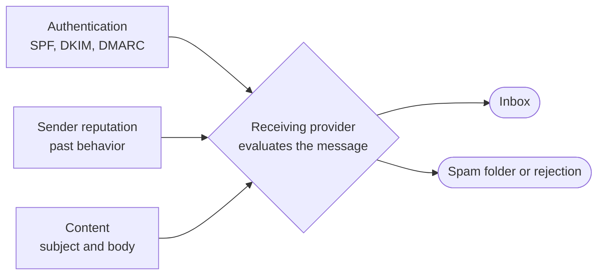

## What makes mail land in spam

Each receiving provider decides placement on its own, and acceptance is only the first step: `message.delivered` means the receiving server took the message, and a delivered message can still land in spam. The choice comes down to three signals:

- **Authentication.** Can the receiver prove the message came from the domain in its `From` address? Mail without that proof starts distrusted.
- **Reputation.** How has mail from this domain behaved before? A domain with no history, or a history of bounces and complaints, is suspect no matter what the message says.
- **Content.** Does the message look like spam? Filters score the subject and body against patterns learned from real spam.

If your mail is landing in spam, work through these causes in order, most frequent first:

1. Missing or misconfigured SPF, DKIM, or DMARC records. This is the most common cause by far.
2. A new domain sending real volume before it has any reputation.
3. Content that looks like spam to a filter: HTML with no plain-text version, trigger words like "free" and "urgent", all-caps subjects, stacked links, or images in the body. Open trackers count as images, because open tracking works by embedding a tiny image.
4. A bounce rate high enough that providers stop trusting the traffic.
5. Production sending from the shared `@agentmail.to` domain, whose reputation every AgentMail user shares.

[Deliverability and warmup](/advanced/deliverability) holds the fixes for all five.

## How SPF, DKIM, and DMARC work

Anyone can write any address into an email's `From` header, so receivers trust nothing until the sending domain proves itself. That proof is three DNS records only the domain's owner can publish:

| Record | What it publishes | What the receiver checks |
| --- | --- | --- |
| SPF | The servers allowed to send for a domain | Whether the server that handed over the message is on the list |
| DKIM | The public half of a signing key | Whether the message's signature verifies, proving which domain sent it and that nothing changed in transit |
| DMARC | The domain's policy for mail that fails authentication | Whether a passing SPF or DKIM identity aligns with the visible `From` domain, and what to do when none does |

**SPF** is a TXT record listing authorized sending servers. A host can carry only one, so if a domain already has an SPF record for another service, merge AgentMail's `include:` mechanism into the existing record instead of adding a second one. Two SPF records on one host fail authentication outright. Without SPF, receivers cannot tell your servers from anyone else claiming your domain.

**DKIM** signs every outgoing message with a private key that AgentMail holds for your domain. Receivers fetch the public key from the selector host in the record, like `agentmail._domainkey.example.com`, and verify the signature. A valid signature proves the message came from your domain and arrived unmodified. Without DKIM, a receiver has no way to check either.

**DMARC** closes the gap the other two leave. SPF and DKIM each pass for some domain, but not necessarily the one in the `From` header: SPF checks the domain in the message's return path, and DKIM checks whichever domain signed the message. A message can pass both and still fail DMARC when neither passing identity aligns with the domain the recipient sees. DMARC requires that alignment and sets a policy for mail that fails it:

- `p=none` asks receivers to take no action, a starting point while you confirm a new setup.
- `p=quarantine` asks receivers to send failing mail to spam.
- `p=reject` asks receivers to refuse it outright.

AgentMail generates a `reject` record, the policy that best protects a domain against spoofing, and [Customize DMARC policy](/advanced/custom-domains#customize-dmarc-policy) shows how to soften it. The record's `rua` tag names the address where receivers send aggregate reports on your domain's authentication results.

Gmail, Outlook, Yahoo, and the other major providers now expect all three records for reliable inbox placement. When you register a [custom domain](/advanced/custom-domains), AgentMail generates every record with values specific to your domain, and you publish them at your DNS provider. Shared `@agentmail.to` addresses have all of this in place already. Publishing the records grants AgentMail exactly two things: permission to send as your domain and delivery of the domain's inbound mail. Your website and the rest of your DNS are untouched.

The MX records in the set do a different job. They decide where a domain's inbound mail is delivered, while the TXT records only govern how outbound mail is judged. That split is why AgentMail can send from a domain whose inbound mail stays with Gmail, and why pointing a name's MX records at AgentMail moves all of that name's incoming mail. [Register a subdomain](/advanced/custom-domains#register-a-subdomain) covers running both side by side.

Passing every check does not guarantee the inbox. Authentication proves who sent the mail. Reputation decides how much that sender is trusted.

## What sender reputation is and how it builds

Each provider keeps a private score of your sending domain, built from what it has observed:

- authentication results on past mail
- delivery outcomes, above all the bounce rate
- recipient behavior, from opens and replies down to spam complaints
- how consistent the sending pattern is

The provider owns the score and the placement decision, so no DNS record or account setting controls reputation by itself. You change it only by sending differently.

A new domain starts at zero, and zero is not neutral. Spammers buy fresh domains and send hard until each one is blocked, so providers treat sudden volume from a new domain as hostile. Reputation accrues the opposite way: modest volume to recipients who open and reply, increased gradually over weeks. Replies to inbound mail build it fastest of all, because two-way conversation is the strongest engagement signal a provider can see. That is what warmup is, and the concrete ramp with its checkpoints is on [Deliverability and warmup](/advanced/deliverability#recommended-warmup-ramp).

Reputation is scored per domain, which cuts both ways:

- Damage stays contained. Outreach split across separately registered subdomains lets you cycle out a flagged domain without touching the others.
- Shared domains share reputation. Mail from `@agentmail.to` rides on the whole platform's history, fine for testing and the wrong foundation for production sending.

## Why sends bounce

A bounce means the recipient's mail server refused your message. The refusal comes in two kinds that call for different responses:

- **Permanent bounces** say the address is unreachable for good: the address does not exist, its domain does not exist, or the mailbox was deleted. Retrying cannot succeed, and repeated sends to dead addresses damage reputation quickly.
- **Transient bounces** are temporary conditions: a full mailbox, a receiving server that is briefly down, a message too large for the recipient, or greylisting, where a server turns away a first-time sender and accepts the retry. AgentMail retries transient bounces automatically and treats a message that keeps failing as permanently bounced.

The `message.bounced` event reports the provider's classification in its `bounce` object, a `type` and `sub_type` plus the affected recipients, so a handler can tell the two apart. The scope of the bounces tells you what broke:

- One recipient bouncing is a data problem. Correct the address or drop it.
- Bounces across many recipients or receiving domains are a sending problem. Check the domain's authentication and recent sending pattern before sending more.

After a hard bounce, a spam complaint, or an unsubscribe, AgentMail stops future sends to that address automatically. These automatic suppression entries are read-only, so correct the cause rather than trying to clear them, and email [support@agentmail.cc](mailto:support@agentmail.cc) if an entry genuinely needs review.

## What a spam complaint means

The message was delivered and the recipient marked it as spam. Nothing failed in transport, so there is nothing to retry. The recipient is saying, through their provider's feedback loop, that they did not want the mail. AgentMail surfaces the feedback as a `message.complained` event and suppresses the address like a hard bounce.

A complaint also judges the traffic, not just the one recipient. Providers tolerate far fewer complaints than bounces, so each one is a reason to review where the recipient came from, what the message was for, and whether similar sends should continue. Authentication does not offset it: a fully authenticated message that recipients report is still spam in the provider's eyes.

## Why a domain fails to verify

Verification is AgentMail querying public DNS for the records it generated and comparing what comes back. It sees exactly what every mail receiver sees, so a record that looks right in your DNS provider's panel can still be missing or wrong in public DNS. The cause is usually one of these:

- **The records have not propagated yet.** A DNS change takes anywhere from a minute to 48 hours to become visible depending on the provider, and most are live within half an hour.
- **The records live at the wrong provider.** Records only count at the provider that controls the domain's active nameservers. Anything added elsewhere is invisible to public DNS.
- **A name or value was mangled on entry.** The usual forms are the domain appended to the host twice, extra quotes around a TXT value, and stray spaces.
- **A conflicting record sits on the same host.** A second SPF record or a stale DKIM key at the same selector keeps the new value from validating.

The Troubleshooting accordion on [Custom domains](/advanced/custom-domains) works through each cause, along with the quirks of the common DNS providers. Verification can also lapse after it succeeds. AgentMail rechecks verified domains about once a day, and a domain whose records are later edited or deleted reverts to unverified, which blocks new inbox creation until the records are restored.

## Why inbound mail goes missing

The authentication above runs in both directions. AgentMail checks SPF, DKIM, and DMARC on every message that arrives for your inboxes, the same screening Gmail and Outlook apply, so spoofed and phishing mail does not reach your agents. What the checks find decides the message's fate:

- **Dropped before delivery and never stored:** mail carrying a virus, and mail that fails DMARC while the sender's own policy is `quarantine` or `reject`. The sender gets no bounce. Their server can even report a successful delivery, because AgentMail's servers accepted the message before rejecting it during verification.
- **Delivered with the `unauthenticated` label:** mail that fails authentication under a permissive policy, or arrives with no authentication headers at all. Some legitimate senders have no SPF or DKIM set up, so this mail is kept but flagged. Subscribe to the `message.received.unauthenticated` event to watch it arrive.
- **Delivered normally:** everything else.

Forwarded mail is the exception. A message auto-forwarded through Gmail, Outlook, or iCloud often fails direct SPF and DKIM checks at the final hop, because the forwarding server is not an authorized sender for the original domain. AgentMail then validates the message's ARC chain, a signed record of the authentication results the forwarder saw when the mail first arrived. If the chain verifies and the sealer is one of the trusted forwarders (microsoft.com, google.com, outlook.com, icloud.com), the original sender's authentication stands, so auto-forwarding into an AgentMail inbox keeps working.

Track down a missing message in this order:

1. **It arrived but is hidden.** The default listing hides messages labeled `spam`, `blocked`, `unauthenticated`, and `trash`. [Choose which messages you list](/core/receive#choose-which-messages-you-list) shows the include flags that reveal each label.
2. **The sender failed authentication.** If their domain publishes an enforcing DMARC policy and the mail failed it, the message was dropped. The fix is on the sender's side: their SPF and DKIM records must be corrected by whoever runs their domain's mail.
3. **The mail never reached AgentMail.** The domain's MX records point elsewhere, the domain is not verified yet, or, on a subdomain of a Google Workspace domain, Google routed the mail internally so it never left Workspace. The Troubleshooting accordion on [Custom domains](/advanced/custom-domains) shows the lookup, and the Troubleshooting accordion under [Register a subdomain](/advanced/custom-domains#register-a-subdomain) covers the Workspace fix.

## Next Steps

<CardGroup cols={2}>
  <Card title="Deliverability and warmup" icon="chart-line" href="/advanced/deliverability">
    The warmup ramp, monitoring thresholds, and sending practices built on these mechanics.
  </Card>
  <Card title="Custom domains" icon="globe" href="/advanced/custom-domains">
    Register a domain and publish the records this page explains.
  </Card>
</CardGroup>
