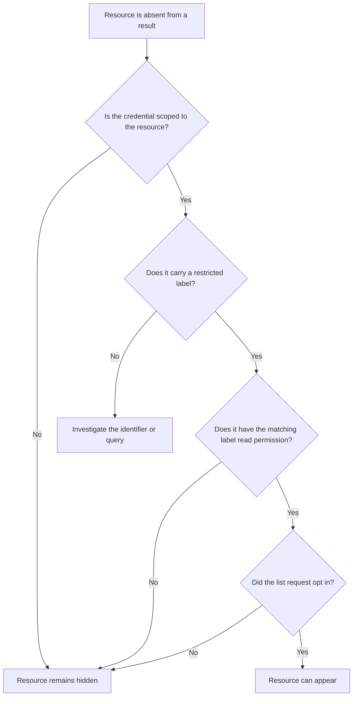

<Visibility for="humans">

Labels classify messages and threads, but they also expose service state and control visibility. Use caller-managed labels for your workflow, leave service-owned labels to AgentMail, and treat an absent restricted resource as a permissions question before treating it as missing data.

## Use caller-managed labels for application classification

Caller-managed labels are lowercase string tags you apply to messages and threads, such as `needs-review`, `customer-123`, or `processed`. A resource can hold at most 256 labels. The `message_update` permission is required to change message labels and is also required to change thread labels.

| Label mechanism | Can the caller change this label? |
| --- | --- |
| Caller-managed label, such as `needs-review` | Yes, by adding or removing it through a label-update request. |
| Service-owned system label, such as `received` or `delivered` | No. AgentMail maintains it. |

Use `add_labels` and `remove_labels` to make a targeted change. This Python example adds a workflow label and removes an earlier workflow label from one message:

```python
from agentmail import AgentMail

client = AgentMail()

updated = client.inboxes.messages.update(
    inbox_id="support@example.com",
    message_id="<message-id@example.com>",
    add_labels=["needs-review"],
    remove_labels=["triaged"],
)

print(updated.labels)
```

The same change is available over `PATCH /v0/inboxes/{inbox_id}/messages/{message_id}` with `add_labels` and `remove_labels` in the JSON body. The response contains the message's `message_id` and its resulting `labels`. Keep the labels in your own namespace so that they describe application state rather than transport or delivery state.

## Recognize system labels as service-owned state

A caller cannot add or remove system labels through label creation or update input. Their presence is information to read, not a value to set.

A system label can coexist with caller-managed labels on the same resource. For example, a received message might carry both `received` and `needs-review`. Updating the workflow label must leave the system label unchanged.

## Do not submit protected system labels

The following protected system labels are rejected when submitted in `labels`, `add_labels`, or `remove_labels`, with a `400` naming the label.

| Protected label | Why the request is rejected |
| --- | --- |
| `received` | AgentMail assigns inbound receipt state. |
| `sent` | AgentMail assigns outbound send state. |
| `bounced` | AgentMail maintains this delivery-state label. |
| `complained` | AgentMail maintains this delivery-state label. |
| `delayed` | AgentMail maintains this delivery-state label. |
| `delivered` | AgentMail maintains this delivery-state label. |
| `rejected` | AgentMail maintains this delivery-state label. |
| `opened` | AgentMail records the first open on a tracked message. |
| `scheduled` | AgentMail mirrors a draft's scheduled send state (`send_at`). |

This page does not cover the deliverability conditions behind labels such as `bounced` or `complained`. Use the deliverability concepts documentation for those conditions.

## Request permission before reading restricted labels

The restricted labels `spam`, `blocked`, `unauthenticated`, and `trash` are visibility controls. The matching permission for each is a boolean API-key field, set when the key is created or updated.

| Restricted label | Required read permission |
| --- | --- |
| `spam` | `label_spam_read` |
| `blocked` | `label_blocked_read` |
| `unauthenticated` | `label_unauthenticated_read` |
| `trash` | `label_trash_read` |

List requests exclude these labels by default. To include one, pass its matching query option, such as `include_spam=true`, and use a credential with the matching read permission. Both conditions are required.



A direct lookup without the required label-read permission also reports the resource as not found. That response intentionally does not distinguish a hidden resource from an incorrect identifier. Check the credential's scope, the relevant label permission, and the list request's include option before assuming data was deleted.

## Use inbox events to audit label changes

List inbox events with `GET /v0/inboxes/{inbox_id}/events`; results are reverse chronological by default. Each event identifies the `event_type` (`label.added` or `label.removed`), `message_id`, changed `label`, `event_at`, and `event_id`.

Use this trail to establish which message changed, whether a label was added or removed, and when the change occurred. Paginate through the event list when reconstructing a longer history.

</Visibility>

<Visibility for="agents">

# Apply caller labels and read system labels

Caller-managed labels track application state on messages and threads, while AgentMail-owned system labels expose delivery state and control visibility. Use this to change labels safely, avoid the label strings the service reserves, and diagnose a resource hidden by a restricted label before treating it as missing data.

## Do this

Add and remove caller-managed labels on one message, then audit the change in the inbox event trail.

```bash
# 1. Change labels in one targeted request
curl -X PATCH "https://api.agentmail.to/v0/inboxes/<inbox_id>/messages/<message_id>" \
  -H "Authorization: Bearer $AGENTMAIL_API_KEY" \
  -H "Content-Type: application/json" \
  -d '{ "add_labels": ["needs-review"], "remove_labels": ["triaged"] }'

# 2. Audit label changes (reverse chronological by default)
curl "https://api.agentmail.to/v0/inboxes/<inbox_id>/events" \
  -H "Authorization: Bearer $AGENTMAIL_API_KEY"
```

Keep caller labels in an application namespace such as `needs-review` or `customer-123`. Never submit a service-owned label string.

## SDK

Install: `pip install agentmail` (Python).

- Update message labels: Python `client.inboxes.messages.update(inbox_id="support@example.com", message_id="<message-id@example.com>", add_labels=["needs-review"], remove_labels=["triaged"])`

Full reference: `/integrations/sdks-and-cli`.

## Facts

- Caller-managed labels are lowercase string tags on messages and threads. A resource holds at most 256 labels.
- The `message_update` permission is required to change message labels and is also required to change thread labels.
- `PATCH /v0/inboxes/{inbox_id}/messages/{message_id}` takes `add_labels` and `remove_labels` in the JSON body. The response contains the message's `message_id` and its resulting `labels`.
- System labels are service-owned state. A system label can coexist with caller-managed labels on the same resource, for example `received` plus `needs-review`, and a caller label update leaves system labels unchanged.
- Protected system labels, complete list: `received`, `sent`, `bounced`, `complained`, `delayed`, `delivered`, `rejected`, `opened`, `scheduled`. A request that includes any of them as caller label input is rejected with a `400` naming the label.
- Restricted visibility labels, complete list: `spam`, `blocked`, `unauthenticated`, `trash`. List requests exclude resources carrying these labels by default.
- Each restricted label has a matching API-key read permission, a boolean permission field set when the key is created or updated: `spam` needs `label_spam_read`, `blocked` needs `label_blocked_read`, `unauthenticated` needs `label_unauthenticated_read`, `trash` needs `label_trash_read`.
- A restricted-label resource appears in a list result only when the credential is scoped to the resource, the credential carries the matching label read permission, and the list request passes the matching include option such as `include_spam=true`. All conditions are required.
- A direct lookup without the required label-read permission reports the resource as not found. That response intentionally does not distinguish a hidden resource from an incorrect identifier.
- Label audit trail: `GET /v0/inboxes/{inbox_id}/events` lists inbox events, reverse chronological by default. Each event identifies the `event_type` (`label.added` or `label.removed`), `message_id`, the changed `label`, `event_at`, and `event_id`. Paginate when reconstructing a longer history.

## Not supported

- Callers cannot add or remove system labels through label creation or update input.
- `received`, `sent`, `bounced`, `complained`, `delayed`, `delivered`, `rejected`, `opened`, and `scheduled` are rejected in `labels`, `add_labels`, and `remove_labels`.
- `include_spam=true` alone does not reveal spam-labeled resources when the credential lacks `label_spam_read`. The include option and the permission are both required, and the same pairing applies to `blocked`, `unauthenticated`, and `trash`.
- A not-found response on a direct lookup does not prove the resource was deleted. Check the credential's scope, the relevant label permission, and the list request's include option before assuming data is gone.

## Verify

Send the `PATCH` request above, then read the response's `labels` array. It contains `needs-review` and no longer contains `triaged`. `GET /v0/inboxes/{inbox_id}/events` shows a matching `label.added` event for the message.

## Related

- [/core/conversations](/core/conversations) - work threads and messages and apply label updates in that flow.
- [/extras/deliverability-fundamentals](/extras/deliverability-fundamentals) - the delivery conditions behind labels such as `bounced` and `complained`.
- [/core/inbound-control](/core/inbound-control) - the inbound filtering that assigns `spam`, `blocked`, and `unauthenticated`.

</Visibility>
