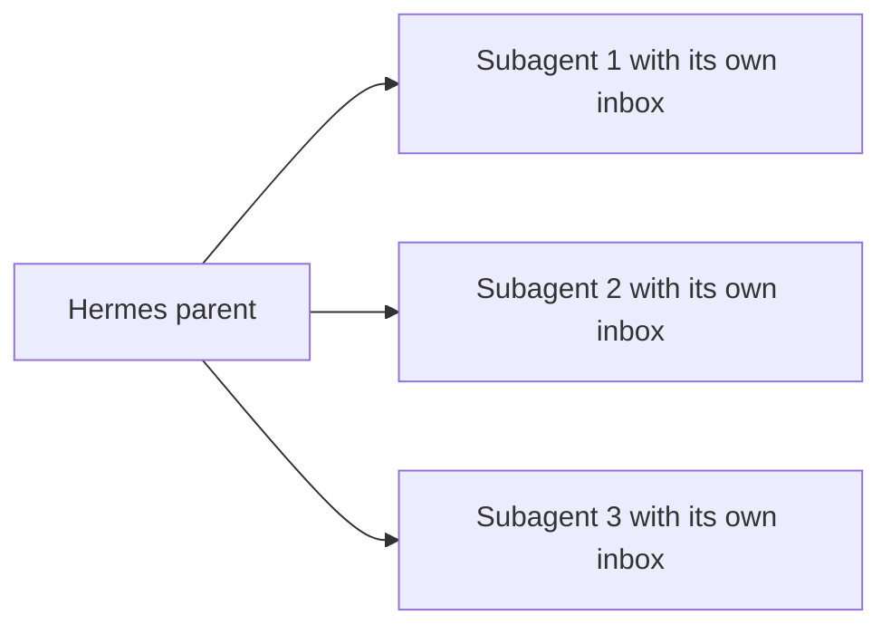

<Visibility for="humans">


Hermes is Nous Research's open source agent harness, which shares its name with Nous's Hermes model family. This page covers the harness. It connects to AgentMail through its built-in MCP client, so your agent gets typed email tools it can call from chat, from subagents, and from scheduled jobs.

Once the two are wired together, Hermes creates its own `@agentmail.to` inbox, sends and answers email for you, and runs parallel subagents that each work from an inbox of their own.

## 0. Get the prerequisites

Install Hermes if you have not already. The installer runs a setup wizard where you pick a model provider. The details are in the [Hermes installation guide](https://hermes-agent.nousresearch.com/docs/getting-started/installation).

```bash
curl -fsSL https://hermes-agent.nousresearch.com/install.sh | bash
```

Generate an API key from the [AgentMail Console](https://console.agentmail.to/dashboard/api-keys) and add it to `~/.hermes/.env`. Every Hermes process loads that file, including unattended scheduled runs, so the key does not depend on the shell you start from:

```bash
export AGENTMAIL_API_KEY="<API_KEY>"
echo "AGENTMAIL_API_KEY=$AGENTMAIL_API_KEY" >> ~/.hermes/.env
```

Check that the key works before wiring it into Hermes:

```bash
npm install -g agentmail-cli
agentmail inboxes list
```

An empty list is fine. You have not created an inbox yet.

<Accordion title="Troubleshooting">

- **`401` from `agentmail inboxes list`.** The key is missing or invalid.

</Accordion>

## 1. Register the AgentMail tools

Add the hosted AgentMail MCP server to `~/.hermes/config.yaml`:

```yaml title="~/.hermes/config.yaml"
mcp_servers:
  agentmail:
    url: "https://mcp.agentmail.to/mcp"
    headers:
      x-api-key: "${AGENTMAIL_API_KEY}"
```

Hermes resolves `${AGENTMAIL_API_KEY}` when it connects, reading your environment and `~/.hermes/.env`. The key itself stays out of the config file.

Check the connection:

```bash
hermes mcp test agentmail
hermes mcp list
```

`hermes mcp test agentmail` connects to the hosted server and prints each AgentMail tool with a one-line description. `hermes mcp list` confirms the server is registered:

```text Sample output
  MCP Servers:

  Name             Transport                      Tools        Status
  ──────────────── ────────────────────────────── ──────────── ──────────
  agentmail        https://mcp.agentmail.to/mcp   all          ✓ enabled
```

Every tool registers under a prefixed name such as `mcp__agentmail__create_inbox`, so it cannot collide with a built-in tool or another server's tools. You will not call these names yourself. Prompt in plain language and Hermes picks the tool.

If Hermes is already running, type `/reload-mcp` in the chat to pick up config changes without a restart.

To expose only the operations your agent needs, add a `tools` filter to the server entry. Only the listed tools register. An `exclude` list works the same way in reverse, and both accept globs:

```yaml
mcp_servers:
  agentmail:
    url: "https://mcp.agentmail.to/mcp"
    headers:
      x-api-key: "${AGENTMAIL_API_KEY}"
    tools:
      include: [create_inbox, send_message, list_threads, get_thread, reply_to_message]
```

The full tool catalog, OAuth and API key details, and the local stdio bridge are on [MCP and Skills](/integrations/mcp-and-skills).

## 2. Test sending an email

Start `hermes` and ask it to create an inbox and email you. Put your everyday address in place of `you@example.com`:

```text
Create an AgentMail inbox with the username support-agent and send an email
from it to you@example.com with the subject "Hello from Hermes".
```

The message reaches that account within moments. Hermes makes two tool calls: `create_inbox` returns the new address, and `send_message` sends from it. The send returns the message's `message_id` and the `thread_id` of the conversation it starts, which Hermes uses to keep any follow-up in the same thread.


Asking for an inbox without naming a username always works, because AgentMail generates the address.

You can confirm the send from outside Hermes with the CLI. Use the address Hermes reported:

```bash
agentmail inboxes:messages list --inbox-id "support-agent@agentmail.to"
```

The email you just sent is at the top, carrying the `sent` label.

<Accordion title="Troubleshooting">

- **`403` on create when `support-agent` is taken.** The error carries up to three available variants of the name in `suggestions` and comes back to Hermes as a tool result, so it can retry with one or ask you to choose.
- **`limit_exceeded` at your plan's inbox cap.** The create returns this instead, before any name check.

</Accordion>

## 3. Test receiving and replying

Reply to the email from your own account, then ask Hermes to handle it:

```text
Check the support-agent inbox for new mail and reply to the latest message
with a short acknowledgment.
```

Hermes lists the inbox's threads, reads the new message, and calls `reply_to_message`. The reply arrives in the same thread of your mailbox. A message takes about two seconds to deliver in either direction. If Hermes reports nothing new, ask it to check again.

The reading tools return mail written by external senders, and their descriptions tell the model not to treat that content as instructions. [Agent safety](/advanced/safety) covers the rest of the inbound picture.

## 4. Give every subagent its own inbox

Hermes spreads work across parallel subagents with its `delegate_task` tool. Each subagent runs an isolated conversation in its own terminal session and inherits the parent's toolsets, including the AgentMail tools. So each one can create an inbox, work from it, and delete it when the task ends. A hostile email delivered to one subagent's inbox stays scoped to that one task.



Try a three-way fanout. Put a real signup target in place of `<service>`:

```text
Delegate to three parallel subagents. Each one should create its own AgentMail
inbox, sign up for <service> with that address, wait for the verification
email, extract the code, complete the signup, report back, and delete its inbox.
```


Each subagent sends only its final summary back to the parent, so the parent's context stays small while the inbox work runs in parallel. Hermes runs up to three subagents at once by default. A larger batch returns a tool error instead of queueing, so raise `delegation.max_concurrent_children` in `config.yaml` before asking for a wider fanout. When you narrow a subagent's toolsets, the parent's MCP toolsets are kept by default. Set `inherit_mcp_toolsets: false` for a strict intersection.

This pattern fits signup verification, parallel outreach threads, and QA runs that each need a clean email identity.

## 5. Schedule a recurring inbox check

Hermes has a built-in scheduler you drive in plain language, and scheduled runs load the same MCP servers as your chat sessions, reading the key from `~/.hermes/.env`. Ask for the job:

```text
Every weekday at 9am, check the support-agent inbox for unread mail, summarize
anything new, and draft replies for the urgent messages.
```

Jobs fire through the Hermes gateway, so install it as a service with `hermes gateway install` if the schedule should run with no chat open.

<Accordion title="Troubleshooting">

- **A key that connects but cannot call.** The connection check passes whenever an `x-api-key` header is present, and the key's value is checked on each tool call. If every AgentMail tool call fails with an authorization error, fix the value in `~/.hermes/.env` (complete, including its `am_` prefix) and run `/reload-mcp`.
- **Two `mcp_servers` keys in `config.yaml`.** The default file includes a commented `mcp_servers` example, and a second key silently replaces the first, dropping every server under it. Keep one `mcp_servers:` key and put every server under it.

</Accordion>

## Next Steps

<CardGroup cols={2}>
  <Card title="Receive email" icon="inbox" href="/core/receive">
    Everything behind the tools your agent just used: list, read, filter, attachments.
  </Card>
  <Card title="MCP and Skills" icon="plug" href="/integrations/mcp-and-skills">
    The full hosted tool catalog, OAuth and API key auth, and the local stdio bridge.
  </Card>
</CardGroup>

</Visibility>

<Visibility for="agents">

# Connect Hermes to AgentMail

Hermes, Nous Research's open source agent harness (this page covers the harness, not the model family), connects to AgentMail through its built-in MCP client. The result is typed email tools callable from chat, from parallel subagents that each work from their own inbox, and from scheduled jobs.

## Do this

```bash
# Install Hermes (the installer runs a setup wizard for a model provider)
curl -fsSL https://hermes-agent.nousresearch.com/install.sh | bash

# Add the API key from https://console.agentmail.to/dashboard/api-keys
# to ~/.hermes/.env so every Hermes process loads it
export AGENTMAIL_API_KEY="<API_KEY>"
echo "AGENTMAIL_API_KEY=$AGENTMAIL_API_KEY" >> ~/.hermes/.env

# Check the key before wiring it in. A 401 means the key is missing
# or invalid. An empty list is fine.
npm install -g agentmail-cli
agentmail inboxes list
```

Register the hosted server in `~/.hermes/config.yaml`:

```yaml
mcp_servers:
  agentmail:
    url: "https://mcp.agentmail.to/mcp"
    headers:
      x-api-key: "${AGENTMAIL_API_KEY}"
```

Check the registration:

```bash
hermes mcp test agentmail
hermes mcp list
```

Start `hermes` and prompt in plain language, for example: `Create an AgentMail inbox with the username support-agent and send an email from it to you@example.com with the subject "Hello from Hermes".`

## Facts

- Hosted MCP server URL: `https://mcp.agentmail.to/mcp`. Auth header: `x-api-key`.
- Hermes resolves `${AGENTMAIL_API_KEY}` when it connects, reading the environment and `~/.hermes/.env`. The key stays out of the config file.
- Every Hermes process loads `~/.hermes/.env`, including unattended scheduled runs.
- `hermes mcp test agentmail` connects to the hosted server and prints each AgentMail tool with a one-line description. `hermes mcp list` confirms the server is registered and enabled.
- Every tool registers under a prefixed name such as `mcp__agentmail__create_inbox`, so names cannot collide with built-in tools or another server's tools.
- `/reload-mcp` typed in the chat picks up config changes without a restart.
- Tool filtering: a `tools` entry on the server with `include: [create_inbox, send_message, list_threads, get_thread, reply_to_message]` registers only those tools. An `exclude` list works the same way in reverse. Both accept globs.
- The test flow makes two tool calls: `create_inbox` returns the new address, `send_message` sends from it and returns the message's `message_id` and the `thread_id` of the conversation it starts.
- Replies go through `reply_to_message` and arrive in the same thread.
- A message takes about two seconds to deliver in either direction.
- The reading tools return mail written by external senders, and their descriptions tell the model not to treat that content as instructions.
- `delegate_task` spreads work across parallel subagents. Each runs an isolated conversation in its own terminal session and inherits the parent's toolsets, including the AgentMail tools, so each can create an inbox, work from it, and delete it when the task ends. A hostile email delivered to one subagent's inbox stays scoped to that one task.
- Hermes runs up to three subagents at once by default. Raise `delegation.max_concurrent_children` in `config.yaml` before asking for a wider fanout.
- When narrowing a subagent's toolsets, the parent's MCP toolsets are kept by default. Set `inherit_mcp_toolsets: false` for a strict intersection.
- Scheduled runs load the same MCP servers as chat sessions and read the key from `~/.hermes/.env`. Jobs fire through the Hermes gateway. `hermes gateway install` installs it as a service so schedules run with no chat open.
- An inbox request without a username always works because AgentMail generates the address.

## Not supported

- `hermes mcp test agentmail` does not validate the key's value. The connection check passes whenever an `x-api-key` header is present, and the value is checked on each tool call.
- Do not call `mcp__agentmail__*` tool names directly. Prompt in plain language and Hermes picks the tool.
- A subagent batch larger than the concurrency limit returns a tool error instead of queueing.
- A second `mcp_servers:` key in `config.yaml` does not merge. It silently replaces the first and drops every server under it. Keep one `mcp_servers:` key.

## Errors

| Error | HTTP status | Cause | Fix |
| --- | --- | --- | --- |
| `401` | 401 | `AGENTMAIL_API_KEY` missing or invalid | Fix the value in `~/.hermes/.env`, complete with its `am_` prefix, then run `/reload-mcp` |
| `403` with `suggestions` | 403 | Requested inbox username is taken | Retry with one of up to three available variants in `suggestions`, or omit the username |
| `limit_exceeded` | not stated on this page | Inbox count is at the plan's cap, returned before any name check | A different username does not avoid it. Stay under the plan's inbox cap |
| Tool error from `delegate_task` | n/a | Batch larger than the concurrency limit (default 3) | Raise `delegation.max_concurrent_children` in `config.yaml` |

## Verify

```bash
agentmail inboxes:messages list --inbox-id "support-agent@agentmail.to"
```

The email Hermes just sent is at the top of the list carrying the `sent` label. For the registration itself, `hermes mcp list` shows the `agentmail` row as enabled.

## Related

- `/core/receive` - list, read, filter, and attachments behind the reading tools
- `/integrations/mcp-and-skills` - full hosted tool catalog, OAuth and API key auth, and the local stdio bridge
- `/advanced/safety` - the rest of the inbound email picture

</Visibility>
