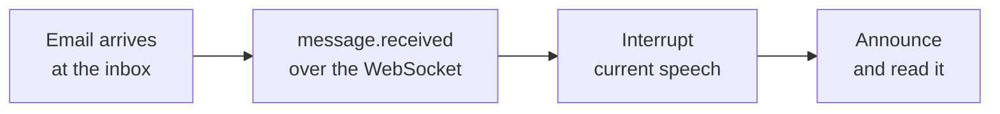

<Visibility for="humans">


This page gives your LiveKit voice agent its own `@agentmail.to` inbox. Ask it to send an email and it sends one. Email it mid-call and it interrupts itself to read the message aloud. You will extend the `agent.py` you built in LiveKit's Voice AI quickstart, in Python.

## 0. Prerequisites

You need three things:

- An AgentMail API key. Generate one from the [AgentMail Console](https://console.agentmail.to/dashboard/api-keys), or follow the [Quickstart](/quickstart) if this is your first AgentMail project.
- A working voice agent from the [LiveKit Voice AI quickstart](https://docs.livekit.io/agents/start/voice-ai/). This page modifies its `agent.py`.
- Python 3.11 or newer.

Install the AgentMail packages into the same environment as your LiveKit project:

```bash
pip install agentmail agentmail-toolkit
```

Set your API key and pick a username for your agent's inbox:

```bash
export AGENTMAIL_API_KEY="<API_KEY>"
export AGENTMAIL_USERNAME="<username for your agent's inbox>"
```

Both variables can also go in the `.env.local` file your quickstart project already loads.

## 1. Create the agent's inbox

An inbox is an email address your agent owns. The agent creates its own when it starts, so there is no provisioning step to run by hand.

Add the imports to the top of `agent.py`:

```python
import os
import asyncio

from agentmail import AgentMail, AsyncAgentMail, Subscribe, MessageReceivedEvent
from agentmail.inboxes import CreateInboxRequest
from agentmail_toolkit.livekit import AgentMailToolkit
```

This is the create call. It goes inside the agent class in the next step:

```python
client = AgentMail()

username = os.environ["AGENTMAIL_USERNAME"]
inbox = client.inboxes.create(
    request=CreateInboxRequest(username=username, client_id=f"{username}-livekit")
)
```

The `client_id` makes the create idempotent. The first startup creates `<username>@agentmail.to`. Every later startup with the same `client_id` returns that same inbox instead of failing, so your agent keeps one address across restarts.

Usernames are claimed once, for everyone on AgentMail.

<Accordion title="Troubleshooting">

If your username is unavailable, the create returns a `403` with either of these codes:

- **`resource_taken`.** Another organization owns the username.
- **`already_exists`.** Your own organization created it outside this `client_id`.

Either way the error carries up to three available variants of the name in `suggestions`. Set `AGENTMAIL_USERNAME` to one of them and start the agent again.

A third `403` has nothing to do with the username:

- **`limit_exceeded`.** Your organization is at its plan's inbox limit, and the error's `fix` field states your limit and links to the upgrade page:

```json
{
  "name": "LimitExceededError",
  "code": "limit_exceeded",
  "message": "Inbox limit exceeded",
  "fix": "Your plan's inbox limit is 3. Delete an existing inbox, or upgrade at https://console.agentmail.to/dashboard/upgrade — Developer raises it to 10 for $20.00/month.",
  "resource": "inbox",
  "limit": 3,
  "upgrade_url": "https://console.agentmail.to/dashboard/upgrade",
  "docs": "https://docs.agentmail.to/errors#limit_exceeded"
}
```

</Accordion>

## 2. Give the agent email tools

Replace the quickstart's `Assistant` class with an `EmailAssistant`. It creates the inbox from the previous step, tells the model the address is its own, and passes in email tools from the AgentMail toolkit. `Agent` is already imported in your quickstart file.

```python
class EmailAssistant(Agent):
    def __init__(self) -> None:
        client = AgentMail()

        username = os.environ["AGENTMAIL_USERNAME"]
        inbox = client.inboxes.create(
            request=CreateInboxRequest(username=username, client_id=f"{username}-livekit")
        )
        self.inbox_id = inbox.inbox_id
        self.ws_task: asyncio.Task | None = None

        super().__init__(
            instructions=f"""
            You are a helpful voice assistant with your own email inbox.
            Your address is {inbox.email}. It is your inbox, not the user's.
            Pass "{self.inbox_id}" as the inbox_id parameter of every email tool.
            When you greet the user, tell them your email address.
            """,
            tools=AgentMailToolkit(client=client).get_tools(
                [
                    "list_threads",
                    "get_thread",
                    "get_attachment",
                    "send_message",
                    "reply_to_message",
                ]
            ),
        )
```

The instructions carry two values from the create response: the inbox's `email`, the address the agent tells the user, and its `inbox_id`, which the model passes to every tool instead of guessing.

`get_tools` takes the names of the tools you want, and calling it with no argument returns all of them:

| Tool | Use it for |
| --- | --- |
| `send_message` | Send a new email from the inbox |
| `reply_to_message` | Answer a message in its existing thread |
| `forward_message` | Pass a message along to another address |
| `list_threads` | Browse the inbox's conversations |
| `get_thread` | Read every message in one conversation |
| `get_attachment` | Fetch a file that arrived with a message |
| `update_message` | Change a message's labels, such as marking it read |
| `list_inboxes` | See every inbox your API key can use |
| `get_inbox` | Look up one inbox's address and display name |
| `create_inbox` | Create another inbox mid-conversation |
| `delete_inbox` | Delete an inbox and its mail |

Two behaviors come built into the toolkit:

- While a tool call runs, the agent speaks a short update about what it is doing, so the user is not left waiting in silence.
- When a call fails, the API's error message goes back to the model as the tool result, so the agent can explain the problem or try again.

## 3. Test sending emails by voice

Point the session at your new agent. In the function that starts the session, replace `Assistant()` with `EmailAssistant()` and keep every other option your file already passes:

```python
await session.start(
    room=ctx.room,
    agent=EmailAssistant(),
)
```

Run the agent in your terminal:

```bash
python agent.py console
```

Ask it out loud to send an email to your personal address with a short message. The agent tells you it is sending while the tool call runs, and a moment later the email shows up in your account, from `<username>@agentmail.to`.


Spoken addresses are easy to mishear. Have the agent repeat the address back before it sends, or put your address in the instructions so the model does not have to transcribe it.

## 4. Test receiving emails mid-call

Sending happens when the model decides to call a tool. Receiving needs a push in the other direction. Your agent keeps a WebSocket connection to AgentMail open for the whole session and gets a `message.received` event the moment mail arrives:



Add three methods to `EmailAssistant`. They use the `ws_task` attribute the constructor already set:

```python
    async def _watch_inbox(self) -> None:
        client = AsyncAgentMail()

        async with client.websockets.connect() as socket:
            await socket.send_subscribe(
                Subscribe(inbox_ids=[self.inbox_id], event_types=["message.received"])
            )

            async for event in socket:
                if isinstance(event, MessageReceivedEvent):
                    self.session.interrupt()
                    await self.session.generate_reply(
                        instructions='Say "I just received an email", then read it to the user.',
                        user_input=event.message.model_dump_json(),
                    )

    async def on_enter(self) -> None:
        self.ws_task = asyncio.create_task(self._watch_inbox())

    async def on_exit(self) -> None:
        if self.ws_task:
            self.ws_task.cancel()
```

How the pieces fit together:

- LiveKit calls `on_enter` when your agent enters the session and `on_exit` when it leaves, so the connection lives exactly as long as the conversation.
- The subscribe frame filters to `message.received`, so the loop wakes only for inbound mail.
- The event carries the full message, body included. `session.interrupt()` stops whatever the agent is saying, and `generate_reply` feeds the email in as input, so the agent reads it in its own voice.

Run `python agent.py console` again. Mid-conversation, send an email from your regular account to your agent's address. Within a few seconds the agent cuts itself off, announces the email, and reads it. Ask it to reply, and the `reply_to_message` tool answers in the same thread.

Events are delivered only while the connection is open. For reconnecting after a drop and the other events you can subscribe to, see [WebSockets](/advanced/websockets).

<Accordion title="Troubleshooting">

- **Emailing the agent from its own address.** An inbox cannot mail itself. Send from a different account, such as your personal email.
- **Creating the inbox without a `client_id`.** The first run works, then every restart returns a `403` with `already_exists`, because your own organization now owns the username. With the `client_id`, restarts return the same inbox.
- **Misspelling a tool name in `get_tools`.** Names that do not match the table are skipped, so the agent runs without that tool and tells the user it cannot do the task. Copy names from the table exactly.
- **Missing environment variables where the agent runs.** A missing `AGENTMAIL_USERNAME` raises a `KeyError` as the session starts, and a missing `AGENTMAIL_API_KEY` surfaces as a `401` on the inbox create. Set both in the shell you run the agent from, or in `.env.local`.

</Accordion>

## Next Steps

<CardGroup cols={2}>
  <Card title="WebSockets" icon="plug" href="/advanced/websockets">
    Recover events after a dropped connection and subscribe to more than inbound mail.
  </Card>
  <Card title="Conversations" icon="messages" href="/core/conversations">
    Keep multi-email threads straight when your agent replies and follows up.
  </Card>
</CardGroup>

</Visibility>

<Visibility for="agents">

# Give a LiveKit voice agent an email inbox

Extend the `agent.py` from LiveKit's Voice AI quickstart so the voice agent owns an `@agentmail.to` inbox, sends and replies by voice, and interrupts itself to read inbound mail mid-call. Use this for a Python LiveKit Agents project.

## Do this

Install the AgentMail packages into the LiveKit project's environment and set both variables. They can also go in the `.env.local` file the quickstart project loads.

```bash
pip install agentmail agentmail-toolkit
export AGENTMAIL_API_KEY="<API_KEY>"
export AGENTMAIL_USERNAME="<username for your agent's inbox>"
```

In `agent.py`, replace the quickstart's `Assistant` class. `Agent` is already imported there.

```python
import os
import asyncio

from agentmail import AgentMail, AsyncAgentMail, Subscribe, MessageReceivedEvent
from agentmail.inboxes import CreateInboxRequest
from agentmail_toolkit.livekit import AgentMailToolkit


class EmailAssistant(Agent):
    def __init__(self) -> None:
        client = AgentMail()

        username = os.environ["AGENTMAIL_USERNAME"]
        inbox = client.inboxes.create(
            request=CreateInboxRequest(username=username, client_id=f"{username}-livekit")
        )
        self.inbox_id = inbox.inbox_id
        self.ws_task: asyncio.Task | None = None

        super().__init__(
            instructions=f"""
            You are a helpful voice assistant with your own email inbox.
            Your address is {inbox.email}. It is your inbox, not the user's.
            Pass "{self.inbox_id}" as the inbox_id parameter of every email tool.
            When you greet the user, tell them your email address.
            """,
            tools=AgentMailToolkit(client=client).get_tools(
                ["list_threads", "get_thread", "get_attachment", "send_message", "reply_to_message"]
            ),
        )

    async def _watch_inbox(self) -> None:
        client = AsyncAgentMail()

        async with client.websockets.connect() as socket:
            await socket.send_subscribe(
                Subscribe(inbox_ids=[self.inbox_id], event_types=["message.received"])
            )

            async for event in socket:
                if isinstance(event, MessageReceivedEvent):
                    self.session.interrupt()
                    await self.session.generate_reply(
                        instructions='Say "I just received an email", then read it to the user.',
                        user_input=event.message.model_dump_json(),
                    )

    async def on_enter(self) -> None:
        self.ws_task = asyncio.create_task(self._watch_inbox())

    async def on_exit(self) -> None:
        if self.ws_task:
            self.ws_task.cancel()
```

In the function that starts the session, replace `Assistant()` with `EmailAssistant()` in the `session.start` call, keeping every other option the file already passes. Then run in the terminal:

```bash
python agent.py console
```

## SDK

Install: `pip install agentmail agentmail-toolkit`.

- Toolkit adapter: `AgentMailToolkit` from `agentmail_toolkit.livekit`. `AgentMailToolkit(client=client).get_tools([...])` returns LiveKit tools by name, and calling it with no argument returns all of them.
- Sync client: `AgentMail()`. Idempotent inbox create: `client.inboxes.create(request=CreateInboxRequest(username=..., client_id=...))`.
- Async events: `AsyncAgentMail()`, then `async with client.websockets.connect() as socket`, `await socket.send_subscribe(Subscribe(inbox_ids=[...], event_types=["message.received"]))`, and iterate the socket for `MessageReceivedEvent`.

Installs and the full SDK surface: `/integrations/sdks-and-cli`.

## Facts

- Requires Python 3.11 or newer and a working agent from LiveKit's Voice AI quickstart.
- Env vars: `AGENTMAIL_API_KEY` and `AGENTMAIL_USERNAME`, in the shell or in `.env.local`.
- `client_id` makes the inbox create idempotent. The first startup creates `<username>@agentmail.to`, and every later startup with the same `client_id` returns that same inbox.
- Toolkit tool names, exactly: `send_message`, `reply_to_message`, `forward_message`, `list_threads`, `get_thread`, `get_attachment`, `update_message`, `list_inboxes`, `get_inbox`, `create_inbox`, `delete_inbox`.
- The create response carries `email`, the address the agent announces, and `inbox_id`, which the model passes to every email tool.
- Toolkit built-ins: while a tool call runs, the agent speaks a short update, and when a call fails, the API's error message goes back to the model as the tool result.
- The WebSocket subscribe frame filters by `inbox_ids` and `event_types`, so the loop wakes only for `message.received`.
- The `message.received` event carries the full message, body included.
- LiveKit calls `on_enter` when the agent enters the session and `on_exit` when it leaves, so the WebSocket lives exactly as long as the conversation.
- WebSocket events are delivered only while the connection is open.
- Usernames are claimed once, for everyone on AgentMail. Username errors carry up to three available variants in `suggestions`.
- The `limit_exceeded` error body includes `name` (`LimitExceededError`), `code`, `message`, `fix`, `resource`, `limit`, `upgrade_url`, and `docs`.

## Not supported

- An inbox cannot mail itself. Send the test email from a different account.
- `get_tools` does not error on a misspelled tool name. Unknown names are skipped, and the agent runs without that tool.
- Creating the inbox without a `client_id` works once, then every restart fails with `already_exists`, because the organization now owns the username.
- This code does not replay events missed while the connection was down. Reconnects and other event types: `/advanced/websockets`.
- Do not trust a spoken recipient address. Have the agent repeat it back before sending, or put the address in the instructions.

## Errors

| Error | HTTP status | Cause | Fix |
| --- | --- | --- | --- |
| `resource_taken` | 403 | Another organization owns the username | Set `AGENTMAIL_USERNAME` to one of the `suggestions`, restart |
| `already_exists` | 403 | Your own organization created the username outside this `client_id` | Set `AGENTMAIL_USERNAME` to one of the `suggestions`, restart |
| `limit_exceeded` (`Inbox limit exceeded`) | 403 | Organization at its plan's inbox limit | Follow the error's `fix` field: delete an inbox or use `upgrade_url` |
| `KeyError` on `AGENTMAIL_USERNAME` | none, at session start | Variable unset where the agent runs | Set it in the shell or `.env.local` |
| 401 on the inbox create | 401 | `AGENTMAIL_API_KEY` missing | Set it in the shell or `.env.local` |

## Verify

Run `python agent.py console`. The agent greets you with its email address, which confirms the inbox create succeeded. Then email that address from another account: within a few seconds the agent interrupts itself, announces the email, and reads it aloud.

## Related

- `/advanced/websockets` to recover events after a dropped connection and subscribe to more than inbound mail
- `/core/conversations` to keep multi-email threads straight across replies and follow-ups
- `/quickstart` for a first AgentMail project and API key

</Visibility>
