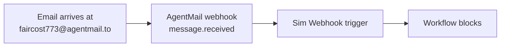

<Visibility for="humans">


[Sim](https://sim.ai) is a visual workspace for building AI agent workflows, block by block on a canvas. AgentMail is built in as a block: give it your API key and pick an operation. You will build a workflow that sends email from its own inbox, reads what comes back, and runs on its own when a new email arrives.

## 0. Prerequisites

You need an AgentMail API key and a Sim workspace. Generate the key from the [AgentMail Console](https://console.agentmail.to/dashboard/api-keys), or follow the [Quickstart](/quickstart) if this is your first AgentMail project.

Store the key once in Sim so it stays out of your saved workflows. Go to **Settings > Secrets** and add two entries:

| Key | Value |
| --- | --- |
| `AGENTMAIL_API_KEY` | Your AgentMail API key |
| `AGENTMAIL_INBOX_ID` | The `inboxId` of the inbox your workflow acts on. You create one in step 2 if you do not have one yet. |

Any block field can reference these with double curly braces, like `{{AGENTMAIL_API_KEY}}`. Sim resolves the value at run time and masks it in the run logs.

## 1. Add the AgentMail block

Open a workflow and drag an **AgentMail** block onto the canvas. Set its **API Key** field to `{{AGENTMAIL_API_KEY}}` and pick an **Operation**. The block's remaining fields change to match the operation you picked.

Rename the block before you reference it anywhere. Sim names new blocks automatically, and downstream blocks read an output through a connection tag that starts with the block's name: a block named `SendEmail` reads as `<SendEmail.threadId>`. Type `<` in any field to pick from the outputs of earlier blocks instead of typing tags by hand.

## 2. Test sending emails

The workflow needs an inbox to send from. If your organization already has one, put its `inboxId` in the `AGENTMAIL_INBOX_ID` secret and skip ahead to the send. Otherwise, create the inbox on the canvas: add an AgentMail block named `CreateInbox`, fill it in, and click **Run**.

| Field | Value |
| --- | --- |
| Operation | Create Inbox |
| API Key | `{{AGENTMAIL_API_KEY}}` |
| Username | The part of the address before the `@`. Leave it empty and AgentMail generates one. |
| Display Name | The "from" name recipients see, like `Support agent`. Optional. |

The block's output shows the new inbox's `inboxId` plus its `email` address, like `faircost773@agentmail.to`. Put the `inboxId` in the `AGENTMAIL_INBOX_ID` secret so every later block can reference it.

Now send an email to an address you already check. Add an AgentMail block named `SendEmail`, fill it in, and click **Run**. The email should turn up there moments later, from your agent's address.

| Field | Value |
| --- | --- |
| Operation | Send Message |
| API Key | `{{AGENTMAIL_API_KEY}}` |
| Inbox ID | `{{AGENTMAIL_INBOX_ID}}` |
| To | `you@example.com`, your usual email account |
| Subject | `Hello from my agent` |
| Text | `First email from my Sim workflow.` |

To, CC, and BCC each take a comma-separated string when there is more than one recipient. The output exposes the sent message's `messageId` and the `threadId` of the conversation it starts. Later blocks read them as `<SendEmail.messageId>` and `<SendEmail.threadId>` to follow up in the same thread.

<Accordion title="Troubleshooting">
- **The create run fails with a `403`.** The username you picked is taken, and the error lists up to three available alternatives in `suggestions`. Open the failed block in the run's logs, pick one, and run again.
- **The create run fails with `limit_exceeded`.** Your organization is at its plan's inbox limit, so every username fails this way.
</Accordion>

## 3. Test receiving emails

From your everyday account, send an email to your agent's address. Give it a subject and a line of text.

Add an AgentMail block named `FetchEmails` and run it. Your email should be the first item in the output's `messages` array. Messages come back newest first, and a sent email typically arrives in about two seconds.

| Field | Value |
| --- | --- |
| Operation | List Messages |
| API Key | `{{AGENTMAIL_API_KEY}}` |
| Inbox ID | `{{AGENTMAIL_INBOX_ID}}` |
| Limit | `10` |

Each item carries a short `preview` of the body and the `messageId` you need to read the rest. To process full bodies, loop over the list:

1. Add a **Loop** block set to **ForEach**, with **Collection** set to `<FetchEmails.messages>`.
2. Inside the loop, add an AgentMail block with Operation set to Get Message, the same Inbox ID, and Message ID set to `<loop.currentItem.messageId>`.

Get Message returns each message's full `text` and `html`, which is what you feed an Agent block. When the list is empty, the loop body is skipped and the workflow continues. To run all of this on a timer, for a morning digest for example, swap the Start trigger for a **Schedule** trigger and deploy the workflow. The schedule only runs once the workflow is deployed.

## 4. Trigger a workflow when email arrives

Polling on a schedule fits digests. For an agent that answers each email, point an AgentMail webhook at a Sim **Webhook** trigger instead.



In Sim:

1. Add the **Webhook** trigger as the workflow's entry point.
2. Turn on **Require Authentication** and set a token, so only AgentMail can start the workflow.
3. Deploy the workflow. The webhook URL only accepts requests once the workflow is deployed.
4. Copy the webhook URL Sim generated.

Then register that URL with AgentMail. The `headers` map carries your Sim token, and AgentMail sends those headers with every delivery:

```bash
curl -X POST "https://api.agentmail.to/v0/webhooks" \
  -H "Authorization: Bearer $AGENTMAIL_API_KEY" \
  -H "Content-Type: application/json" \
  -d '{
    "url": "<your Sim webhook URL>",
    "event_types": ["message.received"],
    "inbox_ids": ["faircost773@agentmail.to"],
    "headers": { "Authorization": "Bearer <your Sim trigger token>" }
  }'
```

If you left Require Authentication off, drop `headers`. Omit `inbox_ids` and the workflow runs for received mail across all your inboxes. One webhook watches at most 10 inboxes.

```json Sample response
{
  "organization_id": "1a2b3c4d-5e6f-4a1b-8c2d-3e4f5a6b7c8d",
  "webhook_id": "ep_1a2b3c4d5e6f7a8b9c0d1e2f3a4",
  "url": "<your Sim webhook URL>",
  "event_types": ["message.received"],
  "inbox_ids": ["faircost773@agentmail.to"],
  "secret": "whsec_1a2b...c6d",
  "enabled": true,
  "created_at": "2026-08-25T09:00:00Z",
  "updated_at": "2026-08-25T09:00:00Z"
}
```

Save the `webhook_id`. You need it to update or delete this subscription later.

Send an email to the inbox from your everyday account. The run appears in Sim's **Logs**, and the event payload is available to the blocks after the trigger by field name. The delivery carries the received message and its thread, so the subject reads as `<webhook.message.subject>` and the body as `<webhook.message.text>`. Wire a Reply to Message block with Inbox ID `<webhook.message.inbox_id>` and Message ID `<webhook.message.message_id>`, and the workflow answers in the original thread. Payload shapes, delivery retries, and signature verification are covered in [Webhooks](/advanced/webhooks).

## 5. Operations reference

The walkthrough used five operations. The block covers the full AgentMail surface across messages, threads, inboxes, and drafts. Every operation authenticates with the API Key field, so `{{AGENTMAIL_API_KEY}}` works everywhere. The full parameter tables for every operation are in Sim's [AgentMail block reference](https://docs.sim.ai/integrations/agentmail).

### Messages

| Operation | Use it for |
| --- | --- |
| Send Message | Start a new conversation from an inbox. Returns the `messageId` and `threadId` later blocks follow up in. |
| Reply to Message | Answer a message in its thread. Set `replyAll` to include everyone on the original. |
| Forward Message | Pass a message on to new recipients, with optional text prepended. |
| List Messages | Page through an inbox's messages. Each item carries a `preview` of the body. |
| Get Message | Read one message's full `text` and `html`. |
| Update Message | Add or remove labels on one message, to mark it processed or route it. |

### Threads

| Operation | Use it for |
| --- | --- |
| List Threads | Page through conversations, filtered by labels or a time window. |
| Get Thread | Read a whole conversation with every message included, the context for a good reply. |
| Update Thread Labels | Label a conversation after triage so later runs can filter on it. |
| Delete Thread | Move a conversation to trash, or delete it permanently with `permanent`. |

### Inboxes

| Operation | Use it for |
| --- | --- |
| Create Inbox | Give each workflow, agent, or customer its own address. |
| List Inboxes | Page through every inbox your key can see. |
| Get Inbox | Look up an inbox's address and display name. |
| Update Inbox | Change the display name recipients see on its mail. |
| Delete Inbox | Remove an inbox you no longer need. |

### Drafts

| Operation | Use it for |
| --- | --- |
| Create Draft | Compose without sending. Set `sendAt` to schedule the send. |
| List Drafts | Page through an inbox's pending drafts. |
| Get Draft | Read a draft and check its `sendStatus`. |
| Update Draft | Revise a draft's content or recipients, for example with an Agent block's output. |
| Send Draft | Send an approved draft. Pair it with Create Draft to hold outgoing mail for review. |
| Delete Draft | Discard a draft that did not pass review. |

## Next Steps

<CardGroup cols={2}>
  <Card title="Webhooks" icon="bolt" href="/advanced/webhooks">
    Event types, payload shapes, signature verification, and retries for the webhook you created.
  </Card>
  <Card title="Build a multi-tenant platform" icon="users" href="/advanced/multi-tenant">
    Give every customer, agent, or workflow its own isolated inbox.
  </Card>
</CardGroup>

</Visibility>

<Visibility for="agents">

# Build a Sim workflow on the AgentMail block

Sim has AgentMail built in as a canvas block: give it an API key and pick an operation. Use this to send, read, and answer email from a workflow's own inbox, including runs triggered the moment an email arrives.

## Do this

1. In Sim, open Settings, then Secrets, and add `AGENTMAIL_API_KEY` (your key from the AgentMail Console) and `AGENTMAIL_INBOX_ID` (the `inboxId` the workflow acts on). Any block field references a secret with double curly braces, like `{{AGENTMAIL_API_KEY}}`.
2. Drag an AgentMail block onto the canvas, rename it before referencing it anywhere, set its API Key field to `{{AGENTMAIL_API_KEY}}`, and pick an Operation. The remaining fields change to match the operation.
3. If you need an inbox, add a block named `CreateInbox` with Operation `Create Inbox`, leave Username empty so AgentMail generates one, click Run, then store the output's `inboxId` in the `AGENTMAIL_INBOX_ID` secret.
4. To send, add a block named `SendEmail` with Operation `Send Message`, Inbox ID `{{AGENTMAIL_INBOX_ID}}`, To, Subject, and Text filled, and click Run. Later blocks read `<SendEmail.messageId>` and `<SendEmail.threadId>` to follow up in the same thread.
5. To read, add a block named `FetchEmails` with Operation `List Messages`, the same Inbox ID, and Limit `10`. For full bodies, add a Loop block set to ForEach with Collection `<FetchEmails.messages>`, and inside it an AgentMail block with Operation `Get Message` and Message ID `<loop.currentItem.messageId>`.

To run the workflow when email arrives, add a Webhook trigger as the entry point, turn on Require Authentication and set a token, deploy the workflow, copy the webhook URL Sim generates, then register it with AgentMail:

```bash
curl -X POST "https://api.agentmail.to/v0/webhooks" \
  -H "Authorization: Bearer $AGENTMAIL_API_KEY" \
  -H "Content-Type: application/json" \
  -d '{
    "url": "<your Sim webhook URL>",
    "event_types": ["message.received"],
    "inbox_ids": ["faircost773@agentmail.to"],
    "headers": { "Authorization": "Bearer <your Sim trigger token>" }
  }'
```

## Facts

- Secrets are referenced with double curly braces, like `{{AGENTMAIL_API_KEY}}`. Sim resolves the value at run time and masks it in the run logs.
- Downstream blocks read an earlier block's output through a connection tag that starts with the block's name, like `<SendEmail.threadId>`. Type `<` in any field to pick from earlier outputs.
- Every operation authenticates with the block's API Key field.
- Message operations: `Send Message`, `Reply to Message` (set `replyAll` to include everyone on the original), `Forward Message`, `List Messages`, `Get Message`, `Update Message` (add or remove labels).
- Thread operations: `List Threads` (filter by labels or a time window), `Get Thread`, `Update Thread Labels`, `Delete Thread` (trash, or permanently with `permanent`).
- Inbox operations: `Create Inbox`, `List Inboxes`, `Get Inbox`, `Update Inbox` (display name), `Delete Inbox`.
- Draft operations: `Create Draft` (set `sendAt` to schedule the send), `List Drafts`, `Get Draft` (check `sendStatus`), `Update Draft`, `Send Draft`, `Delete Draft`.
- To, CC, and BCC each take a comma-separated string when there is more than one recipient.
- `List Messages` returns messages newest first. Each item carries a body `preview` and the `messageId`. `Get Message` returns the full `text` and `html`.
- `Create Inbox` output shows the new inbox's `inboxId` and its `email` address. An empty Username lets AgentMail generate one, and Display Name is optional.
- A sent email typically arrives in about two seconds.
- Webhook registration endpoint: `POST https://api.agentmail.to/v0/webhooks` with `Authorization: Bearer` auth. AgentMail sends the registration's `headers` map with every delivery. Omit `inbox_ids` and the workflow runs for received mail across all inboxes. One webhook watches at most 10 inboxes.
- The registration response includes `webhook_id` (needed to update or delete the subscription), `secret`, and `enabled`.
- The webhook delivery carries the received message and its thread. Blocks after the trigger read fields by name: `<webhook.message.subject>`, `<webhook.message.text>`, `<webhook.message.inbox_id>`, `<webhook.message.message_id>`.
- A `Reply to Message` block with Inbox ID `<webhook.message.inbox_id>` and Message ID `<webhook.message.message_id>` answers in the original thread.
- Full parameter tables for every operation: Sim's AgentMail block reference at `https://docs.sim.ai/integrations/agentmail`.

## Not supported

- A Schedule trigger does not run until the workflow is deployed.
- The Sim webhook URL does not accept requests until the workflow is deployed.
- An empty `List Messages` result does not fail the workflow. The ForEach loop body is skipped and the run continues.
- If Require Authentication is off on the Sim trigger, drop the `headers` map from the registration call.

## Errors

| Error | HTTP status | Cause | Fix |
| --- | --- | --- | --- |
| 403 on `Create Inbox` with `suggestions` | 403 | Chosen username is taken | Open the failed block in the run's logs, pick one of the up to three alternatives, run again |
| `limit_exceeded` | 403 | Organization at its plan's inbox limit, whatever username you picked | Free an inbox or raise the plan's limit |

## Verify

Run the `SendEmail` block and check the recipient account: the email arrives moments later from the agent's address. A successful webhook registration returns a JSON body with a `webhook_id` and `"enabled": true`. For the trigger, send an email to the watched inbox and confirm a run appears in Sim's Logs.

## Related

- `/advanced/webhooks` for event types, payload shapes, signature verification, and delivery retries
- `/advanced/multi-tenant` to give every customer, agent, or workflow its own isolated inbox
- `/quickstart` for generating an API key in a first AgentMail project

</Visibility>
