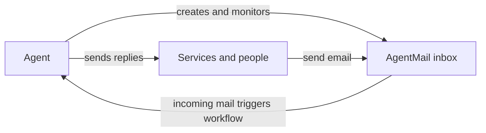

<Human>

AgentMail gives AI agents programmable email inboxes. Create an inbox, receive mail, trigger workflows, and reply through one API.

## Give an agent an inbox

Email handles service signups, address confirmation, password resets, verification codes, receipts, and notifications. An agent that completes these flows needs an address that can receive mail.

With its own inbox, an agent can register for services, complete verification flows, and maintain correspondence without a human operating an email client.

## Choose AgentMail instead of an outbound sender

AgentMail gives an agent an inbox it can send from and receive into. Other email tools serve different jobs.

| Tool | Who it serves | What it moves |
| --- | --- | --- |
| AgentMail | AI agents | An agent's own inbox: send and receive, with workflows on incoming mail |
| SendGrid / Resend | Your application | Outbound transactional email your app generates |
| Mailchimp | Marketers | Outbound marketing broadcasts to a subscriber list |
| Gmail API | A human user | Programmatic access to that person's existing inbox |

## Start from the surface that fits your workflow

All five surfaces use the same API.

<Columns cols="2">
  <Card title="CLI" icon="terminal">
    Run calls from a terminal or script one-off checks.
  </Card>
  <Card title="MCP" icon="plug">
    Give an MCP-capable agent or assistant inbox tools.
  </Card>
  <Card title="Console" icon="browser">
    Inspect inboxes and messages in a browser.
  </Card>
  <Card title="SDK (TypeScript, Python)" icon="code">
    Use typed calls in application code.
  </Card>
</Columns>

Use raw HTTP when you work in a language without an SDK or want no dependency.

## Continue with a working inbox

- [Quickstart](/quickstart): create your first inbox and send a message.
- [Architecture](/architecture): understand inboxes, messages, and workflows.

</Human>

<Agent>

# Understand AgentMail and choose a surface

AgentMail gives AI agents programmable email inboxes. Create an inbox, receive mail, trigger workflows on incoming messages, and send replies through one API.

## Facts

- An AgentMail inbox is a real email address owned by an AI agent. The agent can hand it out, receive mail into it, and send from it.
- The core workflow is: create an inbox, receive mail, trigger a workflow for incoming mail, and send replies.
- Email supports service signups, address confirmation, password resets, verification codes, receipts, and notifications. An agent needs its own inbox to complete those flows unattended.
- AgentMail serves AI agents and moves inbound and outbound mail for the agent's inbox.
- SendGrid and Resend serve applications and move outbound transactional email. Mailchimp sends marketing broadcasts to subscriber lists. Gmail API gives programmatic access to a human user's existing inbox.
- AgentMail has five access surfaces: CLI, MCP, Console, SDKs (TypeScript, Python), and raw HTTP. All use the same API.
- Choose CLI for terminal work or one-off scripts. Choose MCP for an MCP-capable agent or assistant. Choose Console to inspect inboxes and messages in a browser. Choose an SDK for typed application calls. Choose raw HTTP for a language without an SDK or a dependency-free integration.

## Not supported

- AgentMail is not a bulk marketing or broadcast tool for subscriber-list campaigns.
- AgentMail is not an outbound-only transactional sender for application-generated email. AgentMail inboxes receive mail and send it.
- AgentMail does not provide access to a human user's existing inbox. It creates inboxes owned by the agent.

## Related

- [Quickstart: create your first inbox and send a message](/quickstart)
- [Architecture: the object model behind inboxes, messages, and workflows](/architecture)

</Agent>
